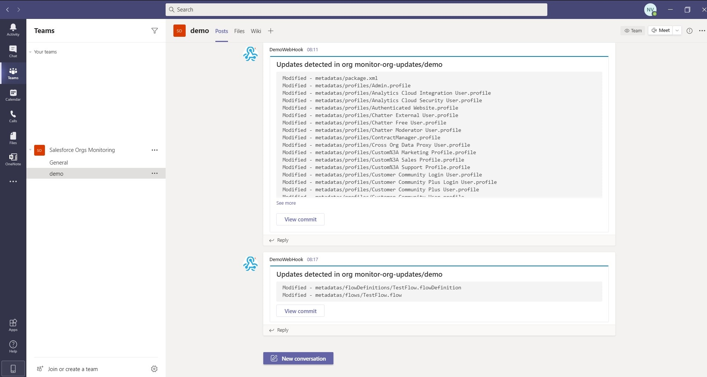
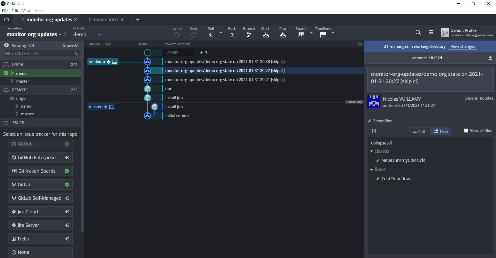
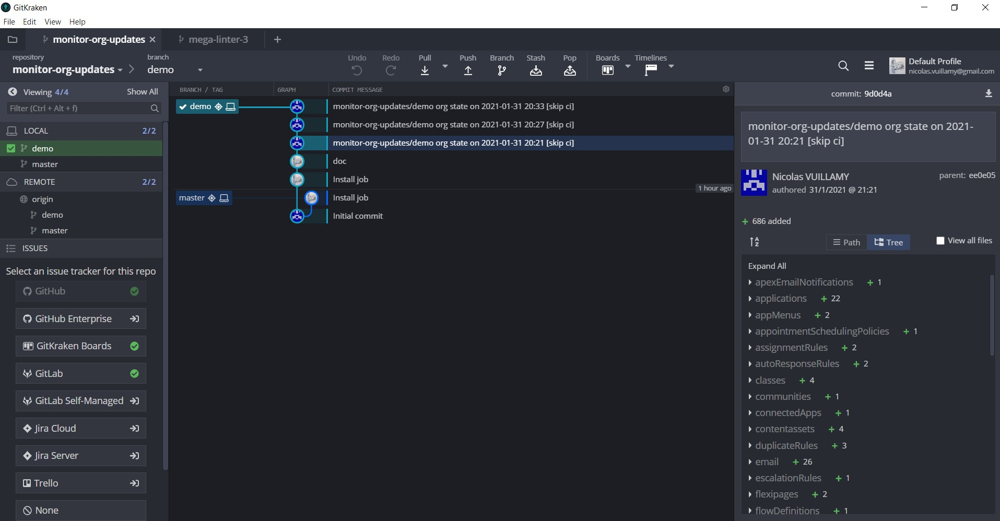
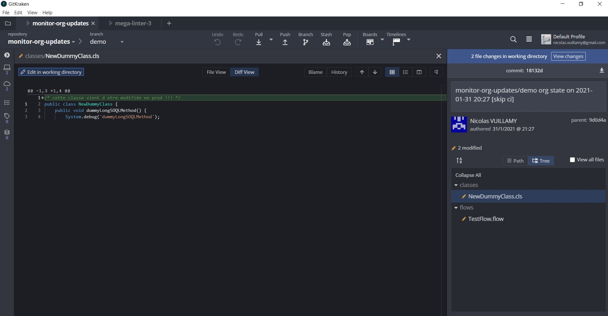
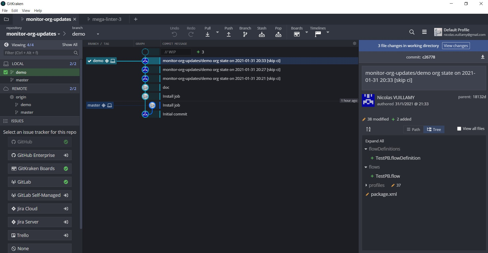
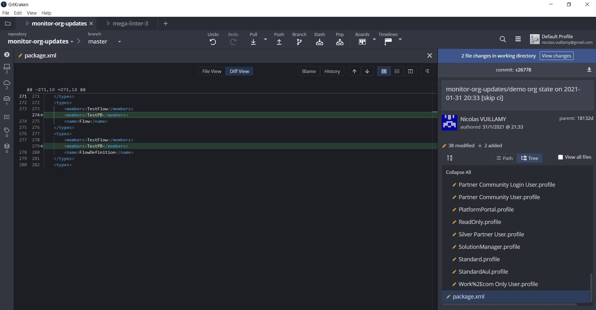
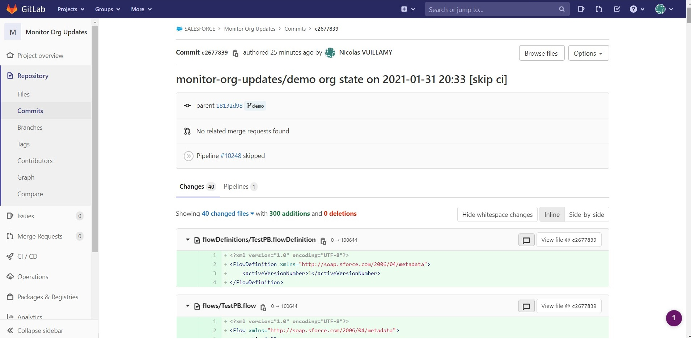

# Monitor Org Updates

Utilisez la CI/CD facilement sur toutes vos orgs afin dd faciliter leur gestion:
- **Sauvegarde quotidienne des metadatas** de l'org: anticiper les ennuis, ou le cas échéant les investiguer plus rapidement
- **automatisation des purges manuelles**
  - **Purge des versions obsolètes des Flow** configurés dans l'org

Cet outil utilise **Salesforce DX** mais **fonctionne avec toutes les orgs**, quels que soient le mode de gestion de leurs sources et leur mode leurs déploiements.

## Description

Ce template de repository vous permettra de détecter automatiquement les modifications effectuées dans une org
- Les **modifications prévues**, suite à un **déploiement** (qu'il soit effactué par Click&Deploy, changeset, sfdx ou tout autre outil)
- Les **modifications non prévues**, suite au **non respect des bonnes pratiques** (configuration/code directement dans une org qui n'est pas prévue à cet effet)

Suivez les [instructions détaillées](#instructions) pour la mise en place du monitoring des metadatas de votre org (**1h environ**, voire moins si vous êtes très geek)

Vous pouvez monitorer plusieurs orgs du même client dans le même repository: **une branche par org**

En cas de problème, vous pouvez me contacter sur Workplace ou Teams (Nicolas Vuillamy)

- Pour permettre au job de commit/push, ACCESS_TOKEN doit être défini dans `Project -> Settings -> Access Token`
  - name: ACCESS_TOKEN
  - scopes: read_repository et write_repository
  - copiez le token généré dans le presse-papier (CTRL+C)

- Definissez ensuite la variable ACCESS_TOKEN dans `Project -> Settings -> CI / CD -> Variables`
  - name: ACCESS_TOKEN
  - Cochez "Mask variable", décochez "Protected variable"

- **Notification Ms Teams** _(optionnel)
  - Définissez une propriété **msTeamsWebhookUrl** dans le fichier `.sfdx-hardis.yml`, contenant l'[URL d'un WebHook de channel Ms Teams](https://docs.microsoft.com/fr-fr/microsoftteams/platform/webhooks-and-connectors/how-to/add-incoming-webhook#add-an-incoming-webhook-to-a-teams-channel)

- Stage, commit, push du repository

## Planification

- Vous pouvez planifier ce pipeline une ou plusieurs fois par jour dans `Project -> CI/CD -> Schedules`
- Vous pouvez lancer manuellement le job avec le bouton `Project -> CI/CD -> Pipelines -> Run pipeline`

## Sauvegarde automatique des metadatas

### Analyse

Chaque run du job (planifié ou non) va générer un nouveau commit (sauf s'il n'y a aucun changement)
Vous pouvez modifier le fichier **.gitignore** à la racine pour ignorer les dossiers de metadatas que vous jugez non pertinents.

Vous pouvez surveiller:

- le fichier package.xml (ajouts et suppressions d'éléments)
- le contenu des dossiers de métadatas

### Demo

- Premier commit avec toutes les metadatas

- Après une modification de classe Apex et de Flow dans l'org

- Après la créaton d'un nouveau ProcessBuilder (metadata Flow) dans l'org

- Vous pouvez aussi consulter les différentes depuis l'interface de GitLab: `Project -> Repository -> Commits`, puis selectionnez votre branche et cliquez sur le commit

- Le job envoie des notifications au channel Ms Teams de votre choix 

## Maintenance automatique de l'org

### Purge des versions de Flow obsolètes

Ce pipeline purge automatiquement les versions obsolètes de Flow.

Pour activer cette fonction, définissez les variables `PURGE` et `PURGE_FLOW_VERSIONS` avec la valeur `"true"` dans le fichier `.gitlab-ci-config.yml` 

## Améliorations 

Besoin d'autres actions de maintenance automatique ? [Demandez les !](https://gitlab.hardis-group.com/busalesforce/doc/-/issues)