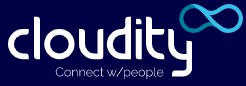
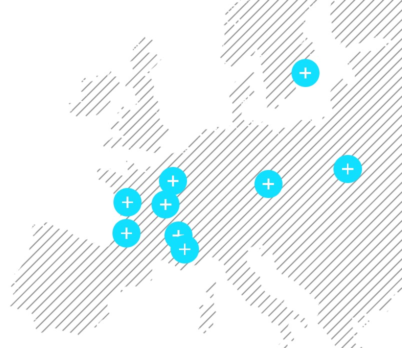

## Your Expert Salesforce Partner

    

___

At Cloudity, we love **sharing our technical expertise**, such as sfdx-hardis as Open-Source, but that's **just a small part of everything we do** !

We provide **end-to-end digitalization services for companies**, combining **technical skills** and **business expertise** to deliver **solutions that set the bar high for quality**. With the backing of our talented people, we’re aiming to grow our influence and spread our culture based on trust, ambition and empowerment.

By end-2025, our goal is to grow our workforce to more than 500 employees, to sustain profitability and to make Cloudity a go-to market player for top companies and for our partners, Salesforce and Meta.

With experts from Hardis Group, Carrenet and Cloudity having joined forces, we now have more than 350 employees in four countries, serving customers across 30 countries (Europe + US).

Want to know more ? Contact us on our [**WebSite**](https://cloudity.com/) !

    

