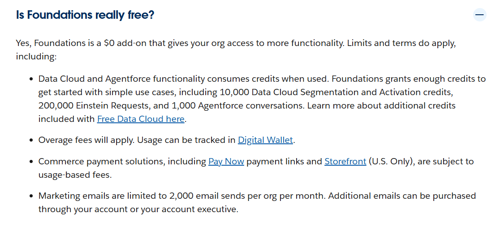
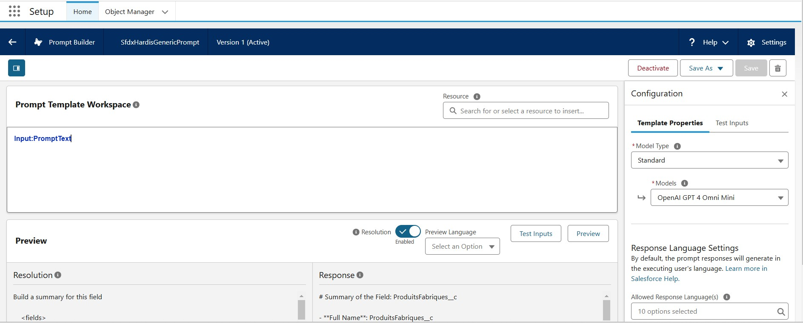
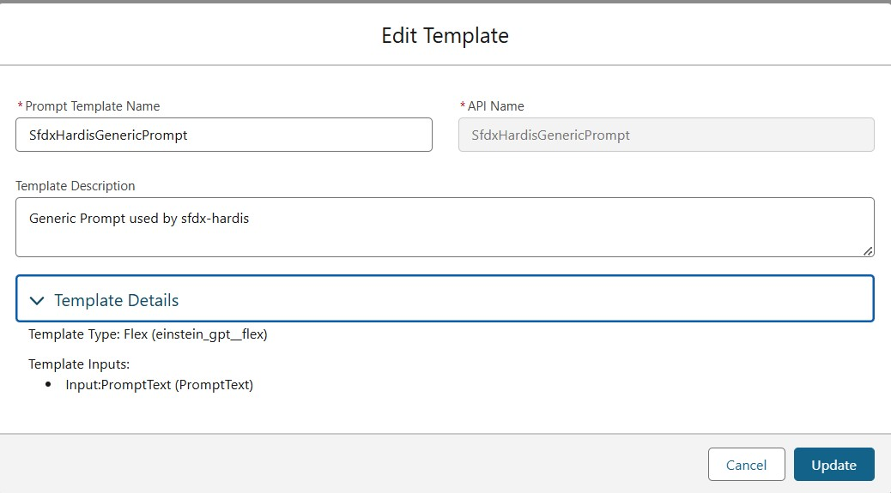

<!-- markdownlint-disable MD013 -->

# Setup AI for sfdx-hardis

## Security considerations

sfdx-hardis uses **prompt via API** to collect analysis: only **Metadata XML** or **JSON deployment errors** are sent in the prompts.

If you follow Flows best practices and **do not hardcode credentials / tokens in variables**, there is no serious risk to send metadata XML to an external LLM (**but be aware that you do !**)

You can see the prompts content if you set env variable `DEBUG_PROMPTS=true`.

See the [list of prompts used by sfdx-hardis](salesforce-ai-prompts.md) , and how to override them.

| If you use AI for generated project documentation, it is highly recommended to run it locally the first time to generate and commit AI cache, as it can make hundreds of API calls, so take some time.

## Main configuration

> You're lost ? Contact [Cloudity](https://cloudity.com/#form), we can do it for you :)

### Common variables

| Variable                     | Description                                                                                                                                                                                             | Default |
|------------------------------|---------------------------------------------------------------------------------------------------------------------------------------------------------------------------------------------------------|---------|
| AI_MAXIMUM_CALL_NUMBER       | Maximum allowed number of calls to AI Providers during a single sfdx-hardis command                                                                                                                     | `10000` |
| PROMPTS_LANGUAGE             | Language to use for prompts results (`en`,`fr`, or any [ISO Language code](https://en.wikipedia.org/wiki/List_of_ISO_639_language_codes))                                                               | `en`    |
| DEBUG_PROMPTS                | Set to true if you want prompts requests and responses in logs                                                                                                                                          | `false` |
| MAX_DEPLOYMENT_TIPS_AI_CALLS | Maximum number of errors that will be analyzed by AI for a single Pull Request                                                                                                                          | `20`    |
| DISABLE_AI                   | In case you want to disable API calls to API without removing your configuration, set to true                                                                                                           | `false` |
| IGNORE_AI_CACHE              | Some processes like Flow description use AI cache files to save calls to prompts API, disable by setting to true                                                                                        | `false` |
| AI_MAX_TIMEOUT_MINUTES       | If you are running sfdx-hardis from a CI/CD job, AI will stopped to be called after 30 minutes, to not mess with the timeouts of other jobs. You can increase this value to however minutes you want :) | `30`    |

### With Agentforce

- Agentforce must be activated on the default org used when you call the sfdx-hardis command

> You can do that with Salesforce Freemium feature [Salesforce Foundations](https://www.salesforce.com/crm/foundations/), that offers 200000 Einstein Prompts



- A prompt template **SfdxHardisGenericPrompt** (type `Flex`) must exist in the default org, with input variable **PromptText** (type `FreeText`)
- The connected used must be assigned to permission set **Prompt Template User**

| Variable                           | Description                                                                                                                                                                                                                       | Default                                                                                                        |
|------------------------------------|-----------------------------------------------------------------------------------------------------------------------------------------------------------------------------------------------------------------------------------|----------------------------------------------------------------------------------------------------------------|
| USE_AGENTFORCE                     | Set to true to activate the use of Agentforce prompts                                                                                                                                                                             | false                                                                                                          |
| GENERIC_AGENTFORCE_PROMPT_TEMPLATE | Set this variable to override default prompt template                                                                                                                                                                             | `SfdxHardisGenericPrompt`                                                                                      |
| GENERIC_AGENTFORCE_PROMPT_URL      | Set this variable to override default prompt url                                                                                                                                                                                  | `/services/data/v{{API_VERSION}}/einstein/prompt-templates/{{GENERIC_AGENTFORCE_PROMPT_TEMPLATE}}/generations` |
| SFDX_AUTH_URL_TECHNICAL_ORG        | If you want to use another org to call Agentforce (like a [Developer Org](https://developer.salesforce.com/signup) just to test the feature), you can define this variable (get Auth Url using `sf org display --verbose --json`) | <!-- -->                                                                                                       |





### With LangChain

[LangChainJs](https://js.langchain.com/docs/integrations/chat/) provides a unified interface to work with multiple LLM providers. This way to use AI provides better extensibility and future-proofing to extend support for more providers.

Currently supported LangchainJS providers:

- Ollama
- OpenAI
- Anthropic
- Google GenAI

| Variable                    | Description                                                                                     | Default                          |
|-----------------------------|-------------------------------------------------------------------------------------------------|----------------------------------|
| USE_LANGCHAIN_LLM           | Set to true to use LangChain integration                                                        | `false`                          |
| LANGCHAIN_LLM_PROVIDER      | The LLM provider to use (currently supports `ollama`, `openai`, `anthropic` and `google-genai`) |                                  |
| LANGCHAIN_LLM_MODEL         | The model to use with the selected provider (e.g. `gpt-4o`, `qwen2.5-coder:14b`)                |                                  |
| LANGCHAIN_LLM_MODEL_API_KEY | API key for the selected provider (required for OpenAI, Anthropic and Gemini)                   |                                  |
| LANGCHAIN_LLM_TEMPERATURE   | Controls randomness (0-1)                                                                       |                                  |
| LANGCHAIN_LLM_MAX_TOKENS    | Maximum number of tokens to generate                                                            |                                  |
| LANGCHAIN_LLM_MAX_RETRIES   | Number of retries for failed requests                                                           |                                  |
| LANGCHAIN_LLM_BASE_URL      | Base URL for the API (mainly for Ollama)                                                        | Ollama: `http://localhost:11434` |

#### Example configurations

For Ollama:

- Visit [Ollama's official website](https://ollama.ai/) and download the appropriate version for your operating system
- Follow the installation instructions for your platform
- After installation, pull your preferred model e.g. `ollama pull qwen2.5-coder:14b` and start the Ollama service with `ollama serve`

```sh
USE_LANGCHAIN_LLM=true
LANGCHAIN_LLM_PROVIDER=ollama
LANGCHAIN_LLM_MODEL=qwen2.5-coder:14b
LANGCHAIN_LLM_TEMPERATURE=1
LANGCHAIN_LLM_BASE_URL=http://localhost:11434
```

For OpenAI:

```sh
USE_LANGCHAIN_LLM=true
LANGCHAIN_LLM_PROVIDER=openai
LANGCHAIN_LLM_MODEL=gpt-4o-mini
LANGCHAIN_LLM_MODEL_API_KEY=your-api-key
LANGCHAIN_LLM_TEMPERATURE=0.7
LANGCHAIN_LLM_MAX_TOKENS=2000
```

For Anthropic:

```sh
USE_LANGCHAIN_LLM=true
LANGCHAIN_LLM_PROVIDER=anthropic
LANGCHAIN_LLM_MODEL=claude-3.5-sonnet
LANGCHAIN_LLM_MODEL_API_KEY=your-api-key
LANGCHAIN_LLM_TEMPERATURE=0.7
LANGCHAIN_LLM_MAX_TOKENS=2000
```

For Google Gen AI:

```sh
USE_LANGCHAIN_LLM=true
LANGCHAIN_LLM_PROVIDER=google-genai
LANGCHAIN_LLM_MODEL=gemini-1.5-pro
LANGCHAIN_LLM_MODEL_API_KEY=your-api-key
```

### With OpenAI Directly

You need to define env variable OPENAI_API_KEY and make it available to your CI/CD workflow.

To get an OpenAi API key , register on [OpenAi Platform](https://platform.openai.com/).

| Variable       | Description                                                                               | Default       |
|----------------|-------------------------------------------------------------------------------------------|---------------|
| OPENAI_API_KEY | Your openai account API key                                                               |               |
| OPENAI_MODEL   | OpenAi model used to perform prompts (see [models list](https://openai.com/api/pricing/)) | `gpt-4o-mini` |

## Templates

You can override default prompts by defining the following environment variables.

| Prompt Template                      | Description                                                                                         |                          Variables                          |
|--------------------------------------|-----------------------------------------------------------------------------------------------------|:-----------------------------------------------------------:|
| PROMPT_SOLVE_DEPLOYMENT_ERROR        | Ask AI about how to solve a deployment error                                                        |                            ERROR                            |
| PROMPT_DESCRIBE_FLOW                 | Describe a flow from its XML                                                                        |                          FLOW_XML                           |
| PROMPT_DESCRIBE_FLOW_DIFF            | Describe the differences between 2 flow versions by comparing their XML                             |               FLOW_XML_NEW, FLOW_XML_PREVIOUS               |
| PROMPT_DESCRIBE_OBJECT               | Describe Object using sfdx-hardis generated info based on project metadatas                         | OBJECT_NAME, OBJECT_XML, ALL_OBJECTS_LIST, ALL_OBJECT_LINKS |
| PROMPT_COMPLETE_OBJECT_ATTRIBUTES_MD | Complete fields and validation rules descriptions in input markdown tables generated by sfdx-hardis |                    OBJECT_NAME, MARKDOWN                    |
| PROMPT_DESCRIBE_APEX                 | Describe an Apex class from its code                                                                |                    CLASS_NAME, APEX_CODE                    |
