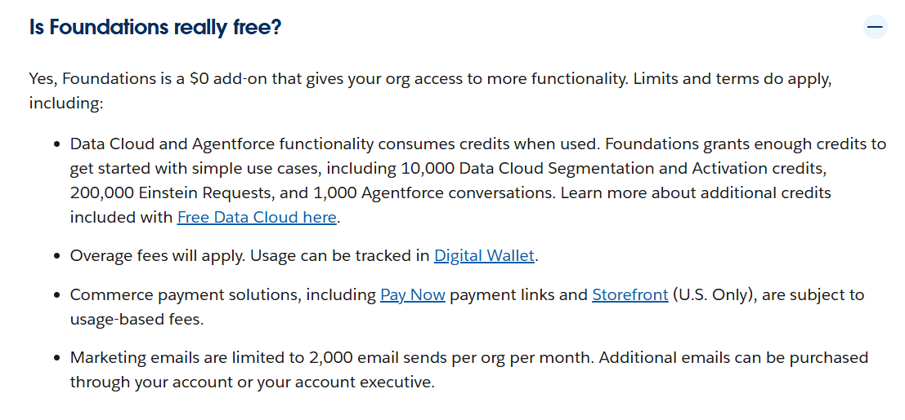
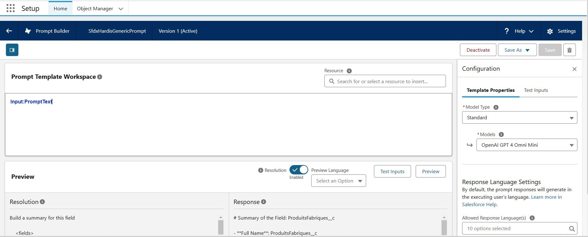
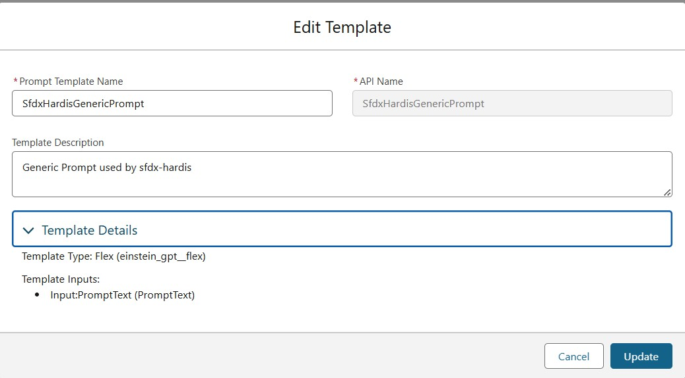

<!-- markdownlint-disable MD013 -->

# Setup AI for sfdx-hardis

## Security considerations

sfdx-hardis sends **prompts via API** to collect its analyses: only **metadata XML** or **JSON deployment errors** are sent in the prompts.

If you follow Flow best practices and **do not hardcode credentials or tokens in variables**, sending metadata XML to an external LLM carries no serious risk (**but be aware that you are doing it**).

You can see the content of the prompts by setting the environment variable `DEBUG_PROMPTS=true`.

See the [list of prompts used by sfdx-hardis](salesforce-ai-prompts.md), and how to override them.

> If you use AI for the generated project documentation, it is highly recommended to run it locally the first time, to generate and commit the AI cache: the generation can make hundreds of API calls and take some time.

## Main configuration

> Feeling lost? Contact [Cloudity](https://cloudity.com/contact-us/), we can set it up for you.

[](https://cloudity.com/contact-us/){target=blank}

### Common variables

| Variable                     | Description                                                                                                                                                                                 | Default |
|------------------------------|---------------------------------------------------------------------------------------------------------------------------------------------------------------------------------------------|---------|
| AI_MAXIMUM_CALL_NUMBER       | Maximum allowed number of calls to AI Providers during a single sfdx-hardis command                                                                                                         | `10000` |
| PROMPTS_LANGUAGE             | Language of the prompt results (`en`,`fr`, or any [ISO Language code](https://en.wikipedia.org/wiki/List_of_ISO_639_language_codes))                                                        | `en`    |
| DEBUG_PROMPTS                | Set to true to log prompt requests and responses                                                                                                                                            | `false` |
| MAX_DEPLOYMENT_TIPS_AI_CALLS | Maximum number of errors that will be analyzed by AI for a single Pull Request                                                                                                              | `20`    |
| DISABLE_AI                   | Set to true to disable AI calls without removing your configuration                                                                                                                         | `false` |
| IGNORE_AI_CACHE              | Some processes like Flow description use AI cache files to save calls to the AI API; set to true to disable the cache                                                                       | `false` |
| AI_MAX_TIMEOUT_MINUTES       | When sfdx-hardis runs in a CI/CD job, AI stops being called after 30 minutes, to avoid interfering with the timeouts of other jobs. You can raise this value to as many minutes as you want | `30`    |

### With Agentforce

- Agentforce must be activated on the default org used when you call the sfdx-hardis command

> You can do that with the free [Salesforce Foundations](https://www.salesforce.com/crm/foundations/) offer, which includes 200,000 Einstein prompts



- A prompt template **SfdxHardisGenericPrompt** (type `Flex`) must exist in the default org, with input variable **PromptText** (type `FreeText`)
- The connected user must be assigned to permission set **Prompt Template User** (EinsteinGPTPromptTemplateUser)

> **Quick setup:** Run [`sf hardis:org:configure:generic-prompt`](hardis/org/configure/generic-prompt.md) to deploy the `SfdxHardisGenericPrompt` template and optionally assign the `EinsteinGPTPromptTemplateUser` Permission Set to your user in a single interactive step. Then **manually** add `useAgentforce: true` to your `.sfdx-hardis.yml` config file or set the `USE_AGENTFORCE` env variable to enable Agentforce integration.

| Variable                           | Description                                                                                                                                                                                                                                                                 | Default                                                                                                        |
|------------------------------------|-----------------------------------------------------------------------------------------------------------------------------------------------------------------------------------------------------------------------------------------------------------------------------|----------------------------------------------------------------------------------------------------------------|
| USE_AGENTFORCE                     | Set to true to activate the use of Agentforce prompts                                                                                                                                                                                                                       | false                                                                                                          |
| GENERIC_AGENTFORCE_PROMPT_TEMPLATE | Set this variable to override the default prompt template                                                                                                                                                                                                                   | `SfdxHardisGenericPrompt`                                                                                      |
| GENERIC_AGENTFORCE_PROMPT_URL      | Set this variable to override the default prompt URL                                                                                                                                                                                                                        | `/services/data/v{{API_VERSION}}/einstein/prompt-templates/{{GENERIC_AGENTFORCE_PROMPT_TEMPLATE}}/generations` |
| SFDX_AUTH_URL_TECHNICAL_ORG        | If you want to use another org to call Agentforce (like a [Developer Org](https://developer.salesforce.com/signup) just to test the feature), you can define this variable (get the auth URL with `sf org auth show-sfdx-auth-url --target-org <alias> --no-prompt --json`) | <!-- -->                                                                                                       |





#### Configure Agentforce via .sfdx-hardis.yml

```yaml
useAgentforce: true
genericAgentforcePromptTemplate: SfdxHardisGenericPrompt
genericAgentforcePromptUrl: /services/data/v{{API_VERSION}}/einstein/prompt-templates/{{PROMPT_TEMPLATE}}/generations
```

API keys or technical org auth URLs still have to be provided via secure environment variables; the config file only holds non-sensitive defaults.

### With LangChain

[LangChain.js](https://js.langchain.com/docs/integrations/chat/) provides a unified interface to work with multiple LLM providers. This makes it easier to add support for more providers in the future.

Currently supported LangChain.js providers:

- Ollama
- OpenAI
- Anthropic
- Google GenAI

| Variable                      | Description                                                                                                            | Default                          |
|-------------------------------|------------------------------------------------------------------------------------------------------------------------|----------------------------------|
| USE_LANGCHAIN_LLM             | Set to true to use LangChain integration                                                                               | `false`                          |
| LANGCHAIN_LLM_PROVIDER        | The LLM provider to use (currently supports `ollama`, `openai`, `anthropic` and `google-genai`)                        |                                  |
| LANGCHAIN_LLM_MODEL           | The model to use with the selected provider (e.g. `gpt-4o`, `qwen2.5-coder:14b`)                                       |                                  |
| LANGCHAIN_LLM_MODEL_API_KEY   | API key for the selected provider (required for OpenAI, Anthropic, and Gemini unless using gateway headers for OpenAI) |                                  |
| LANGCHAIN_LLM_TEMPERATURE     | Controls randomness (0-1)                                                                                              |                                  |
| LANGCHAIN_LLM_MAX_TOKENS      | Maximum number of tokens to generate                                                                                   |                                  |
| LANGCHAIN_LLM_MAX_RETRIES     | Number of retries for failed requests                                                                                  |                                  |
| LANGCHAIN_LLM_BASE_URL        | Base URL for the API (for Ollama or corporate OpenAI gateways)                                                         | Ollama: `http://localhost:11434` |
| LANGCHAIN_LLM_DEFAULT_HEADERS | JSON object of default HTTP headers sent with every request (for gateway/proxy authentication)                         |                                  |

#### Example configurations

For Ollama:

- Visit [Ollama's official website](https://ollama.ai/) and download the appropriate version for your operating system
- Follow the installation instructions for your platform
- After installation, pull your preferred model (e.g. `ollama pull qwen2.5-coder:14b`) and start the Ollama service with `ollama serve`

```sh
USE_LANGCHAIN_LLM=true
LANGCHAIN_LLM_PROVIDER=ollama
LANGCHAIN_LLM_MODEL=qwen2.5-coder:14b
LANGCHAIN_LLM_TEMPERATURE=1
LANGCHAIN_LLM_BASE_URL=http://localhost:11434
```

For OpenAI:

```sh
USE_LANGCHAIN_LLM=true
LANGCHAIN_LLM_PROVIDER=openai
LANGCHAIN_LLM_MODEL=gpt-4o-mini
LANGCHAIN_LLM_MODEL_API_KEY=your-api-key
LANGCHAIN_LLM_TEMPERATURE=0.7
LANGCHAIN_LLM_MAX_TOKENS=2000
```

For OpenAI via a corporate gateway (no API key needed):

```sh
USE_LANGCHAIN_LLM=true
LANGCHAIN_LLM_PROVIDER=openai
LANGCHAIN_LLM_MODEL=gpt-4o
LANGCHAIN_LLM_BASE_URL=https://your-company-gateway.example.com/v1
LANGCHAIN_LLM_DEFAULT_HEADERS='{"X-Company-Auth": "your-token-here"}'
```

When `LANGCHAIN_LLM_DEFAULT_HEADERS` is set together with `LANGCHAIN_LLM_BASE_URL`, the OpenAI provider skips the API key requirement and authenticates via the supplied headers instead.

For Anthropic:

```sh
USE_LANGCHAIN_LLM=true
LANGCHAIN_LLM_PROVIDER=anthropic
LANGCHAIN_LLM_MODEL=claude-3.5-sonnet
LANGCHAIN_LLM_MODEL_API_KEY=your-api-key
LANGCHAIN_LLM_TEMPERATURE=0.7
LANGCHAIN_LLM_MAX_TOKENS=2000
```

For Google Gen AI:

```sh
USE_LANGCHAIN_LLM=true
LANGCHAIN_LLM_PROVIDER=google-genai
LANGCHAIN_LLM_MODEL=gemini-1.5-pro
LANGCHAIN_LLM_MODEL_API_KEY=your-api-key
```

#### Configure via .sfdx-hardis.yml

You can store non-secret defaults for LangChain inside your project configuration so every contributor shares the same provider/model while API keys remain in CI/CD secrets:

```yaml
# .sfdx-hardis.yml
useLangchainLlm: true
langchainLlmProvider: google-genai
langchainLlmModel: gemini-3-flash
langchainLlmTemperature: 0.1
langchainLlmMaxTokens: 1000
```

Only values that are safe to commit (model, provider, tuning) are loaded from the config file. Secrets such as `LANGCHAIN_LLM_MODEL_API_KEY` must always be provided through secure environment variables or your CI secret manager.

### With OpenAI Directly

You need to define the environment variable OPENAI_API_KEY (or use gateway authentication) and make it available to your CI/CD workflow.

To get an OpenAI API key, register on the [OpenAI Platform](https://platform.openai.com/).

| Variable                | Description                                                                               | Default       |
|-------------------------|-------------------------------------------------------------------------------------------|---------------|
| OPENAI_API_KEY          | Your OpenAI account API key (not required when using gateway headers)                     |               |
| OPENAI_MODEL            | OpenAI model used to perform prompts (see [models list](https://openai.com/api/pricing/)) | `gpt-4o-mini` |
| OPENAI_SERVICE_TIER     | Optional OpenAI service tier for supported projects (`auto`, `default`, `flex`)           |               |
| OPENAI_REASONING_EFFORT | Optional reasoning effort for supported OpenAI reasoning models (`low`, `medium`, `high`) |               |
| OPENAI_BASE_URL         | Base URL for OpenAI API (for corporate gateways/proxies)                                  |               |
| OPENAI_DEFAULT_HEADERS  | JSON object of default HTTP headers for gateway/proxy authentication                      |               |

#### OpenAI via corporate gateway (no API key needed)

```sh
USE_OPENAI_DIRECT=true
OPENAI_MODEL=gpt-4o
OPENAI_BASE_URL=https://your-company-gateway.example.com/v1
OPENAI_DEFAULT_HEADERS='{"X-Company-Auth": "your-token-here"}'
```

When `OPENAI_DEFAULT_HEADERS` is set together with `OPENAI_BASE_URL`, the OpenAI provider skips the API key requirement and authenticates via the supplied headers instead.

#### Configure OpenAI via .sfdx-hardis.yml

```yaml
useOpenaiDirect: true
openaiModel: gpt-4o-mini
openaiServiceTier: auto
openaiReasoningEffort: medium
```

Store only model and provider preferences in the config file; keep `OPENAI_API_KEY` (or gateway headers) in secure environment variables.

### With Codex Directly

To use Codex directly, set `USE_CODEX_DIRECT=true`.

Authentication is resolved in this order:

1. `CODEX_API_KEY` environment variable (recommended for CI/CD).
2. Gateway authentication via `CODEX_BASE_URL` + `CODEX_DEFAULT_HEADERS` (for corporate OpenAI gateways).
3. Existing Codex local auth cache file at `$CODEX_HOME/auth.json` (or `~/.codex/auth.json` when `CODEX_HOME` is not set).

| Variable               | Description                                                                                         | Default         |
|------------------------|-----------------------------------------------------------------------------------------------------|-----------------|
| USE_CODEX_DIRECT       | Set to true to activate direct Codex integration                                                    | `false`         |
| CODEX_API_KEY          | Codex API key used by `@openai/codex-sdk` (optional if auth cache file exists)                      |                 |
| CODEX_MODEL            | Codex model used to perform prompts                                                                 | `gpt-5.1-codex` |
| CODEX_REASONING_EFFORT | Reasoning effort used for Codex calls (`low`, `medium`, `high`, `xhigh`)                            | `high`          |
| CODEX_BASE_URL         | Base URL for Codex API (for corporate gateways/proxies; falls back to `OPENAI_BASE_URL`)            |                 |
| CODEX_DEFAULT_HEADERS  | JSON object of default HTTP headers for gateway/proxy auth (falls back to `OPENAI_DEFAULT_HEADERS`) |                 |

If `CODEX_REASONING_EFFORT` is set to an unsupported value, sfdx-hardis falls back to `high`.

#### Codex via corporate gateway (no API key needed)

```sh
USE_CODEX_DIRECT=true
CODEX_MODEL=gpt-5.1-codex
CODEX_BASE_URL=https://your-company-gateway.example.com/v1
CODEX_DEFAULT_HEADERS='{"X-Company-Auth": "your-token-here"}'
```

When headers are configured, sfdx-hardis defines a custom Codex CLI model provider with the supplied headers and routes requests through it.

#### Configure Codex via .sfdx-hardis.yml

```yaml
useCodexDirect: true
codexModel: gpt-5.1-codex
codexReasoningEffort: high
```

Store only model preferences in the config file; keep `CODEX_API_KEY` in a secure environment variable when running in CI/CD.

## Coding Agent Auto-Fix (Beta)

If you have configured one of the AI providers above (LangChain, OpenAI, Codex), sfdx-hardis can also use the matching **coding agent CLI** to automatically fix deployment errors.

The API key configured for your AI provider (e.g. `LANGCHAIN_LLM_MODEL_API_KEY`) is automatically reused by the coding agent CLI, so no extra key configuration is needed.

**Local mode:** When running outside CI/CD (on your local machine), sfdx-hardis automatically detects installed coding agent CLIs and uses them **without any API key environment variables**. Agents authenticate via their own login mechanisms (`claude login`, `gh auth login`, etc.).

> **Use with caution:** This feature is in beta. AI coding agents can make mistakes: all proposed changes must be reviewed by an expert before merging.

See [Coding Agent Auto-Fix](salesforce-deployment-agent-autofix.md) for full setup instructions.

## Templates

You can override the default prompts by defining the following environment variables.

| Prompt Template                           | Description                                                                                 |                          Variables                          |
|-------------------------------------------|---------------------------------------------------------------------------------------------|:-----------------------------------------------------------:|
| PROMPT_SOLVE_DEPLOYMENT_ERROR             | Ask AI about how to solve a deployment error                                                |                            ERROR                            |
| PROMPT_DESCRIBE_FLOW                      | Describe a flow from its XML                                                                |                          FLOW_XML                           |
| PROMPT_DESCRIBE_FLOW_DIFF                 | Describe the differences between two Flow versions by comparing their XML                   |               FLOW_XML_NEW, FLOW_XML_PREVIOUS               |
| PROMPT_DESCRIBE_OBJECT                    | Describe an object using sfdx-hardis generated info based on project metadata               | OBJECT_NAME, OBJECT_XML, ALL_OBJECTS_LIST, ALL_OBJECT_LINKS |
| PROMPT_COMPLETE_OBJECT_ATTRIBUTES_MD      | Complete field and validation rule descriptions in markdown tables generated by sfdx-hardis |                    OBJECT_NAME, MARKDOWN                    |
| PROMPT_DESCRIBE_APEX                      | Describe an Apex class from its code                                                        |                    CLASS_NAME, APEX_CODE                    |
| PROMPT_CODING_AGENT_FIX_DEPLOYMENT_ERRORS | Prompt used by coding agents to fix deployment errors                                       |              ERRORS, FAILED_TESTS, TARGET_ORG               |
