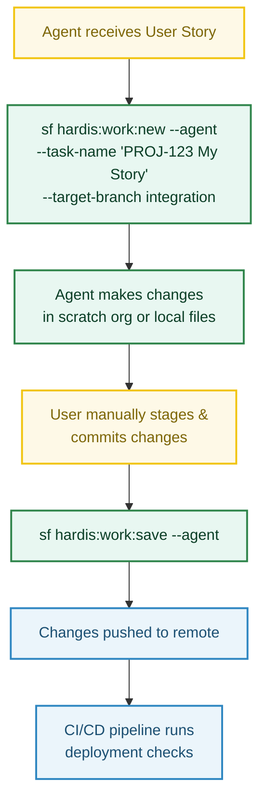

<!-- markdownlint-disable MD013 -->

# Using sfdx-hardis with AI Coding Agents

AI coding agents such as [Claude Code](https://docs.anthropic.com/en/docs/claude-code), [GitHub Copilot](https://github.com/features/copilot), or similar tools can drive sfdx-hardis commands non-interactively using the **`--agent`** flag.

This page explains how to set up agent skills (also called "tools" or "custom commands") so that your coding agent can **create a new User Story branch** and **save / push work** on your behalf.

---

## Prerequisites

- **sfdx-hardis** installed and configured in your Salesforce DX project ([Installation](installation.md))
- A `config/.sfdx-hardis.yml` config file with at least `availableTargetBranches` or `developmentBranch` defined
- The Salesforce CLI authenticated to your target org / Dev Hub
- Your AI coding agent installed and able to run shell commands in the project directory

---

## The `--agent` flag

Both `hardis:work:new` and `hardis:work:save` accept an **`--agent`** flag that switches the command to a fully **non-interactive** execution mode:

- All interactive prompts are disabled
- Required inputs must be provided as CLI flags
- The command fails fast with an explicit error message if any required input is missing, listing available options

This makes the commands safe and predictable when called by an automated agent.

---

## `hardis:work:new --agent` — Create a New User Story

Creates a Git branch (and optionally a scratch org) for a new User Story.

### Usage

```bash
sf hardis:work:new --agent --task-name "MYPROJECT-123 My User Story" --target-branch integration
```

### Required flags in agent mode

| Flag              | Description                                                                |
|-------------------|----------------------------------------------------------------------------|
| `--task-name`     | Name of the User Story. Used to generate the branch name.                  |
| `--target-branch` | The branch to create the feature branch from (e.g. `integration`, `main`). |

### Optional flags

| Flag         | Description                               |
|--------------|-------------------------------------------|
| `--open-org` | Open the org in a browser after creation. |

### Behavior in agent mode

- **Branch prefix**: uses the first configured `branchPrefixChoices` value, fallback `feature`.
- **Org type**: computed automatically from `allowedOrgTypes` in `config/.sfdx-hardis.yml`.
- **Scratch mode**: always creates a new scratch org (when applicable).
- **Skips**: sandbox initialization, updating default target branch in user config.

### Example `config/.sfdx-hardis.yml`

```yaml
availableTargetBranches:
  - integration
  - uat
  - preprod
allowedOrgTypes:
  - sandbox
```

---

## `hardis:work:save --agent` — Save and Push Your Work

Cleans sources, updates `package.xml` / `destructiveChanges.xml`, commits, and pushes changes.

> **Important**: You must manually stage and commit your metadata changes with Git **before** running this command. The command does not pull or stage metadata on your behalf in agent mode.

### Usage

```bash
sf hardis:work:save --agent
```

Or, if the target branch cannot be auto-resolved:

```bash
sf hardis:work:save --agent --targetbranch integration
```

### Optional flags

| Flag             | Description                                                                           |
|------------------|---------------------------------------------------------------------------------------|
| `--targetbranch` | Merge request target branch. Auto-resolved from config if omitted.                    |
| `--noclean`      | Skip automated source cleaning.                                                       |
| `--nogit`        | Skip git commit and push (useful if you only want cleaning + package.xml generation). |

### Behavior in agent mode

- **Metadata pull is skipped**: the user is expected to have manually staged and committed changes before running this command.
- **Data export is skipped**.
- **Push is always attempted** at the end (unless `--nogit` is set).
- **Target branch** is resolved from `--targetbranch` flag, or from the user config (`localStorageBranchTargets`) for the current branch. If it cannot be resolved, the command fails with a validation error.

---

## Setting Up Agent Skills

Below are examples for popular AI coding agents. Adapt the paths and flag values to your project.

### Claude Code

Add the following instructions to your project's `CLAUDE.md` file (at the repository root):

```markdown
## Salesforce User Story Workflow

When asked to start a new Salesforce User Story:
- Run: `sf hardis:work:new --agent --task-name "<TICKET-ID> <description>" --target-branch <branch>`
- The target branch is usually `integration` (check config/.sfdx-hardis.yml for available branches).

When asked to save / publish Salesforce work:
- Tell the user to manually stage and commit their changes with git first.
- Then run: `sf hardis:work:save --agent`
- This will clean sources, update package.xml, and push to the remote.
```

You can also register them as [Claude Code skills](https://docs.anthropic.com/en/docs/claude-code/skills) by creating Markdown files in `.claude/skills/`:

**`.claude/skills/new-user-story.md`**

```markdown
# New Salesforce User Story

When the user asks to start a new Salesforce User Story, run:

sf hardis:work:new --agent --task-name "<TICKET-ID> <description>" --target-branch <branch>

- Replace <TICKET-ID> and <description> with values from the user's request.
- Check config/.sfdx-hardis.yml for available target branches (usually `integration`).
- Do not pass --open-org unless explicitly asked.
```

**`.claude/skills/save-work.md`**

```markdown
# Save Salesforce User Story

When the user asks to save or publish their Salesforce work:

1. Remind the user to manually stage and commit their pending metadata changes with git.
2. Run: sf hardis:work:save --agent

This will clean sources, update package.xml, and push to the remote.
If the target branch cannot be auto-resolved, add --targetbranch <branch>.
```

### Other Agents

For any agent that can execute shell commands, the pattern is the same:

1. **New User Story**: `sf hardis:work:new --agent --task-name "<name>" --target-branch <branch>`
2. **Save Work**: `sf hardis:work:save --agent`

Ensure the agent has access to:

- The project directory (with `config/.sfdx-hardis.yml` configured)
- An authenticated Salesforce CLI session
- Git credentials for pushing to the remote

---

## Typical Agent Workflow

A complete agent-driven workflow looks like this:



---

## Troubleshooting

| Issue                                               | Solution                                                                                                |
|-----------------------------------------------------|---------------------------------------------------------------------------------------------------------|
| `target-branch is required with --agent`            | Provide `--target-branch <branch>` or configure `availableTargetBranches` in `config/.sfdx-hardis.yml`. |
| `target-branch="X" is not an allowed target branch` | Check `availableTargetBranches` in `config/.sfdx-hardis.yml` and use one of the listed branches.        |
| `target branch cannot be resolved` (`work:save`)    | Provide `--targetbranch <branch>` explicitly, or ensure the current branch was created with `work:new`. |
| Authentication errors                               | Ensure `sf org login` has been run and a default org is set before invoking agent commands.             |
| `sfdx-git-delta` not found (`work:save`)            | Install the plugin: `sf plugins install sfdx-git-delta`                                                 |

---

## See Also

- [Create New User Story](salesforce-ci-cd-create-new-task.md) — interactive guide
- [Publish a User Story](salesforce-ci-cd-publish-task.md) — interactive guide
- [Coding Agent Auto-Fix (Beta)](salesforce-deployment-agent-autofix.md) — auto-fix deployment errors with coding agents
- [`hardis:work:new` command reference](hardis/work/new.md)
- [`hardis:work:save` command reference](hardis/work/save.md)
