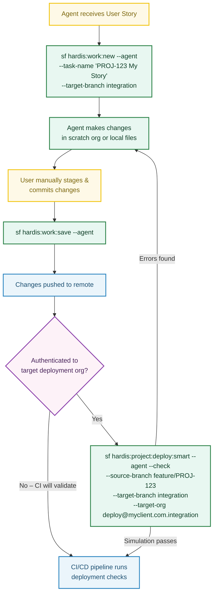

<!-- markdownlint-disable MD013 -->

# Using sfdx-hardis with AI Coding Agents

AI coding agents such as [Claude Code](https://docs.anthropic.com/en/docs/claude-code), [GitHub Copilot](https://github.com/features/copilot), or similar tools can drive sfdx-hardis commands non-interactively using the **`--agent`** flag.

This page explains how to set up agent skills (also called "tools" or "custom commands") so that your coding agent can **create a new User Story branch** and **save / push work** on your behalf.

---

## Prerequisites

- **sfdx-hardis** installed and configured in your Salesforce DX project ([Installation](installation.md))
- A `config/.sfdx-hardis.yml` config file with at least `availableTargetBranches` or `developmentBranch` defined
- The Salesforce CLI authenticated to your target org / Dev Hub
- Your AI coding agent installed and able to run shell commands in the project directory

---

## The `--agent` flag

Over 130 sfdx-hardis commands accept an **`--agent`** flag that switches to a fully **non-interactive** execution mode:

- All interactive prompts are disabled
- Required inputs must be provided as CLI flags
- The command fails fast with an explicit error message if any required input is missing, listing available options
- Sensible defaults are applied where possible, saving tokens and API calls

This makes the commands safe, predictable, and **token-efficient** when called by an automated agent.

---

## `hardis:work:new --agent` - Create a New User Story

Creates a Git branch (and optionally a scratch org) for a new User Story.

### Usage

```bash
sf hardis:work:new --agent --task-name "MYPROJECT-123 My User Story" --target-branch integration
```

### Required flags in agent mode

| Flag              | Description                                                                |
|-------------------|----------------------------------------------------------------------------|
| `--task-name`     | Name of the User Story. Used to generate the branch name.                  |
| `--target-branch` | The branch to create the feature branch from (e.g. `integration`, `main`). |

### Optional flags

| Flag         | Description                               |
|--------------|-------------------------------------------|
| `--open-org` | Open the org in a browser after creation. |

### Behavior in agent mode

- **Branch prefix**: uses the first configured `branchPrefixChoices` value, fallback `feature`.
- **Org type**: computed automatically from `allowedOrgTypes` in `config/.sfdx-hardis.yml`.
- **Scratch mode**: always creates a new scratch org (when applicable).
- **Skips**: sandbox initialization, updating default target branch in user config.

### Example `config/.sfdx-hardis.yml`

```yaml
availableTargetBranches:
  - integration
  - uat
  - preprod
allowedOrgTypes:
  - sandbox
```

---

## `hardis:work:save --agent` - Save and Push Your Work

Cleans sources, updates `package.xml` / `destructiveChanges.xml`, commits, and pushes changes.

> **Important**: You must manually stage and commit your metadata changes with Git **before** running this command. The command does not pull or stage metadata on your behalf in agent mode.

### Usage

```bash
sf hardis:work:save --agent
```

Or, if the target branch cannot be auto-resolved:

```bash
sf hardis:work:save --agent --targetbranch integration
```

### Optional flags

| Flag             | Description                                                                           |
|------------------|---------------------------------------------------------------------------------------|
| `--targetbranch` | Merge request target branch. Auto-resolved from config if omitted.                    |
| `--noclean`      | Skip automated source cleaning.                                                       |
| `--nogit`        | Skip git commit and push (useful if you only want cleaning + package.xml generation). |

### Behavior in agent mode

- **Metadata pull is skipped**: the user is expected to have manually staged and committed changes before running this command.
- **Data export is skipped**.
- **Push is always attempted** at the end (unless `--nogit` is set).
- **Target branch** is resolved from `--targetbranch` flag, or from the user config (`localStorageBranchTargets`) for the current branch. If it cannot be resolved, the command fails with a validation error.

---

## Setting Up Agent Skills

Below are examples for popular AI coding agents. Adapt the paths and flag values to your project.

### Claude Code

Add the following instructions to your project's `CLAUDE.md` file (at the repository root):

```markdown
## Salesforce User Story Workflow

When asked to start a new Salesforce User Story:
- Run: `sf hardis:work:new --agent --task-name "<TICKET-ID> <description>" --target-branch <branch>`
- The target branch is usually `integration` (check config/.sfdx-hardis.yml for available branches).

When asked to save / publish Salesforce work:
- Tell the user to manually stage and commit their changes with git first.
- Then run: `sf hardis:work:save --agent`
- This will clean sources, update package.xml, and push to the remote.
```

You can also register them as [Claude Code skills](https://docs.anthropic.com/en/docs/claude-code/skills) by creating `SKILL.md` files under `.claude/skills/<skill-name>/`:

**`.claude/skills/new-user-story/SKILL.md`**

```markdown
---
name: new-user-story
description: Start a new Salesforce User Story by creating a feature branch. Use when the user wants to start working on a new feature, bug fix, or task. Use this skill even if the user says "start a new story", "create a branch", "new feature", "new task", "work on JIRA-123", "start JIRA-123" or "begin work".
argument-hint: "[TICKET-ID description]"
allowed-tools: Bash, Read, Glob, Grep, AskUserQuestion
user-invocable: true
---

Run the following command, replacing <TICKET-ID> and <description> with values from the user's request:

sf hardis:work:new --agent --task-name "<TICKET-ID> <description>" --target-branch <branch>

- Check `config/.sfdx-hardis.yml` for available target branches (usually `integration`).
- Do not pass `--open-org` unless explicitly asked.

$ARGUMENTS
```

**`.claude/skills/save-work/SKILL.md`**

```markdown
---
name: save-work
description: Save and push Salesforce work by cleaning sources, updating package.xml, committing, and pushing. Use when the user asks to save, publish, or push their Salesforce changes. Use this skill even if the user says "save my work", "push changes", "publish story", "commit and push", or "save story".
argument-hint: "[optional target branch]"
allowed-tools: Bash, Read, Glob, Grep, AskUserQuestion
user-invocable: true
---

1. Remind the user to manually stage and commit any pending metadata changes with git before continuing.
2. Run: `sf hardis:work:save --agent`

This cleans sources, updates package.xml, and pushes to the remote.
If the target branch cannot be auto-resolved, add `--targetbranch <branch>`.

$ARGUMENTS
```

### Other Agents

For any agent that can execute shell commands, the pattern is the same:

1. **New User Story**: `sf hardis:work:new --agent --task-name "<name>" --target-branch <branch>`
2. **Save Work**: `sf hardis:work:save --agent`

Ensure the agent has access to:

- The project directory (with `config/.sfdx-hardis.yml` configured)
- An authenticated Salesforce CLI session
- Git credentials for pushing to the remote

---

## Typical Agent Workflow

A complete agent-driven workflow looks like this:



---

## Troubleshooting

| Issue                                               | Solution                                                                                                |
|-----------------------------------------------------|---------------------------------------------------------------------------------------------------------|
| `target-branch is required with --agent`            | Provide `--target-branch <branch>` or configure `availableTargetBranches` in `config/.sfdx-hardis.yml`. |
| `target-branch="X" is not an allowed target branch` | Check `availableTargetBranches` in `config/.sfdx-hardis.yml` and use one of the listed branches.        |
| `target branch cannot be resolved` (`work:save`)    | Provide `--targetbranch <branch>` explicitly, or ensure the current branch was created with `work:new`. |
| Authentication errors                               | Ensure `sf org login` has been run and a default org is set before invoking agent commands.             |
| `sfdx-git-delta` not found (`work:save`)            | Install the plugin: `sf plugins install sfdx-git-delta`                                                 |
| `deploy:smart` simulation fails with wrong org      | Make sure `config/branches/.sfdx-hardis-<target-branch>.yml` exists and contains `targetUsername`. If not authenticated to the target org, skip the step — CI/CD will validate on the PR. |
| `deploy:smart` simulation uses wrong branch scope   | Provide `--source-branch` explicitly; without it the local git branch is used for delta/PR scope.       |

---

## `hardis:org:retrieve:packageconfig --agent` - Retrieve and Update Package Config

Retrieves installed packages from a Salesforce org and optionally updates the local project configuration. In agent mode, this is a **two-step workflow**: first list the packages, then update config for the ones you need.

### Step 1 - List installed packages

```bash
sf hardis:org:retrieve:packageconfig --agent --target-org myOrg@example.com
```

Without `--packages` or `--update-all-config`, the command **only lists** installed packages and returns them as JSON (with `--json`). No config file is modified.

### Step 2 - Update config

Choose one of three update strategies:

**Option A** - Update only specific packages by name:

```bash
sf hardis:org:retrieve:packageconfig --agent --packages "MyManagedPkg,AnotherPkg" --target-org myOrg@example.com
```

**Option B** - Update only packages already present in your project config (version upgrade):

```bash
sf hardis:org:retrieve:packageconfig --agent --update-existing-config --target-org myOrg@example.com
```

This is the safest option for automation: it upgrades versions of known packages without adding new ones.

**Option C** - Update config with all retrieved packages:

```bash
sf hardis:org:retrieve:packageconfig --agent --update-all-config --target-org myOrg@example.com
```

### Flags summary

| Flag                       | Description                                                                 |
|----------------------------|-----------------------------------------------------------------------------|
| `--packages`               | Comma-separated list of package names or subscriber IDs to update in config |
| `--update-existing-config` | Update only packages already in the project config (version upgrade)        |
| `--update-all-config`      | Update config with all retrieved packages (existing and new)                |
| `--target-org`             | Salesforce org to retrieve packages from (required)                         |

### Agent skill example (Claude Code)

**`.claude/skills/update-package-config/SKILL.md`**

```markdown
---
name: update-package-config
description: Sync or update installed managed package versions in the project configuration from a Salesforce org. Use when the user asks to update packages, sync package versions, or retrieve package configuration. Use this skill even if the user says "update packages", "sync packages", "upgrade managed packages", or "retrieve package config".
argument-hint: "[org alias or username]"
allowed-tools: Bash, Read, Glob, Grep, AskUserQuestion
user-invocable: true
---

1. List the installed packages to see what is available:
   `sf hardis:org:retrieve:packageconfig --agent --target-org <org> --json`

2. Review the JSON output to identify which packages to update.

3. Update config using the appropriate strategy (pick one):
   - **Specific packages**: `sf hardis:org:retrieve:packageconfig --agent --packages "<pkg1>,<pkg2>" --target-org <org>`
   - **Upgrade existing only** (safest): `sf hardis:org:retrieve:packageconfig --agent --update-existing-config --target-org <org>`
   - **All packages**: `sf hardis:org:retrieve:packageconfig --agent --update-all-config --target-org <org>`

Prefer `--update-existing-config` for safe version upgrades.
Use `--update-all-config` only if the user explicitly asks to sync all packages.
The `--target-org` flag is required.

$ARGUMENTS
```

---

## `hardis:project:deploy:smart --agent` - Simulate Deployment to Target Org *(optional)*

Runs a full smart deployment **validation** (check/simulate mode) against a target org without applying any changes. Run this **after `hardis:work:save`** so that the committed and pushed sources are used for delta scope and git diff calculations.

This step is **optional**: if the Salesforce CLI is not authenticated to the target deployment org locally, skip it — the CI/CD pipeline will run the same validation automatically when the pull request is opened.

### Usage

```bash
sf hardis:project:deploy:smart --agent --check \
  --source-branch feature/my-feature \
  --target-branch integration \
  --target-org deploy@myclient.com.integration
```

> **Note**: `--target-org` must be the **target deployment org** (e.g. the integration sandbox), not the developer's current working org. If you are not authenticated to it locally, skip this step — CI/CD will validate the deployment on the pull request.

### Required flags in agent mode

| Flag              | Description                                                                                                                  |
|-------------------|------------------------------------------------------------------------------------------------------------------------------|
| `--target-org`    | The **target deployment org** to validate against (e.g. `deploy@myclient.com.integration`). Must be authenticated locally. This is a different org from the developer's current working org. |
| `--check`         | Explicit simulation flag. Implicit in agent mode but should always be passed to make the intent clear.                       |
| `--source-branch` | Source git branch. Overrides local branch detection so delta scope and PR comment tracking use the correct branch.           |
| `--target-branch` | Target git branch. Sets `FORCE_TARGET_BRANCH` and loads `config/branches/.sfdx-hardis-BRANCHNAME.yml`, which provides the correct `targetUsername` for that environment automatically. |

### Behavior in agent mode

- **Optional step**: if the Salesforce CLI is not authenticated to the target deployment org, skip this command entirely. The pull request CI/CD pipeline performs the same validation.
- **Always simulation**: deployment is forced into check/validate mode — `--check` is implicit but should be passed explicitly. No changes are applied to the org.
- **Target org is the deployment org**: unlike day-to-day usage where `--target-org` is the developer's sandbox, here it must point to the environment being simulated (integration, uat, etc.).
- **Target username from config**: the `targetUsername` used for deployment commands is read from the target branch config file; the `--target-org` flag provides the authenticated connection.
- **Source branch override**: sets `FORCE_SOURCE_BRANCH` so delta deployment scope uses the correct base branch.
- **Deployment actions**: pre- and post-deploy actions run in check context. If a `customUsername` authentication fails, the action is **skipped** (not failed) so the simulation can continue.

### Agent skill example (Claude Code)

**`.claude/skills/simulate-deployment/SKILL.md`**

````markdown
---
name: simulate-deployment
description: Simulate (validate) a Salesforce deployment from a feature branch to a target branch, without applying any changes. Use when the user asks to check if changes are deployable, validate a deployment, run a check deploy, or preview deployment to an org. Use this skill even if the user says "check if my changes can be deployed", "validate deployment", "simulate deploy to integration", or "will my changes break anything".
argument-hint: "[source branch] [target branch] [target org]"
allowed-tools: Bash, Read, Glob, Grep, AskUserQuestion
user-invocable: true
---

This step is **optional** and must run **after `hardis:work:save`** (the commits must exist before the simulation can use them for delta scope). If the Salesforce CLI is not authenticated to the target deployment org locally, skip it and inform the user — the CI/CD pipeline will perform the same validation when the pull request is opened.

1. Check whether the target deployment org is authenticated locally:
   ```bash
   sf org list --json
   ```
   If the target org username is not listed, skip the simulation and tell the user that CI/CD will validate it on the PR.

2. If authenticated, run the simulation:
   ```bash
   sf hardis:project:deploy:smart --agent --check \
     --source-branch <source-branch> \
     --target-branch <target-branch> \
     --target-org <target-deployment-org>
   ```

- `--check`: always include this flag to make the simulation intent explicit.
- `--source-branch`: the feature branch being simulated (e.g. `feature/PROJ-123-my-story`). Use the current git branch if the user does not specify.
- `--target-branch`: the environment to simulate deployment to (e.g. `integration`, `uat`, `main`). Check `config/.sfdx-hardis.yml` for available target branches (`availableTargetBranches`).
- `--target-org`: the **target deployment org** username or alias (e.g. `deploy@myclient.com.integration`). This is the org that corresponds to `--target-branch`, **not** the developer's current working org.

This always runs in simulation mode (check-only). No changes are applied to the org.

$ARGUMENTS
````

---

## Deployment Actions Commands (`hardis:project:action:*`)

Deployment actions are pre- or post-deployment steps stored in YAML config files and executed automatically during CI/CD pipelines. They can be scoped to the whole **project**, a specific **branch**, or a **pull request**.

| Scope     | Config file                                            |
|-----------|--------------------------------------------------------|
| `project` | `config/.sfdx-hardis.yml`                              |
| `branch`  | `config/branches/.sfdx-hardis.<branch>.yml`            |
| `pr`      | `scripts/actions/.sfdx-hardis.<prId>.yml`              |

Six action types are available:

| Type                | Required parameters                            |
|---------------------|------------------------------------------------|
| `command`           | `--command`                                    |
| `apex`              | `--apex-script`                                |
| `data`              | `--sfdmu-project`                              |
| `publish-community` | `--community-name`                             |
| `manual`            | `--instructions`                               |
| `schedule-batch`    | `--class-name`, `--cron-expression`            |

---

### `hardis:project:action:list --agent` - List Actions

```bash
sf hardis:project:action:list --agent --scope branch --when pre-deploy
sf hardis:project:action:list --agent --scope pr --pr-id 123 --when post-deploy --json
```

#### Required flags

| Flag        | Description                                              |
|-------------|----------------------------------------------------------|
| `--scope`   | `project`, `branch`, or `pr`                             |
| `--when`    | `pre-deploy` or `post-deploy`                            |

#### Optional flags

| Flag        | Description                                                        |
|-------------|--------------------------------------------------------------------|
| `--pr-id`   | PR ID (for `pr` scope). Use `current` to auto-detect from branch.  |
| `--branch`  | Branch name (for `branch` scope, defaults to current branch).      |

---

### `hardis:project:action:create --agent` - Create an Action

```bash
# Shell command, branch scope
sf hardis:project:action:create --agent \
  --scope branch --when pre-deploy \
  --type command --label "Disable triggers" \
  --command "sf apex run --file scripts/disable-triggers.apex"

# Data import, PR scope
sf hardis:project:action:create --agent \
  --scope pr --pr-id 123 --when post-deploy \
  --type data --label "Import test data" --sfdmu-project TestData

# Apex script, project scope
sf hardis:project:action:create --agent \
  --scope project --when post-deploy \
  --type apex --label "Set up custom settings" \
  --apex-script scripts/apex/setup-custom-settings.apex
```

When `--pr-id` is omitted for `pr` scope, actions are saved to a **draft file** (`scripts/actions/.sfdx-hardis.draft.yml`). Run `hardis:project:action:link-pull-request` to associate the draft with a PR once it is created.

#### Required flags

| Flag        | Description                                              |
|-------------|----------------------------------------------------------|
| `--scope`   | `project`, `branch`, or `pr`                             |
| `--when`    | `pre-deploy` or `post-deploy`                            |
| `--type`    | Action type (see table above)                            |
| `--label`   | Human-readable label                                     |

#### Type-specific required flags

| Type                | Required flag(s)                                      |
|---------------------|-------------------------------------------------------|
| `command`           | `--command`                                           |
| `apex`              | `--apex-script`                                       |
| `data`              | `--sfdmu-project`                                     |
| `publish-community` | `--community-name`                                    |
| `manual`            | `--instructions`                                      |
| `schedule-batch`    | `--class-name`, `--cron-expression`                   |

#### Optional flags

| Flag                    | Default | Description                                                      |
|-------------------------|---------|------------------------------------------------------------------|
| `--pr-id`               |         | PR ID (for `pr` scope). `current` auto-detects from branch.     |
| `--branch`              |         | Branch name (for `branch` scope).                                |
| `--context`             | `all`   | `all`, `check-deployment-only`, or `process-deployment-only`     |
| `--skip-if-error`       | `false` | Skip action if deployment already failed                         |
| `--allow-failure`       | `false` | Do not block deployment if action fails                          |
| `--run-only-once-by-org`| `true`  | Execute only once per target org (state tracked in the "Deployment Actions" PR comment) |
| `--custom-username`     |         | Run action as a specific Salesforce user                         |

---

### `hardis:project:action:update --agent` - Update an Action

First list actions to get the `--action-id` (the UUID shown in the `Id` column).

```bash
# Update label and command
sf hardis:project:action:update --agent \
  --scope branch --when pre-deploy \
  --action-id <uuid> --label "New label" --command "echo updated"

# Change context
sf hardis:project:action:update --agent \
  --scope project --when post-deploy \
  --action-id <uuid> --context check-deployment-only
```

#### Required flags

| Flag          | Description                                          |
|---------------|------------------------------------------------------|
| `--scope`     | `project`, `branch`, or `pr`                         |
| `--when`      | `pre-deploy` or `post-deploy`                        |
| `--action-id` | UUID of the action to update (from `action:list`)    |

#### Optional flags (provide only the ones to change)

`--label`, `--command`, `--apex-script`, `--sfdmu-project`, `--community-name`, `--instructions`, `--class-name`, `--cron-expression`, `--context`, `--skip-if-error`, `--allow-failure`, `--run-only-once-by-org`, `--custom-username`, `--pr-id`, `--branch`

---

### `hardis:project:action:delete --agent` - Delete an Action

```bash
sf hardis:project:action:delete --agent \
  --scope branch --when pre-deploy --action-id <uuid>
```

#### Required flags

| Flag          | Description                                       |
|---------------|---------------------------------------------------|
| `--scope`     | `project`, `branch`, or `pr`                      |
| `--when`      | `pre-deploy` or `post-deploy`                     |
| `--action-id` | UUID of the action to delete (from `action:list`) |

---

### `hardis:project:action:reorder --agent` - Reorder Actions

Two modes are available.

**Move a single action to a specific position (1-based):**

```bash
sf hardis:project:action:reorder --agent \
  --scope branch --when pre-deploy \
  --action-id <uuid> --position 2
```

**Set the complete order in one call (comma-separated UUIDs):**

```bash
sf hardis:project:action:reorder --agent \
  --scope branch --when pre-deploy \
  --order "<uuid1>,<uuid2>,<uuid3>"
```

The `--order` list must contain **every** action ID exactly once. Retrieve the current list with `action:list --json`.

#### Required flags

| Flag        | Description                                                          |
|-------------|----------------------------------------------------------------------|
| `--scope`   | `project`, `branch`, or `pr`                                         |
| `--when`    | `pre-deploy` or `post-deploy`                                        |

One of:

| Flag          | Description                                                        |
|---------------|--------------------------------------------------------------------|
| `--action-id` + `--position` | Move one action to a 1-based position                |
| `--order`     | Comma-separated list of all action UUIDs in the desired order      |

---

### `hardis:project:action:link-pull-request --agent` - Link Draft Actions to a PR

When actions were created for `pr` scope without a specific `--pr-id`, they are saved in a draft file. This command renames the draft to the target PR file so the actions are picked up during CI/CD for that PR.

```bash
# Link draft to PR 123
sf hardis:project:action:link-pull-request --agent --pr-id 123

# Auto-detect PR from current branch
sf hardis:project:action:link-pull-request --agent --pr-id current
```

#### Required flags in agent mode

| Flag      | Description                                                              |
|-----------|--------------------------------------------------------------------------|
| `--pr-id` | PR number, or `current` to detect from the current git branch            |

---

### Agent Skill Example (Claude Code)

**`.claude/skills/manage-deployment-actions/SKILL.md`**

```markdown
---
name: manage-deployment-actions
description: Create, list, update, delete, or reorder deployment actions that run before or after Salesforce deployments. Actions are scoped to the whole project, a specific branch, or a pull request. Use when the user asks to add, modify, or remove pre-deploy or post-deploy steps. Use this skill even if the user says "add a pre-deploy action", "create a deployment step", "list actions", "delete action", "reorder steps", or "link draft actions to PR".
argument-hint: "[description of what the user wants to do]"
allowed-tools: Bash, Read, Glob, Grep, AskUserQuestion
user-invocable: true
---

Use the commands below to manage deployment actions. Always list first to understand the current state.

## List actions

```bash
sf hardis:project:action:list --agent --scope <project|branch|pr> --when <pre-deploy|post-deploy> [--pr-id <id>] [--branch <name>] [--json]
```

## Create an action

```bash
sf hardis:project:action:create --agent \
  --scope <project|branch|pr> --when <pre-deploy|post-deploy> \
  --type <command|apex|data|publish-community|manual|schedule-batch> \
  --label "<label>" \
  [--command "<cmd>"] [--apex-script <path>] [--sfdmu-project <name>] \
  [--community-name <name>] [--instructions "<text>"] \
  [--class-name <ClassName>] [--cron-expression "<expr>"] \
  [--pr-id <id>] [--context all|check-deployment-only|process-deployment-only]
```

If `--pr-id` is omitted for `pr` scope, actions go to a draft file. Run `link-pull-request` once the PR is created.

## Update an action (provide only the flags to change)

```bash
sf hardis:project:action:update --agent \
  --scope <scope> --when <pre-deploy|post-deploy> --action-id <uuid> \
  [--label "..."] [--command "..."] [--context ...]
```

## Delete an action

```bash
sf hardis:project:action:delete --agent \
  --scope <scope> --when <pre-deploy|post-deploy> --action-id <uuid>
```

## Reorder actions

```bash
# Move one action to position N (1-based)
sf hardis:project:action:reorder --agent \
  --scope <scope> --when <pre-deploy|post-deploy> \
  --action-id <uuid> --position <N>

# Set complete order in one call (all UUIDs required)
sf hardis:project:action:reorder --agent \
  --scope <scope> --when <pre-deploy|post-deploy> \
  --order "<uuid1>,<uuid2>,<uuid3>"
```

## Link draft actions to a PR

```bash
sf hardis:project:action:link-pull-request --agent --pr-id <prId|current>
```

$ARGUMENTS
```

---

## See Also

- [Create New User Story](salesforce-ci-cd-create-new-task.md) - interactive guide
- [Publish a User Story](salesforce-ci-cd-publish-task.md) - interactive guide
- [Coding Agent Auto-Fix (Beta)](salesforce-deployment-agent-autofix.md) - auto-fix deployment errors with coding agents
- [`hardis:work:new` command reference](hardis/work/new.md)
- [`hardis:work:save` command reference](hardis/work/save.md)
- [`hardis:project:deploy:smart` command reference](hardis/project/deploy/smart.md)
- [`hardis:project:action:create` command reference](hardis/project/action/create.md)
- [`hardis:project:action:list` command reference](hardis/project/action/list.md)
- [`hardis:project:action:update` command reference](hardis/project/action/update.md)
- [`hardis:project:action:delete` command reference](hardis/project/action/delete.md)
- [`hardis:project:action:reorder` command reference](hardis/project/action/reorder.md)
- [`hardis:project:action:link-pull-request` command reference](hardis/project/action/link-pull-request.md)
