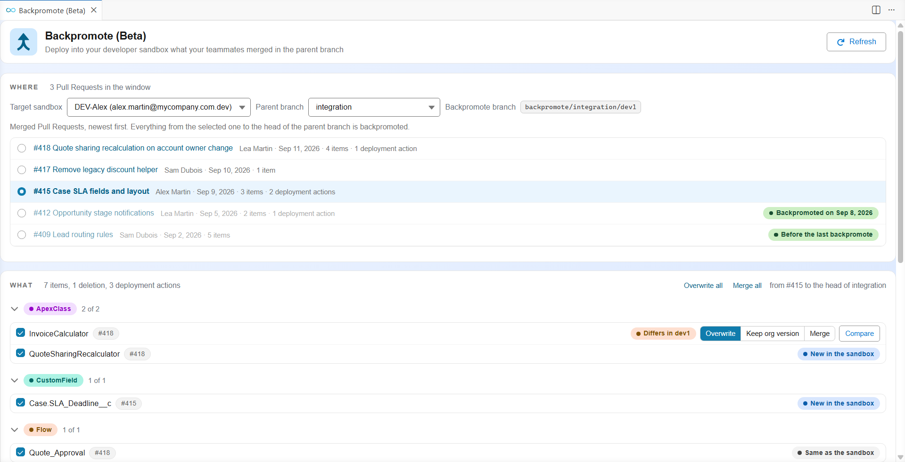
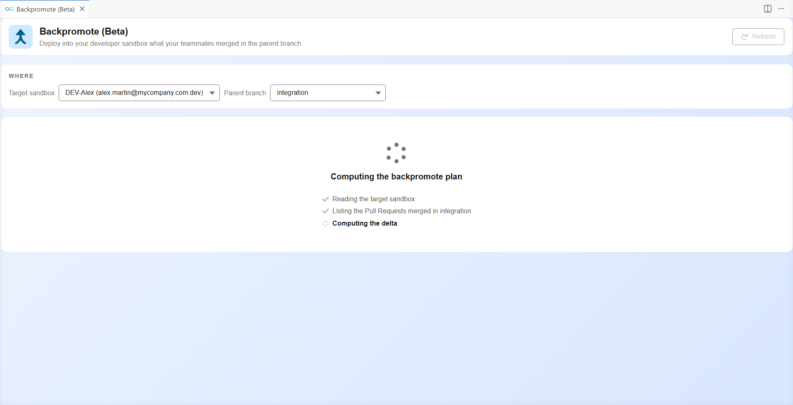
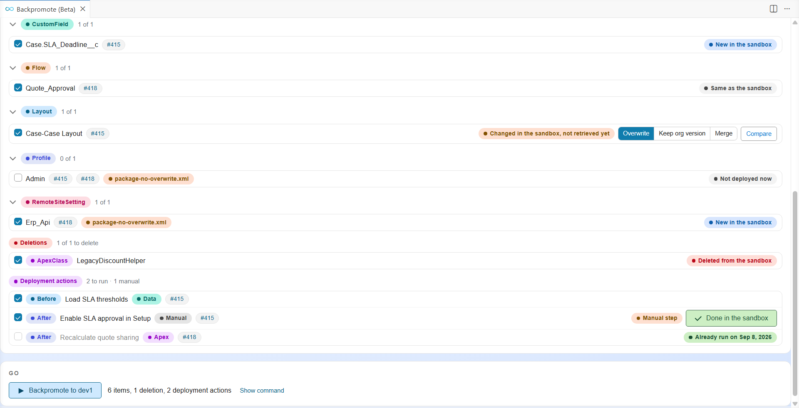
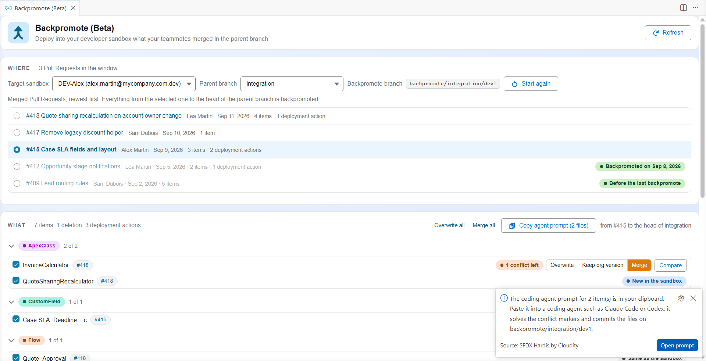
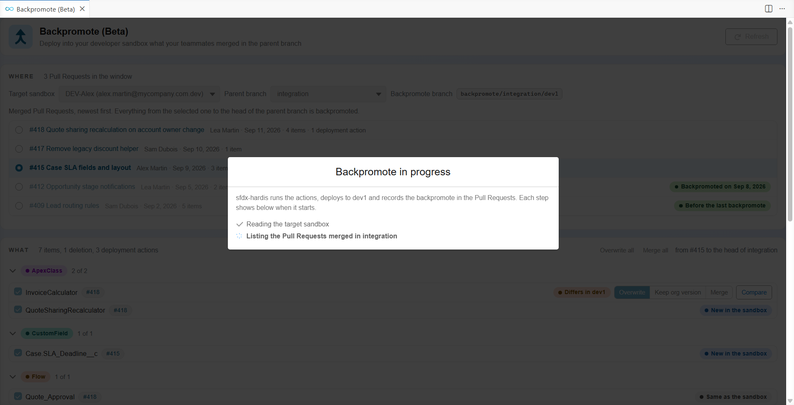
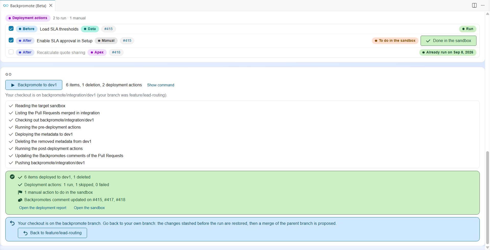
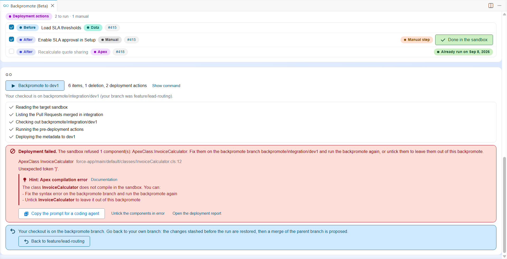
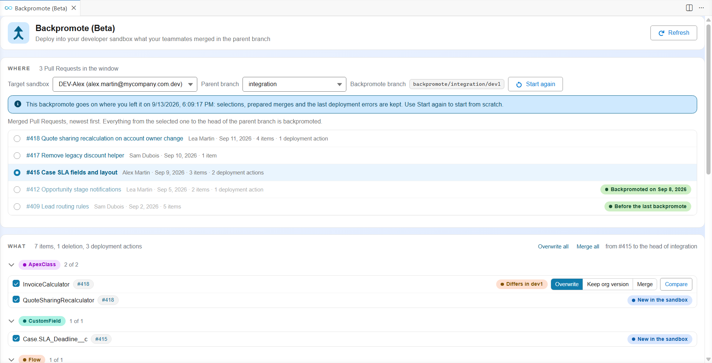

<!-- markdownlint-disable MD013 MD033 -->

# Backpromote to your dev sandbox (Beta)

> This feature is in Beta. Please report any issue or feedback on the [sfdx-hardis GitHub repository](https://github.com/hardisgroupcom/sfdx-hardis/issues).

While you work in your developer sandbox, your teammates merge their User Stories in the parent branch (`integration`, `uat`...). Your sandbox falls behind: fields, classes or flows they created are missing, and your next User Story may conflict with theirs.

A **backpromote** deploys into your sandbox what the team merged since your last backpromote: the metadata, the deletions, and the deployment actions of their Pull Requests.



## When to backpromote

- **Before starting a User Story**, so that you work on the latest version of the parent branch. [New User Story](salesforce-ci-cd-create-new-task.md) no longer updates the metadata of an existing sandbox: backpromote does.
- **During a long User Story**, when a teammate merged something you need.
- **After a sandbox refresh**, to bring the refreshed sandbox up to date with the parent branch.
- **Whenever several people share the same sandbox**: each backpromote is recorded on the Pull Requests, so the next person starts where the previous one ended, from any computer.

## Before you start

- Install the [VS Code SFDX Hardis extension](https://marketplace.visualstudio.com/items?itemName=NicolasVuillamy.vscode-sfdx-hardis).
- Authenticate your developer sandbox (or scratch org) in the Orgs Manager.
- Have a **git provider token** on your computer, for example in a `.env` file at the root of the repository: `GITHUB_TOKEN`, `CI_SFDX_HARDIS_GITLAB_TOKEN`, `SYSTEM_ACCESSTOKEN` (Azure DevOps) or `CI_SFDX_HARDIS_BITBUCKET_TOKEN`. The panel tells you when it is missing.

## Backpromote in 5 steps

### 1. Open the panel

Click the **Backpromote** card below the DevOps Pipeline diagram, or **Backpromote to your dev sandbox (Beta)** in the commands panel.

### 2. Choose where

Pick the **target sandbox** and the **parent branch**. Your default org is picked for you when it is a developer sandbox. The parent branch is picked for you when it is your current branch, or when only one is allowed. Production and the orgs of major branches are greyed: a backpromote never deploys there. The last entry of the sandbox list opens the Orgs Manager to connect another org.

The plan is computed once both are chosen. The panel shows each step as it happens:



The merged Pull Requests are listed newest first:

- **Backpromoted on (date)**: your sandbox already received it.
- **Before the last backpromote**: older, already covered.
- **Before refresh**: received by the sandbox before it was refreshed, so counted as not received.

The first Pull Request not backpromoted yet is selected: it and everything merged after it will be deployed. Select another one to start earlier or later, or click **Show earlier Pull Requests**. Click a Pull Request title or number to open it.

### 3. Review what will be deployed

The **What** block lists the metadata grouped by type, the deletions and the deployment actions. Everything is ticked; untick what must not go now (it will be offered again next time).

Each item says how it compares with your sandbox:

| Label                                     | Meaning                                | What happens                      |
|-------------------------------------------|----------------------------------------|-----------------------------------|
| New in the sandbox                        | The sandbox does not have it           | Deployed                          |
| Same as the sandbox                       | Nothing changes                        | Deployed (no effect)              |
| Differs in (sandbox)                      | Your sandbox has another version       | You choose: see step 4            |
| Changed in the sandbox, not retrieved yet | Someone changed it in the sandbox      | You choose: see step 4            |
| Deleted from the sandbox                  | A deletion merged in the parent branch | Deleted                           |
| Not deployed now                          | You unticked it                        | Left out, offered again next time |

Items of `package-no-overwrite.xml` carry a **package-no-overwrite.xml** marker. When your sandbox already has them they start unticked, so that its version is kept; tick one to deploy it anyway. When your sandbox does not have them yet, they are ticked like any other item.



Deployment actions (data loads, Apex scripts, manual steps...) of the merged Pull Requests are listed with their state. An action never runs twice in the same sandbox: the ones already run are greyed with their date. A **Manual step** is done by hand in the sandbox, then confirmed with **Done in the sandbox**.

### 4. Decide for the items that differ

When your sandbox holds a version of an item that differs from the parent branch, choose on its line:

- **Overwrite** (default): the parent branch version is deployed.
- **Keep org version**: the item is left out, your sandbox version stays, and the item is offered again next time.
- **Merge**: keep both versions. The file is written with conflict markers and the VS Code merge editor opens: solve the conflicts and save.

**Compare** opens the VS Code diff editor between the two versions. **Overwrite all** sets Overwrite everywhere.

To let a coding agent do the merges, click **Merge all**: every ticked item that differs is prepared at once, and a prompt is copied to your clipboard. Paste it into Claude Code, Codex or GitHub Copilot: the agent solves the conflicts and commits the files on the backpromote branch. **Copy agent prompt** copies that prompt again later.



The **Backpromote** button stays disabled while a file still holds conflict markers.

### 5. Backpromote

Click **Backpromote to (sandbox)**. A window shows each step while it runs:



When it is done, the panel shows what was deployed and deleted, the actions run, and the Pull Requests updated:



Your checkout stays on the backpromote branch. Click **Back to (your branch)** to return to your User Story branch: the changes set aside before the run are restored, and a merge of the parent branch is proposed so that your next save does not commit the backpromoted metadata as your own work.

## Other situations

### You have uncommitted changes

Before switching to the backpromote branch, the panel asks what to do with them: **Commit them on my branch** (with a message), or **Stash them**, restored by **Back to my branch**.

### The deployment fails

The panel shows each component the sandbox refused, with its file, the Salesforce error, and an **sfdx-hardis hint** explaining the usual cause and how to fix it (with a link to its documentation). When the AI deployment assistant is configured, its suggestion is shown too.



Then either:

- **Fix the components on the backpromote branch** and click Backpromote again. **Copy the prompt for a coding agent** gives Claude Code, Codex or GitHub Copilot everything it needs (errors, hints, files) to fix them there and commit.
- **Leave them out**: **Untick the components in error** and click Backpromote again.

**Open the deployment report** shows the full deployment output.

### You come back later

Close VS Code, go for lunch, come back: when you open the panel again while your checkout is on the backpromote branch, the backpromote goes on where you left it. The sandbox, the parent branch, the start, your ticks and decisions, the prepared merges and the last deployment errors are all kept.



To start from scratch instead, click **Start again**: the backpromote branch is deleted (with its prepared merges), and a new plan is computed. The history recorded on the Pull Requests is kept.

### Several people use the same sandbox

Nothing needs to be shared by hand. Each backpromote writes a row for the sandbox in a **"Backpromotes"** comment on every Pull Request it deployed. The next backpromote, from any computer, reads those comments and starts after the last Pull Request received.

### Your sandbox was refreshed

A refreshed sandbox is a new org. Its previous backpromotes are shown as **Before refresh**, so no start is selected for you: pick the first Pull Request to deploy. The deployment actions count as not run yet.

### From a terminal or a coding agent

```bash
sf hardis:work:backpromote --target-org dev1
```

The command asks the same questions as the panel. `--plan --json` returns the plan without deploying anything, `--auto` takes every decision from the flags, and `--agent` lets a coding agent drive the whole backpromote. See the [command page](hardis/work/backpromote.md) for all the flags.

## What a backpromote never does

- Deploy to production, or to the org of a major branch.
- Commit on a major branch or a promotion branch. It only commits on its own backpromote branch, and on your User Story branch only when you choose to commit your uncommitted changes.
- Run a deployment action twice in the same sandbox.
- Deploy a file that still holds conflict markers.
- Overwrite the sandbox version of a `package-no-overwrite.xml` item you did not tick.

## Configuration

| Setting                                        | Where                     | Meaning                                                                                         |
|------------------------------------------------|---------------------------|-------------------------------------------------------------------------------------------------|
| `developmentBranch`, `availableTargetBranches` | `config/.sfdx-hardis.yml` | The parent branches you can backpromote from.                                                   |
| `backpromoteScanLimit`                         | `config/.sfdx-hardis.yml` | How many merged Pull Requests are read to find the last backpromote of a sandbox (default 100). |
| Branch rules                                   | Git provider              | Pushes to `backpromote/*` branches must be allowed, and no CI/CD job should run on them.        |

<details markdown="1">
<summary>Technical explanations</summary>

### Vocabulary

| Term                   | Meaning                                                                                                                                                                                                                                                                                     |
|------------------------|---------------------------------------------------------------------------------------------------------------------------------------------------------------------------------------------------------------------------------------------------------------------------------------------|
| Window                 | The start Pull Request and everything merged after it, up to the head of the parent branch.                                                                                                                                                                                                 |
| Backpromote branch     | `backpromote/<parent branch>/<sandbox name>`, created from the parent branch. It only holds the merges made by hand and the fixes committed after a failed deployment; the deployment runs from it, and it is pushed when it holds such commits. `hardis:work:save` refuses to run from it. |
| Sandbox name           | Read from the instance URL (`mycompany--dev1.sandbox.my.salesforce.com` gives `dev1`), else from the username, else the org id. `--sandbox-name` overrides it.                                                                                                                              |
| "Backpromotes" comment | Found by the hidden marker `<!-- sfdx-hardis backpromotes -->`. It holds a hidden JSON block and two tables: one row per sandbox (name, org id, date, user, parent branch, complete or partial with the items left out) and one row per deployment action run.                              |

### How the plan is computed

1. **Checks:** a git provider token, a target org that is a developer sandbox or a scratch org (not production, not an org declared for a major branch in `config/branches`), and an allowed parent branch.
2. **History:** the merged Pull Requests of the parent branch are read newest first, in batches sized for the git provider, until one holds a row for this sandbox and org id. The next one is the default start. When a merge brought several Pull Requests (a retrofit of `main` into `integration`), each Pull Request gets the files of its own merge commit.
3. **Delta:** sfdx-git-delta computes what the window deploys and deletes. The deployment actions come from `scripts/actions/.sfdx-hardis.<PR>.yml` of each Pull Request.
4. **Comparison:** the items are retrieved from the sandbox into a blank sfdx project, in source format, and compared with the parent branch version. Files the org shows as unchanged since the previous plan (source tracking revision, or metadata list dates) are reused from a cache per org id; `SFDX_HARDIS_BACKPROMOTE_RETRIEVE_CACHE=false` turns the cache off.
5. **Merges:** three-way with `git merge-file` when the sandbox already received a backpromote (the base is the version at the start of the window), two-way otherwise.

### How the run works

The working tree is committed or stashed, the checkout switches to the backpromote branch (another git worktree holding that branch is removed), the merged files are committed, then the pre-deployment actions run, the metadata is deployed with `NoTestRun`, the deletions are applied, the post-deployment actions run, the "Backpromotes" comments are written, and the branch is pushed with `--force-with-lease` when it holds commits of its own. A file still holding conflict markers is never deployed.

When the deployment fails, the refused components are returned with the tips of the sfdx-hardis deployment assistant, and a prompt for a coding agent is written in `hardis-report/backpromote-deploy-errors-prompt-<runId>.md`.

### State on your computer

- The plan, the prepared merges and the comparison are cached under the temporary folder, in `sfdx-hardis/backpromote/`, per run id. Deleting it loses nothing that matters.
- The VS Code panel keeps, per workspace and backpromote branch, the choices and the last errors, to resume the backpromote when it is opened again on that branch.
- When `SFDX_HARDIS_PROGRESS_FILE` is set (the panel sets it), each step is appended to that file as one JSON line.

### Refreshed sandbox

A refreshed sandbox keeps its name but gets a new org id. Its old rows are history, not state: the Pull Requests show "Before refresh", nothing counts as received, and the deployment actions count as not run yet.

</details>
