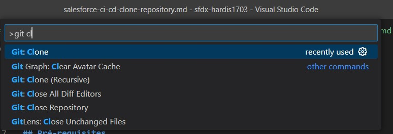
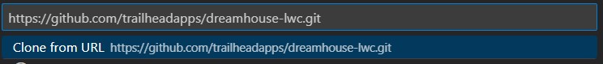
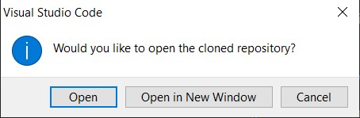
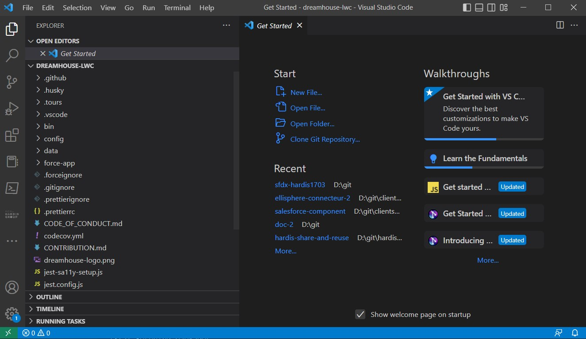

<!-- markdownlint-disable MD013 -->

- [Pre-requisites](#pre-requisites)
- [Clone the repository](#clone-the-repository)

___

## Pre-requisites

You need to access to a Git repository and the url of the repository to clone.

The [release manager](salesforce-ci-cd-release-home.md) of the project can provide it.

It looks like the following: `https://github.com/trailheadapps/dreamhouse-lwc.git`

___

## Clone the repository

- In Visual Studio Code, hit **CTRL+Shirt+P** then look for command **Git clone** then click to select it.

{ align=center }

- Paste the **url of your git repository** then hit **ENTER**
  - If you are asked for a directory and you don't have one yet, create an empty directory at the root of your hard drive, and select it (examples: `C:/git` or `D:/git` )

{ align=center }

- Click on the `Open` notification in VsCode

{ align=center }

- You are now ready to [create a new task](salesforce-ci-cd-create-new-task.md) !

{ align=center }

