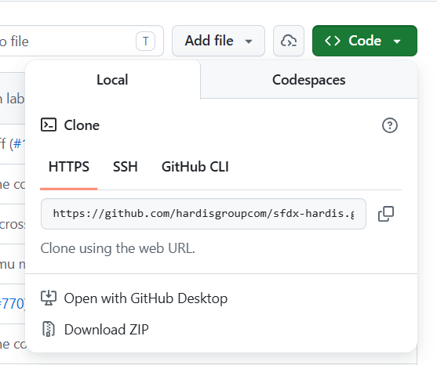
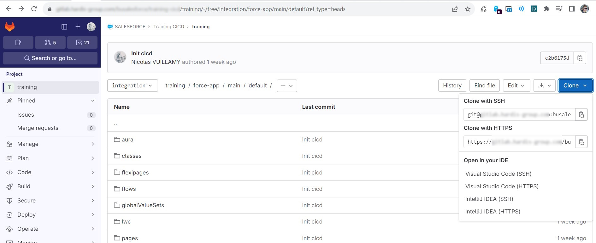
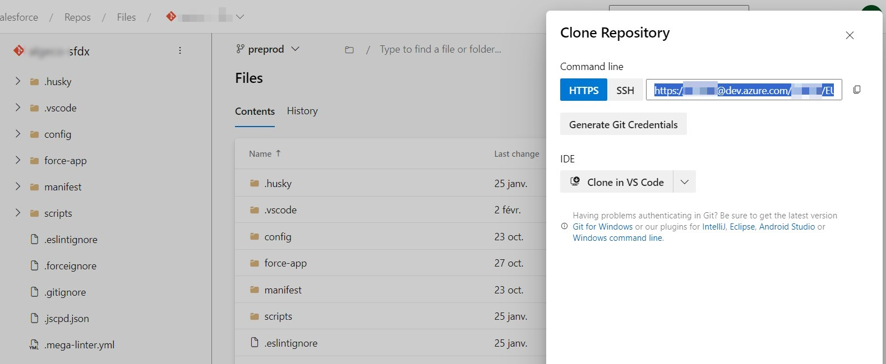
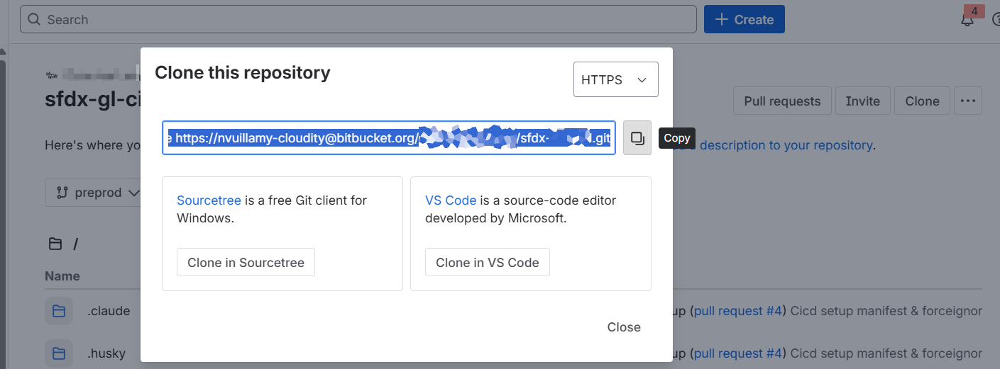
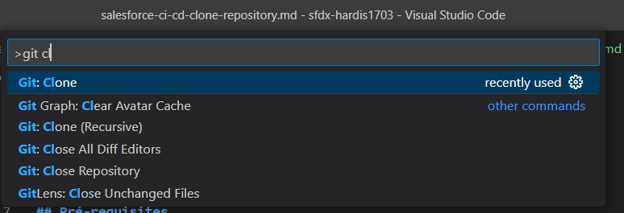
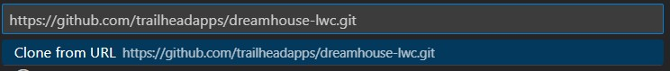
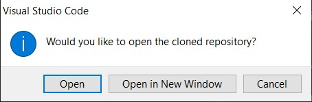
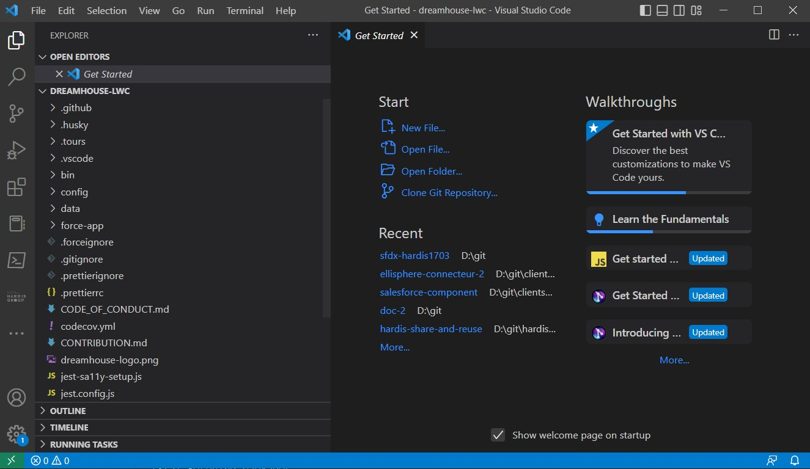

<!-- markdownlint-disable MD013 -->

- [Pre-requisites](#pre-requisites)
- [Clone the repository](#clone-the-repository)
  - [From the Git server UI](#from-the-git-server-ui)
  - [From Visual Studio Code](#from-visual-studio-code)

> If you are prompted for a username and password when cloning, you need a **Personal Access Token**. See [Create Git access tokens](salesforce-ci-cd-git-tokens.md) for step-by-step instructions for GitHub, GitLab, Azure DevOps and Bitbucket.

---

## Pre-requisites

You need to access to a Git repository and the url of the repository to clone.

The [release manager](salesforce-ci-cd-release-home.md) of the project can provide it.

It looks like the following: `https://github.com/trailheadapps/dreamhouse-lwc.git`

---

## Clone the repository

> If you don't have a folder for your git repositories, create a **C:\git** folder and use it as destination for your git clones !

### From the Git server UI

Git providers UIs sometimes have a button **Clone -> Open In VsCode**

If you can use it, use it :)

#### GitHub

Click the green **Code** button, make sure the **HTTPS** tab is selected, then click the copy icon next to the URL. Use it in the [**From Visual Studio Code**](#from-visual-studio-code) section below to clone.

{ align=center }

#### Gitlab

If later you are prompted for username and password, you might need to create a Personal Access Token ([video tuto here](https://www.youtube.com/watch?v=9y5VmmYHuIg), or see the [step-by-step guide](salesforce-ci-cd-git-tokens.md#gitlab)) and use it as password.

If later, it prompts several times the same password in VsCode, run the following command line

`git config --global credential.helper store`

#### Azure

In Azure DevOps, use **Clone** -> **Open in Visual Studio Code** from your repository page.

If this option is not available, copy the **HTTPS** repository URL and use it in the [**From Visual Studio Code**](#from-visual-studio-code) section below.

If you are prompted for credentials, generate an Azure DevOps Personal Access Token (see the [step-by-step guide](salesforce-ci-cd-git-tokens.md#azure-devops)) and use it as password.

#### Bitbucket

Click the **Clone** button on your repository page. In the dialog, switch the dropdown from **SSH** to **HTTPS** (top-right of the dialog), then click the copy icon next to the URL. Use it in the [**From Visual Studio Code**](#from-visual-studio-code) section below to clone.

> You might need to remove "git clone" at the beginning of the copied text.

{ align=center }

### From Visual Studio Code

- In Visual Studio Code, hit **CTRL+Shirt+P** then look for command **Git clone** then click to select it.

{ align=center }

- Paste the **url of your git repository** then hit **ENTER**
  - If you are asked for a directory and you don't have one yet, create an empty directory at the root of your hard drive, and select it (examples: `C:/git` or `D:/git` )

{ align=center }

- Click on the `Open` notification in VsCode

{ align=center }

- You are now ready to [create a new User Story](salesforce-ci-cd-create-new-task.md) !

{ align=center }
