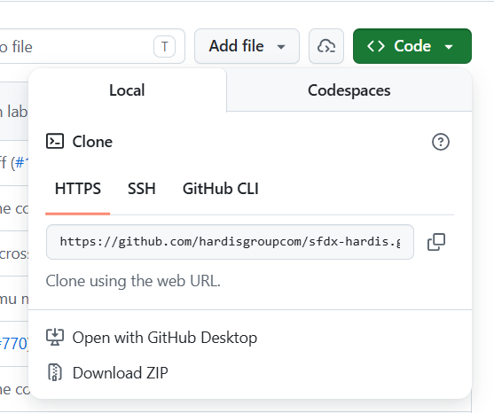
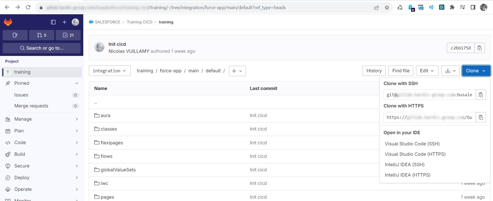
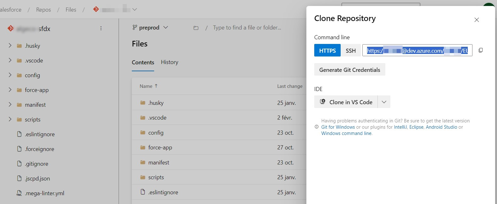
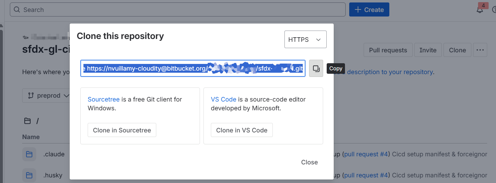
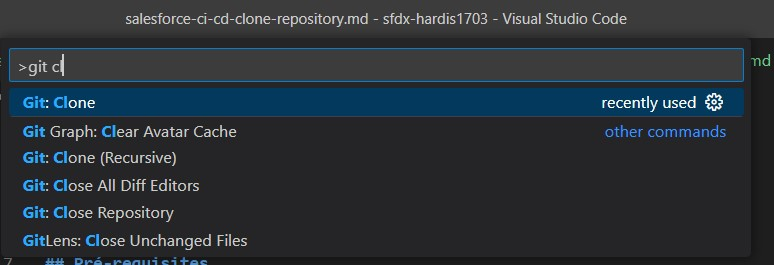
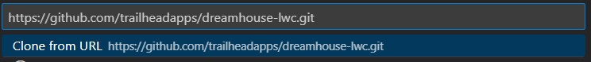
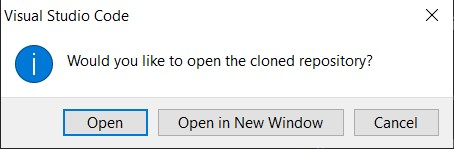
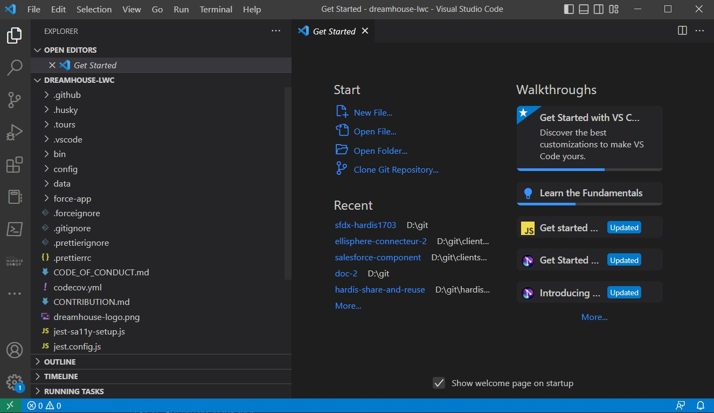

<!-- markdownlint-disable MD013 -->

- [Prerequisites](#prerequisites)
- [From the Git server UI](#from-the-git-server-ui)
- [From VS Code](#from-vs-code)

> If you are prompted for a username and password when cloning, use your account name as the username and the **Personal Access Token** you created in the [previous step](salesforce-ci-cd-git-tokens.md) as the password.

---

## Clone the repository

### Prerequisites

You need access to the Git repository of the project and its URL.

The [release manager](salesforce-ci-cd-release-home.md) of the project can give it to you.

It looks like this: `https://github.com/trailheadapps/dreamhouse-lwc.git`

---

> If you do not have a folder for your Git repositories yet, create a **C:\git** folder (or **D:\git**) and use it as the destination of all your clones.

### From the Git server UI

Some Git providers have a **Clone > Open in VS Code** button on the repository page. When it is available, it is the fastest way to clone.

Otherwise, copy the **HTTPS** URL of the repository and clone it [from VS Code](#from-vs-code).

#### GitHub

Click the green **Code** button, make sure the **HTTPS** tab is selected, then click the copy icon next to the URL. Use it in the [From VS Code](#from-vs-code) section below.

{ align=center }

#### GitLab

Click **Code**, then **Open in your IDE > Visual Studio Code (HTTPS)**.

If you are prompted for a username and password, use the Personal Access Token you created in the [previous step](salesforce-ci-cd-git-tokens.md#gitlab) as the password ([video tutorial](https://www.youtube.com/watch?v=9y5VmmYHuIg)).

If VS Code keeps asking for the same password, run the following command line once:

`git config --global credential.helper store`

#### Azure DevOps

In Azure DevOps, use **Clone > Open in Visual Studio Code** from your repository page.

If this option is not available, copy the **HTTPS** repository URL and use it in the [From VS Code](#from-vs-code) section below.

If you are prompted for credentials, use the Azure DevOps Personal Access Token you created in the [previous step](salesforce-ci-cd-git-tokens.md#azure-devops) as the password.

#### Bitbucket

Click the **Clone** button on your repository page. In the dialog, switch the dropdown from **SSH** to **HTTPS** (top right of the dialog), then click the copy icon next to the URL. Use it in the [From VS Code](#from-vs-code) section below.

> You might need to remove `git clone` at the beginning of the copied text.

{ align=center }

### From VS Code

- In VS Code, press **Ctrl+Shift+P** (**Cmd+Shift+P** on Mac), type **Git: Clone** and select the command.

{ align=center }

- Paste the **URL of your Git repository** and press **Enter**.
  - If you are asked for a directory and you do not have one yet, create an empty folder at the root of your hard drive and select it (for example `C:/git` or `D:/git`).

{ align=center }

- Click **Open** in the notification that appears at the bottom right of VS Code.

{ align=center }

- The project is open in VS Code. You are now ready to [start a User Story](salesforce-ci-cd-create-new-task.md).

{ align=center }
