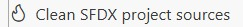

<!-- markdownlint-disable MD013 -->

## Automated cleaning

- [Why clean the sources](#why-clean-the-sources)
- [Dashboards](#dashboards)
- [Destructive Changes](#destructive-changes)
- [List Views Mine](#list-views-mine)
- [Minimize Profiles](#minimize-profiles)
- [System.debug](#systemdebug)
- [Named metadata](#named-metadata)
  - [Case Entitlement](#case-entitlement)
  - [DataDotCom](#datadotcom)
  - [Local Field](#local-field)
  - [Product Request](#product-request)

___

### Why clean the sources

Salesforce CI/CD pipelines do not work natively: many manual XML updates are needed for the deployments to pass.

sfdx-hardis provides a set of commands to automate those boring XML updates that can be called every time a user [prepares a Pull Request](salesforce-ci-cd-publish-task.md#prepare-merge-request) (Merge Request on GitLab) using command [sf hardis:work:save](https://sfdx-hardis.cloudity.com/hardis/work/save/)

Here is the list of available automated cleanings, that can also be called manually using the command 

Example of cleaning config in a .sfdx-hardis.yml config file:

```yaml
autoCleanTypes:
  - destructivechanges
  - datadotcom
  - minimizeProfiles
  - listViewsMine
```
___

### Dashboards

Property: **dashboards**

Removes hardcoded user ids from Dashboards

___

### Destructive Changes

Property: **destructivechanges**

Any file corresponding to an element existing in **manifest/destructiveChanges.xml** is deleted.

___

### List Views Mine

Property: **listViewsMine**

List views with scope **Mine** can not be deployed.

As a workaround, scope is set back to **Everything** in XML, but the list view reference is kept in a property **listViewsToSetToMine** in .sfdx-hardis.yml, and after deployment, manual clicks are simulated to **set back their scope to Mine**.

___

### Minimize Profiles

Property: **minimizeProfiles**

It is a bad practice to define on Profiles elements that can be defined on Permission Sets.

Salesforce [announced in 2023](https://admin.salesforce.com/blog/2023/permissions-updates-learn-moar-spring-23) that permissions on Profiles would eventually be retired in favor of Permission Sets (the date has been postponed since, but the direction remains).

Do not wait for that: use the minimizeProfiles cleaning to automatically remove from Profiles any permission that exists on a Permission Set.

The following XML tags are removed automatically:

- classAccesses
- customMetadataTypeAccesses
- externalDataSourceAccesses
- fieldPermissions
- objectPermissions
- pageAccesses
- userPermissions _(except on Admin Profile)_

You can override this list by defining a property **minimizeProfilesNodesToRemove** in your .sfdx-hardis.yml config file.

___

### System.debug

Property: **systemDebug**

System.debug statements are useless, as explained in [this article](https://medium.com/@michael.bobard/get-rid-of-your-system-debug-with-2-clicks-to-improve-your-performance-80febae76755)

Automatically comments out all System.debug statements in the code to improve performance.

___

### Named metadata

Cleaning can remove files related to named elements.

#### Case Entitlement

Property: **caseentitlement**

Removes [all Case Entitlement related fields](https://github.com/hardisgroupcom/sfdx-hardis/blob/main/defaults/clean/caseentitlement.json), like Case.EntitlementId and Case.MilestoneStatus

#### DataDotCom

Property: **datadotcom**

Removes [all Case Data.com related fields](https://github.com/hardisgroupcom/sfdx-hardis/blob/main/defaults/clean/datadotcom.json), like Account.DandbCompanyId and Account.Jigsaw

#### Local Field

Property: **localfields**

Removes [all Local fields](https://github.com/hardisgroupcom/sfdx-hardis/blob/main/defaults/clean/localfields.json), like Account.NameLocal and Lead.CompanyLocal

#### Product Request

Property: **productrequest**

Removes [all Product Request fields](https://github.com/hardisgroupcom/sfdx-hardis/blob/main/defaults/clean/productrequest.json), like ProductRequest.ShipToAddress and ProductRequest.ShipmentType
