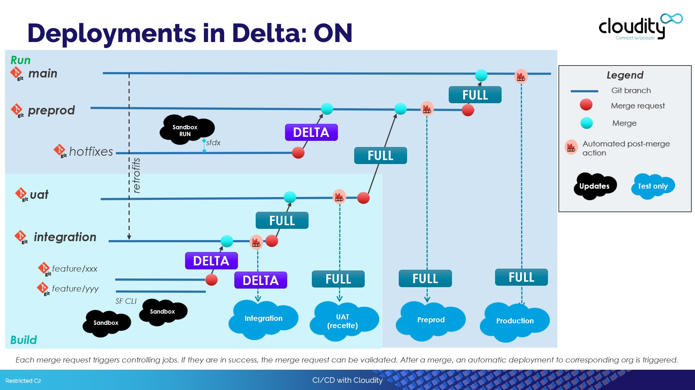
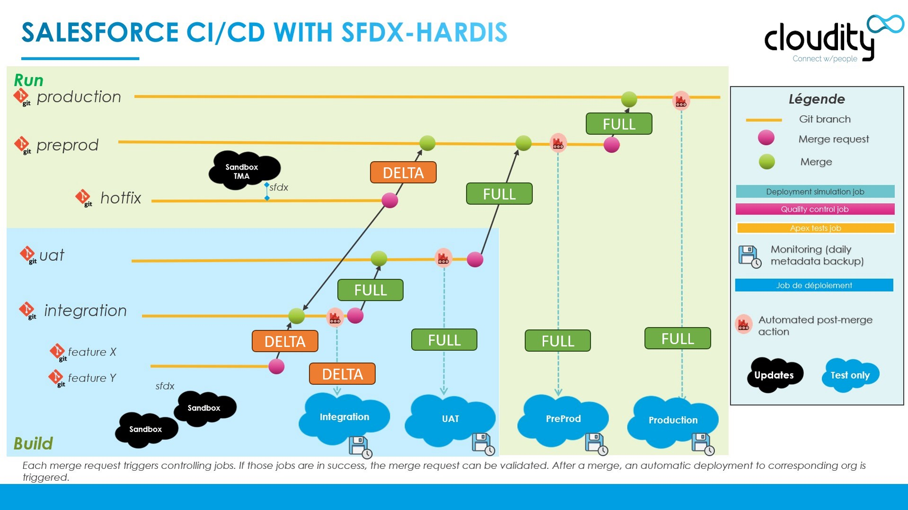
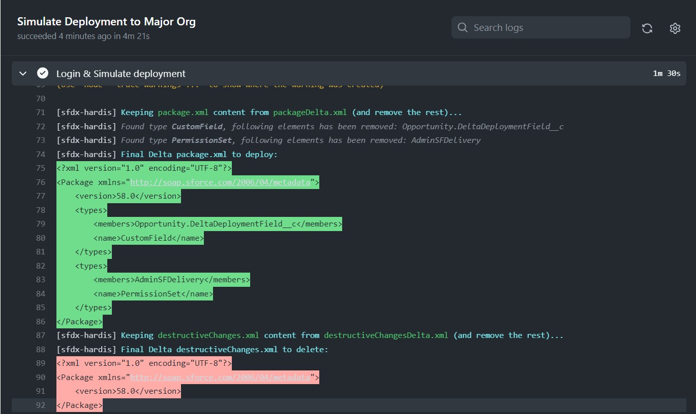

<!-- markdownlint-disable MD013 -->

- [Delta deployments (beta)](#delta-deployments-beta)
  - [Full mode](#full-mode)
  - [Delta mode](#delta-mode)
- [Configuration](#configuration)

___

## Delta deployments (beta)

_sfdx-hardis delta deployment is in beta but can already be safely used_

___

### Full mode

By default, all deployments job (check deploy & process deploy) deploy the **full content of the `package.xml` minus what is matching `package-no-overwrite.xml`** (formerly `packageDeployOnce.xml`)

This is the safest way to deploy at each level

- major to major
- minor to major

___

### Delta mode

In order to improve performances on project with large metadata base, you can **activate delta deployments** for Pull Request/Merge Requests **from a minor branch** (examples: `feature/xxx`, `debug/xxx`) **to a major branch** (ex: `integration`, `uat`, `preprod`, `production`: sfdx-hardis will **deploy only updated metadatas** in the Pull Request / Merge Request.

**Merge Requests / Pull Request between major branches** (ex: uat to preprod) **remains in full deployment mode**, to avoid issues with configuration which would have been done directly in the orgs (whereas it shouldn't be, except for Reports, Dashboards and a few metadata types)

Examples:

- **features/config/my-work to integration** will be **DELTA** DEPLOYMENT
- **integration to uat** will be **FULL** DEPLOYMENT
- **hotfixes/fix-stuff to preprod** will be **DELTA** DEPLOYMENT
- **preprod to production** will be **FULL** DEPLOYMENT

> 💡 If you want to **force the use of full deployment for a PR/MR** on a delta project, add "**nodelta**" in your latest commit title or text.

___

## Configuration

To activate delta deployments,you can:

- define `useDeltaDeployment: true` in **config/.sfdx-hardis.yml**
- define env variable `USE_DELTA_DEPLOYMENT=true`

In case of temporary deactivation of delta deployments, you can set variable `DISABLE_DELTA_DEPLOYMENT=true`, it has priority on other configurations.

> 💡If your sfdx-hardis installation is from before 4.10.0, you might need to update your CI/CD workflows
>
> Check updated versions in [sfdx-hardis sources](https://github.com/hardisgroupcom/sfdx-hardis/tree/main/defaults/ci)
