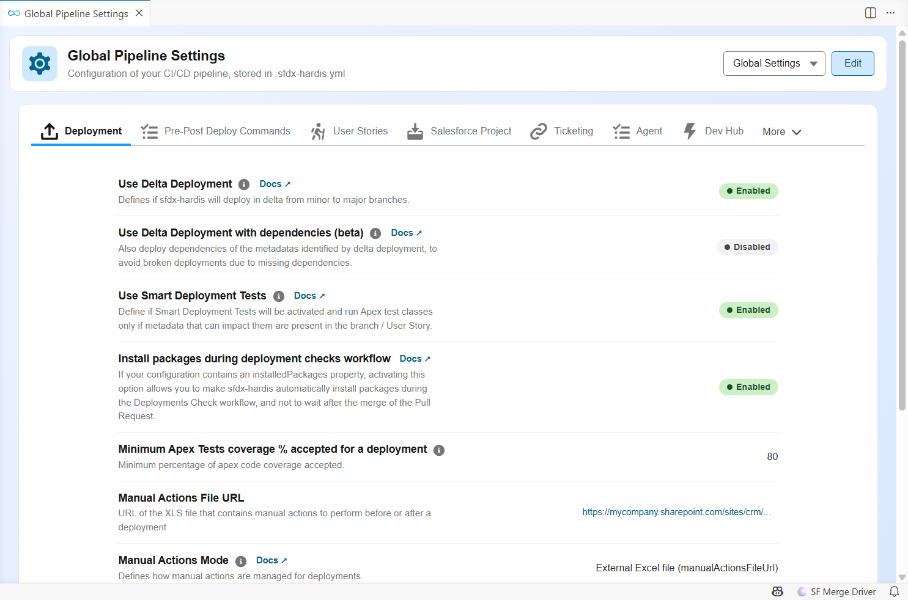

<!-- markdownlint-disable MD013 -->

## Project configuration

The behavior of the pipeline is driven by the `.sfdx-hardis.yml` files of the repository:

| File                                        | Scope                                                              |
|---------------------------------------------|--------------------------------------------------------------------|
| `config/.sfdx-hardis.yml`                   | The whole project. Committed to Git.                               |
| `config/branches/.sfdx-hardis.<branch>.yml` | One major branch and its org (authentication, branch overrides).   |
| `config/user/.sfdx-hardis.<username>.yml`   | One contributor on their own computer. Ignored by Git.             |

The easiest way to edit them is the **Pipeline Settings** panel of the VS Code SFDX Hardis extension, which presents every option as a form with its documentation.

The complete list of properties, with their type, default value and description, is in the [configuration reference](schema/sfdx-hardis-json-schema-parameters.html). Many options can also be set with [environment variables](all-env-variables.md) on the CI server.

---

### What to review after the setup

#### User Story options

The **New User Story** command asks contributors for a target branch, a User Story name and an org. Configure the proposed values (available target branches and their labels, branch prefixes, naming rules, shared dev sandboxes...) with the [User Story options of `hardis:work:new`](hardis/work/new.md).

#### package.xml and destructiveChanges.xml

The repository contains `manifest/package.xml`, the list of all metadata deployed by the CI server, and `manifest/destructiveChanges.xml`, the list of metadata it deletes. Both files are updated automatically by the [Save / Publish command](salesforce-ci-cd-publish-task.md#prepare-merge-request) (`hardis:work:save`), so contributors never edit them by hand.

#### Overwrite management

Some metadata is maintained directly in production on purpose: dashboards, reports, remote site settings, named credentials... [Overwrite management](salesforce-ci-cd-config-overwrite.md) lists the metadata the pipeline must never overwrite when it already exists in the target org. Configure it early: it is the best protection against a deployment erasing someone's work.

#### Delta deployments

By default the CI server deploys the whole `package.xml`. On large projects, [delta deployments](salesforce-ci-cd-config-delta-deployment.md) deploy only the metadata changed by the Pull Request, which makes validations and deployments much faster.

#### Automated cleaning

Before each Pull Request, `hardis:work:save` can [clean the sources](salesforce-ci-cd-config-cleaning.md): remove the items listed in `destructiveChanges.xml`, remove from Profiles the attributes that belong in Permission Sets, remove Flow positions and more.

#### Deployment actions

Contributors can attach [deployment actions](salesforce-ci-cd-work-on-task-deployment-actions.md) to their Pull Requests. Actions that must run at every deployment of the project are declared in `config/.sfdx-hardis.yml` (`commandsPreDeploy` / `commandsPostDeploy`), from the **Pre-Post Deploy Commands** tab of the Pipeline Settings panel.

#### Source retrieve issues

When `hardis:scratch:pull` misses some metadata types, see [Source retrieve issues](salesforce-ci-cd-retrieve.md).

#### Repository clean up

To remove files from the repository without deleting them from the orgs, see [Repository clean up](salesforce-ci-cd-manual-repo-clean.md).
