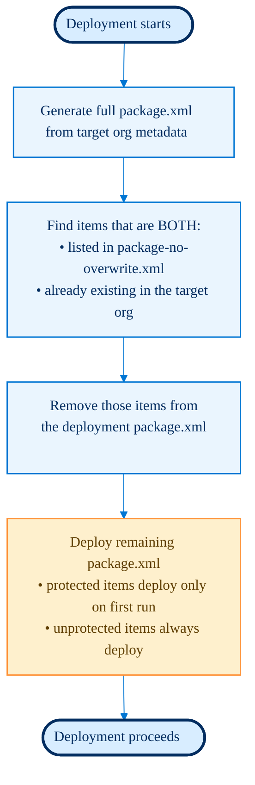

<!-- markdownlint-disable MD013 MD033 -->

- [What is overwrite management?](#what-is-overwrite-management)
- [package-no-overwrite.xml](#package-no-overwritexml)
  - [How it works](#how-it-works)
  - [When to use it](#when-to-use-it)
  - [Setup](#setup)
  - [Configuration options](#configuration-options)
  - [Example](#example)

---

## What is overwrite management?

On most Salesforce projects, **certain metadata types are intentionally maintained directly in the org** via Setup (e.g. production-only credentials, reports managed by business users, org-specific configurations). Deploying these metadata types via CI/CD risks overwriting changes made directly in the org.

**Overwrite management** lets you declare which metadata items should be **deployed only the first time** (when they don't yet exist in the target org) and **left untouched on subsequent deployments** - even if they are tracked in your `package.xml`.

This is controlled by the file `manifest/package-no-overwrite.xml`.

---

## package-no-overwrite.xml

### How it works



The rule applied by `package-no-overwrite.xml` is:

> **An item listed in `package-no-overwrite.xml` is deployed the first time it does not yet exist in the target org. Once it exists in the org, it will never be overwritten by CI/CD - it must be maintained manually via Salesforce Setup.**

In practice, during each deployment:

1. sfdx-hardis reads `manifest/package-no-overwrite.xml`
2. It queries the target org to build its full metadata inventory
3. Items that appear in **both** `package-no-overwrite.xml` **and** the target org are removed from the deployment package
4. The remaining package is deployed - no org-side customizations are ever overwritten

### When to use it

Use `package-no-overwrite.xml` for metadata that:

- Contains **org-specific values** that differ between environments (e.g. authentication URLs in Named Credentials, Remote Site Settings)
- Is **managed by business users directly in production** and should not be reset by deployments (e.g. Reports, Dashboards)
- Contains **hardcoded org references** that cannot be templated (e.g. Connected Apps with OAuth settings, SAML SSO configs)
- Was **initially deployed once** but must be free to evolve independently per org

Common metadata types to protect:

| Metadata type                              | Reason                                                                                                                                   | Scope recommendation |
| :----------------------------------------- | :--------------------------------------------------------------------------------------------------------------------------------------- | :------------------- |
| `ConnectedApp`                             | Contains org-unique OAuth settings                                                                                                       | All (`*`)            |
| `ExternalCredential`                       | Named Credentials v2 (API 57.0+): defines auth protocol and named principals; actual secrets are org-specific and stored at runtime only | All (`*`)            |
| `NamedCredential`                          | Endpoint URLs and auth references vary per environment                                                                                   | All (`*`)            |
| `ExtlClntAppGlobalOauthSettings`           | External Client Apps (API 59.0+): contains OAuth consumer key and consumer secret - highly sensitive, never overwrite                    | All (`*`)            |
| `RemoteSiteSetting`                        | URLs differ between orgs                                                                                                                 | All (`*`)            |
| `ApprovalProcess`                          | May reference usernames specific to that org                                                                                             | All (`*`)            |
| `SamlSsoConfig`                            | SSO configuration is org/IdP-specific                                                                                                    | All (`*`)            |
| `Dashboard` / `Report`                     | Managed by business users directly in production                                                                                         | All (`*`)            |
| `WaveApplication` / `WaveDashboard` / etc. | CRM Analytics items managed in production                                                                                                | All (`*`)            |
| `FlexiPage`                                | Only those embedding hardcoded dashboard or record IDs per org                                                                           | Named items only     |
| `CustomApplication`                        | Only those embedding hardcoded dashboard IDs per org                                                                                     | Named items only     |

### Setup

1. Create the file `manifest/package-no-overwrite.xml` at the root of your Salesforce project
2. Use the **same XML format as `package.xml`**
3. List the metadata types and members to protect - see [Wildcard support](#wildcard-support) below
4. Commit the file to your repository

> The file was formerly named `packageDeployOnce.xml`. Both names are still recognized for backward compatibility, but `package-no-overwrite.xml` is the current standard.

### Wildcard support

Member entries support three matching modes:

| Pattern                               | Meaning                                        | Example                       |
| :------------------------------------ | :--------------------------------------------- | :---------------------------- |
| `*`                                   | Match **all** members of that type             | `<members>*</members>`        |
| `prefix*` or `*suffix` or `part*part` | Match members whose name fits the glob pattern | `<members>*__dlm</members>`   |
| Exact name                            | Match only that specific member                | `<members>MyReport</members>` |

Glob patterns use `*` as a wildcard that matches any sequence of characters. Multiple patterns can be mixed within the same `<types>` block.

```xml
<!-- Protect all Data Cloud (DLM) objects - matched by suffix wildcard -->
<types>
  <members>*__dlm</members>
  <name>CustomObject</name>
</types>

<!-- Protect all fields on DLM objects -->
<types>
  <members>*__dlm.*</members>
  <name>CustomField</name>
</types>
```

### Configuration options

| Configuration                                  | Description                                                                                                                                    |
| :--------------------------------------------- | :--------------------------------------------------------------------------------------------------------------------------------------------- |
| `packageNoOverwritePath` in `.sfdx-hardis.yml` | Override the path to the file for a specific branch (e.g. `manifest/package-no-overwrite-main.xml` in `config/branches/.sfdx-hardis.main.yml`) |
| `PACKAGE_NO_OVERWRITE_PATH` env variable       | Override the file path at pipeline level                                                                                                       |
| `SKIP_PACKAGE_DEPLOY_ONCE=true` env variable   | Disable `package-no-overwrite.xml` processing entirely for a specific run                                                                      |

Example branch-level override in `config/branches/.sfdx-hardis.production.yml`:

```yaml
packageNoOverwritePath: manifest/package-no-overwrite-production.xml
```

This allows you to define stricter protections for production while keeping a more permissive list for lower environments.

### Example

```xml
<?xml version="1.0" encoding="UTF-8" standalone="yes"?>
<Package xmlns="http://soap.sforce.com/2006/04/metadata">
  <!-- Approval processes can contain references to usernames specific to this org -->
  <types>
    <members>*</members>
    <name>ApprovalProcess</name>
  </types>
  <!-- Connected Apps contain org-unique OAuth settings and must never be overwritten -->
  <types>
    <members>*</members>
    <name>ConnectedApp</name>
  </types>
  <!-- Apps that embed hardcoded dashboard IDs managed directly in production -->
  <types>
    <members>DeclareWork</members>
    <members>Facturation</members>
    <members>SomeApp2</members>
    <name>CustomApplication</name>
  </types>
  <!-- Dashboards are published and managed directly in production by business users -->
  <types>
    <members>*</members>
    <name>Dashboard</name>
  </types>
  <!-- FlexiPages that embed Dashboard IDs hardcoded per org -->
  <types>
    <members>Accueil_administrateur</members>
    <members>Accueil_administratif</members>
    <members>Accueil_Commerciaux</members>
    <members>Accueil_Direction</members>
    <members>Accueil_Recrutement</members>
    <name>Flexipage</name>
  </types>
  <!-- Named Credentials contain auth info that differs between environments -->
  <types>
    <members>*</members>
    <name>NamedCredential</name>
  </types>
  <!-- Profiles: prefer Permission Sets, let Profiles be maintained manually in org -->
  <types>
    <members>*</members>
    <name>Profile</name>
  </types>
  <!-- Remote Site Settings URLs differ between dev, uat, preprod, and production -->
  <types>
    <members>*</members>
    <name>RemoteSiteSetting</name>
  </types>
  <!-- Reports are managed directly in production by business users -->
  <types>
    <members>*</members>
    <name>Report</name>
  </types>
  <!-- SSO configuration must be performed directly in org Setup -->
  <types>
    <members>*</members>
    <name>SamlSsoConfig</name>
  </types>
  <!-- CRM Analytics (Wave) items managed directly in production -->
  <types>
    <members>*</members>
    <name>WaveApplication</name>
  </types>
  <types>
    <members>*</members>
    <name>WaveDashboard</name>
  </types>
  <types>
    <members>*</members>
    <name>WaveDataflow</name>
  </types>
  <types>
    <members>*</members>
    <name>WaveDataset</name>
  </types>
  <types>
    <members>*</members>
    <name>WaveRecipe</name>
  </types>
  <types>
    <members>*</members>
    <name>WaveXmd</name>
  </types>
  <version>53.0</version>
</Package>
```
