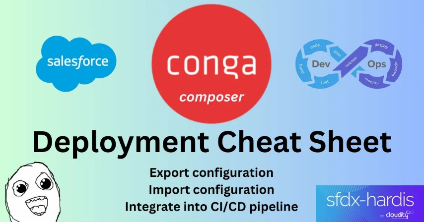

<!-- markdownlint-disable MD013 -->

## Conga deployments

It's easy to handle the deployment of Conga Composer configuration with sfdx-hardis.

Please see how in the following article.

{target=blank}

