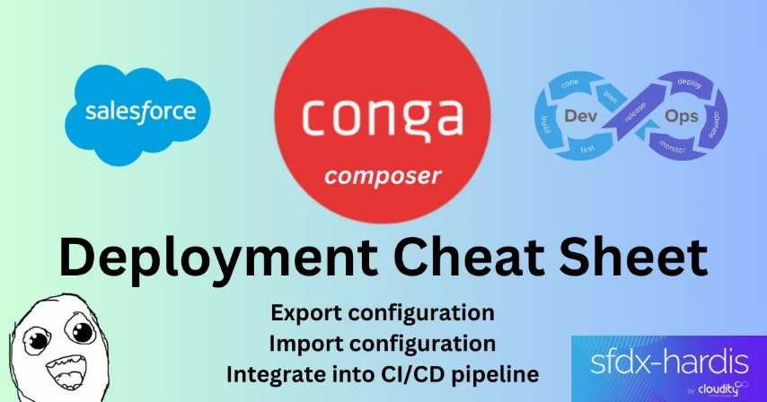

<!-- markdownlint-disable MD013 -->

## Conga Composer deployments

sfdx-hardis handles the deployment of Conga Composer configuration as data, exported from the source org and imported into the target org with SFDMU.

The following article explains how to set it up.

{target=blank}
