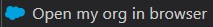

<!-- markdownlint-disable MD013 -->

- [Sandbox or scratch org ?](#sandbox-or-scratch-org-)
- [Source-tracked sandbox mode](#source-tracked-sandbox-mode)
  - [Pre-requisites (sandbox)](#pre-requisites-sandbox)
  - [Start new task on sandbox](#start-new-task-on-sandbox)
- [Scratch Org mode](#scratch-org-mode)
  - [Pre-requisites (scratch org)](#pre-requisites-scratch-org)
  - [Start new task on scratch org](#start-new-task-on-scratch-org)

## Sandbox or scratch org ?

With SFDX, usually each member of the teams has its own sandbox or scratch org to work on it.

The [release manager](salesforce-ci-cd-use.md#release-manager-guide) of the project can tell you if you work with [**scratch orgs**](#scratch-org-mode) or [**source-tracked sandboxes**](#source-tracked-sandbox-mode), and **which sandbox to use if you are in sandbox mode**.

## Source-tracked sandbox mode

### Pre-requisites (sandbox)

You need credentials to login on the source-tracked sandbox you'll work with. It can be:

- An **existing source-tracked sandbox**
  - Existing source-tracked sandboxes must be **refreshed from time to time to avoid too many conflicts**, discuss with your Release Manager !
- A **new source-tracked sandbox** that you can create from production org

### Start new task on sandbox

- Open VsCode SFDX Hardis extension by clicking on  in VsCode left bar _(loading can task several seconds)_

- Click on 

- Answer the questions then **select Sandbox** when prompted
  - If the sandbox is not proposed in the list, select the option to authenticate to your desired sandbox

- Click on  and you can start working in it :)

>  **_Under the hood_**
>
> See details in [hardis:work:new](https://hardisgroupcom.github.io/sfdx-hardis/hardis/work/new/) command documentation

## Scratch Org mode

### Pre-requisites (scratch org)

You need the credentials to login on the **Dev Hub Org** (usually the production environment)

### Start new task on scratch org

- Open VsCode SFDX Hardis extension by clicking on  in VsCode left bar

- Click on 

- Answer the questions then **select Scratch Org** when prompted
  - If the sandbox is not proposed in the list, select the option to authenticate to your desired sandbox

- Wait for the sandbox creation script to be completed, and you can start working in it :)
  - If you see errors while creating the sandbox, request support from the project release manager

>  **_Under the hood_**
>
> See details in [hardis:work:new](https://hardisgroupcom.github.io/sfdx-hardis/hardis/work/new/) command documentation
