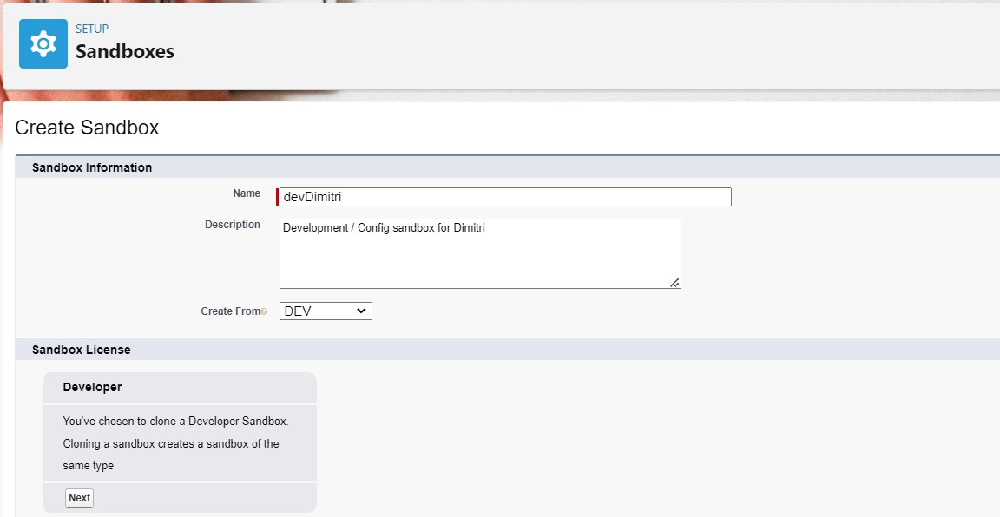
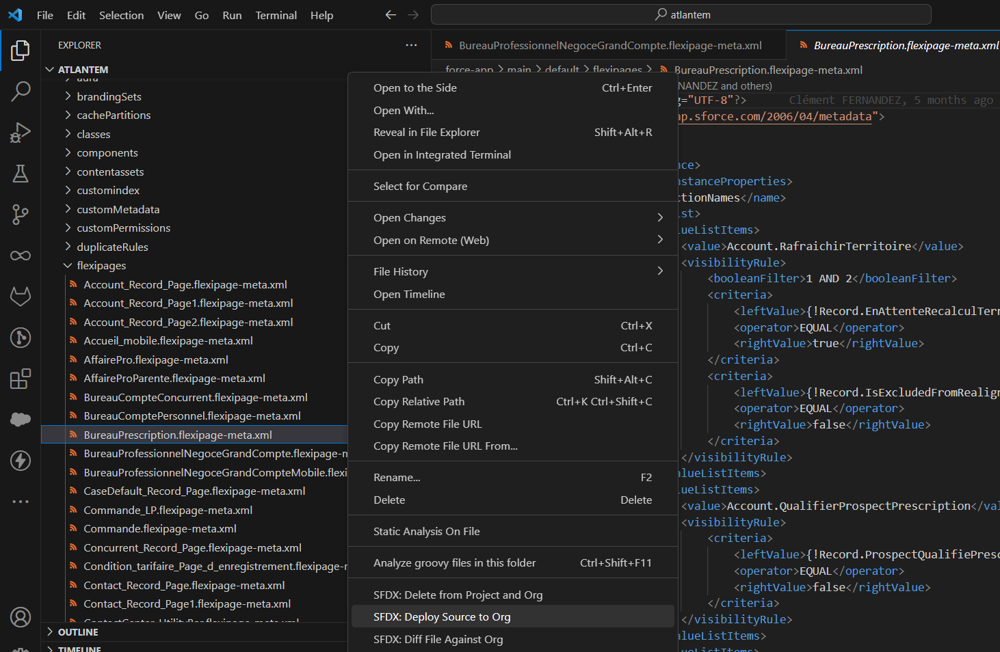

<!-- markdownlint-disable MD013 -->

- [Use cases](#use-cases)
- [Sandbox or scratch org ?](#sandbox-or-scratch-org-)
- [Source-tracked sandbox mode](#source-tracked-sandbox-mode)
  - [Pre-requisites (sandbox)](#pre-requisites-sandbox)
  - [Start new task on sandbox](#start-new-task-on-sandbox)
    - [Select sandbox](#select-sandbox)
    - [Update your sandbox ?](#update-your-sandbox-)
    - [Work !](#work-)
- [Scratch Org mode](#scratch-org-mode)
  - [Pre-requisites (scratch org)](#pre-requisites-scratch-org)
  - [Start new task on scratch org](#start-new-task-on-scratch-org)

___

## Use cases

You use this command when you want to :

- Create a dedicated new branch
- Create a scratch org linked to the branch OR assign a dedicated sandbox to the newly created branch

___

## Sandbox or scratch org ?

With SFDX, usually each member of the teams has its own sandbox or scratch org to work on it.

The [release manager](salesforce-ci-cd-release-home.md) of the project can tell you if you work with [**scratch orgs**](#scratch-org-mode) or [**source-tracked sandboxes**](#source-tracked-sandbox-mode), and **which sandbox to use if you are in sandbox mode**.

___

## Source-tracked sandbox mode

### Pre-requisites (sandbox)

You need credentials to login on the source-tracked sandbox you'll work with. It can be:

- An **existing source-tracked sandbox**
  - Existing source-tracked sandboxes must be **refreshed from time to time to avoid too many conflicts**, discuss with your Release Manager !
  - Release managers: When you create or refresh a sandbox, you can [easily activate invalid users with a few clicks](https://sfdx-hardis.cloudity.com/hardis/org/user/activateinvalid/)
- A **new source-tracked sandbox** that you can create from production org

It is recommended to create sandbox from the org that is related to the target git branch.

{ align=center }

### Start new task on sandbox

#### Select sandbox

- Open VsCode SFDX Hardis extension by clicking on  in VsCode left bar _(loading can task several seconds)_

- Click on 

- Answer the questions then **select Sandbox** when prompted
  - If the sandbox is not proposed in the list, select the option to authenticate to your desired sandbox

#### Update your sandbox ?

- When prompted if you want to update your sandbox:
  - Select `yes` **only if you have NO pending work in your sandbox that you'll want to publish later**
    - If the update script fails, you can manually deploy single metadatas using `Right click -> Deploy to org` (see screenshot below)
  - Otherwise, select `no`

_Example of manual deploy of a metadata that you think could have been updated in parent branch, after an Update sandbox failure_

#### Work !

- At the end of the script execution:

  - If you want to reset the sandbox tracking (**meaning you don't care about the previous updates in your sandbox**), you can click on command 
  - Click on  and you can start working in it :)

<iframe width="560" height="315" src="https://www.youtube.com/embed/WOqssZwjPhw" title="YouTube video player" frameborder="0" allow="accelerometer; autoplay; clipboard-write; encrypted-media; gyroscope; picture-in-picture" allowfullscreen></iframe>

>  **_Under the hood_**
>
> See details in [hardis:work:new](https://sfdx-hardis.cloudity.com/hardis/work/new/) command documentation

___

## Scratch Org mode

### Pre-requisites (scratch org)

You need the credentials to login on the **Dev Hub Org** (usually the production environment)

### Start new task on scratch org

- Open VsCode SFDX Hardis extension by clicking on  in VsCode left bar

- Click on 

- Answer the questions then **select Scratch Org** when prompted
  - If the sandbox is not proposed in the list, select the option to authenticate to your desired sandbox

- Wait for the sandbox creation script to be completed, and you can start working in it :)
  - If you see errors while creating the sandbox, request support from the project release manager

>  **_Under the hood_**
>
> See details in [hardis:work:new](https://sfdx-hardis.cloudity.com/hardis/work/new/) command documentation
