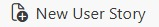
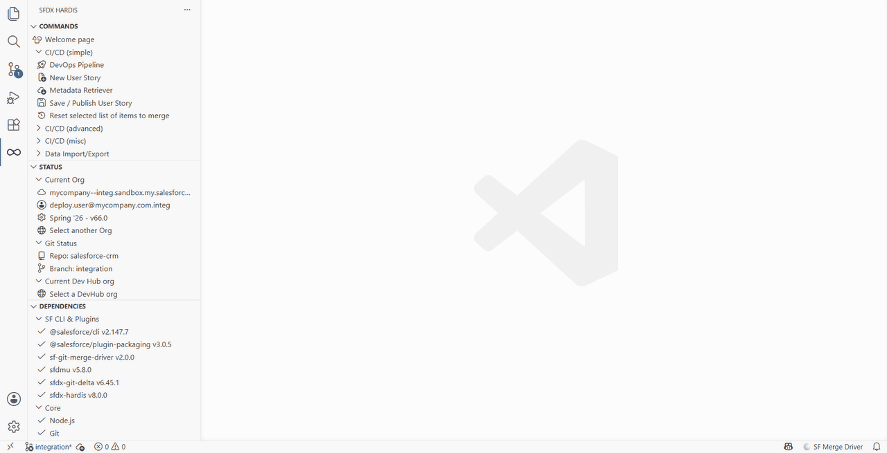
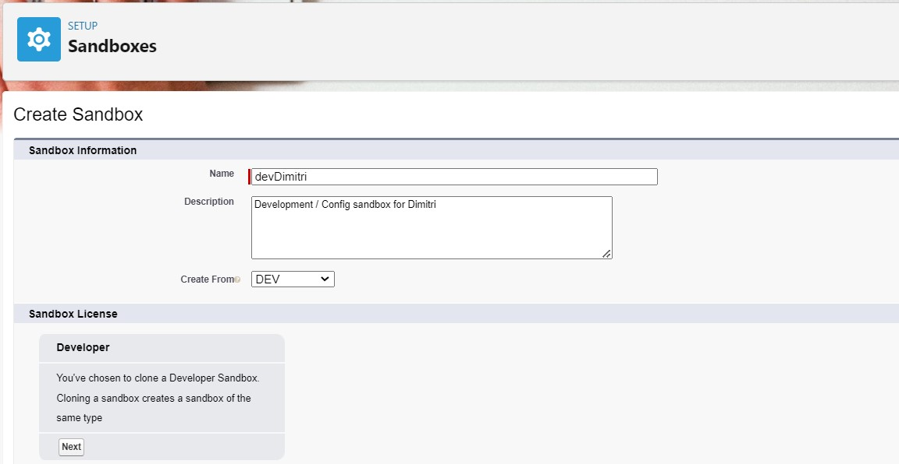
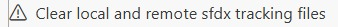
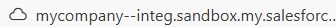

<!-- markdownlint-disable MD013 -->

- [Quick start](#quick-start)
- [What happens](#what-happens)
- [Sandbox or scratch org](#sandbox-or-scratch-org)
- [Source-tracked sandbox](#source-tracked-sandbox)
  - [Prerequisites (sandbox)](#pre-requisites-sandbox)
  - [Start the User Story on a sandbox](#start-the-user-story-on-a-sandbox)
- [Scratch org](#scratch-org)
  - [Prerequisites (scratch org)](#prerequisites-scratch-org)
  - [Start the User Story on a scratch org](#start-the-user-story-on-a-scratch-org)

___

## Start a new User Story

### Quick start

Every piece of work (a User Story, a bug fix, a configuration change) starts with its own git branch and its own Salesforce org. The **New User Story** command creates both for you.

- Open the VS Code SFDX Hardis extension by clicking  in the VS Code left bar.
- On the Welcome page or in the **DevOps Pipeline** panel, click the **New User Story** card. The same command is available as  in the side bar.
- Answer the questions:
  - the **target branch**: the major branch your work will be merged into (for example `integration`),
  - the **name of your User Story**: a short description without accents or special characters (a ticket number is a good start, like `MYPROJECT-123-account-validation-rule`),
  - the **type of org** you want to work in: a **sandbox with source tracking** or a **scratch org**.

If you have a doubt about an answer, ask your release manager.

Once the command is completed, you can start working in your dev sandbox or scratch org.

___

### What happens

The command does two things:

- It creates a **new git branch** from the latest version of the target major branch. All your commits will go in this branch, and your Pull Request (Merge Request on GitLab) will later bring them back into the target branch.
- It links a **Salesforce org** to this branch: either a source-tracked dev sandbox that you select (or create), or a new scratch org. This is the org you will configure and develop in.

>  **_Under the hood_**
>
> The command run is `sf hardis:work:new`. See details in the [hardis:work:new](https://sfdx-hardis.cloudity.com/hardis/work/new/) command documentation.

___

### Sandbox or scratch org

With Salesforce DX, each member of the team works in a personal org: a source-tracked dev sandbox or a scratch org. You never work directly in a major org (integration, uat, preprod, production).

The [release manager](salesforce-ci-cd-release-home.md) of the project decides whether the team works with [**source-tracked sandboxes**](#source-tracked-sandbox) or with [**scratch orgs**](#scratch-org), and, in sandbox mode, **which sandbox you must use**. Ask them before you start.

Dev sandboxes can be **individual** (one sandbox per contributor) or **shared** by several members of the team, which saves sandboxes on projects where they are limited. On a shared sandbox, the **New User Story** command can deploy the content of the target branch to the sandbox before you start, so every contributor works on the same base. Your release manager configures this (`sharedDevSandboxes` in `.sfdx-hardis.yml`).

___

### Source-tracked sandbox

#### Prerequisites (sandbox) { #pre-requisites-sandbox }

You need credentials to log in to the source-tracked sandbox you will work in. It can be:

- An **existing source-tracked sandbox**. Existing sandboxes must be refreshed from time to time to avoid too many conflicts, discuss it with your release manager.
  - Release managers: when you create or refresh a sandbox, you can [activate invalid users with a few clicks](https://sfdx-hardis.cloudity.com/hardis/org/user/activateinvalid/).
- A **new source-tracked sandbox** that you create from Setup. Create it from the org related to the target branch of your User Story (for example the integration org when you target the `integration` branch). A Developer sandbox is enough.

{ align=center }

#### Start the User Story on a sandbox

- Click **New User Story** (or  in the side bar).
- Answer the questions, then select **Sandbox org with source tracking** when asked for the type of org.
- Select your sandbox in the list. If it is not proposed, select the option to connect to another sandbox and log in with your credentials.
- If asked whether you want to update the sandbox to match the target branch, answer yes only when your release manager told you to (for example when several people share the same sandbox). This deploys the branch content to your sandbox, which can take a while.
- At the end of the command:
  - If you want to reset the source tracking of the sandbox (meaning **you do not care about the previous updates made in this sandbox**), click .
  - Click  and start working in your sandbox.

___

### Scratch org

#### Prerequisites (scratch org)

You need credentials to log in to the **Dev Hub org** (usually the production org). The scratch org definition and the packages to install are already configured in the project by the release manager.

#### Start the User Story on a scratch org

- Click **New User Story** (or  in the side bar).
- Answer the questions, then select **Scratch org** when asked for the type of org.
- Choose whether you want to **create a new scratch org** or reuse an existing one. Creating a new one is the safest choice.
- Wait for the scratch org creation to complete. sfdx-hardis creates the scratch org, installs the packages of the project, pushes the sources of the branch and runs the initialization scripts, then opens the scratch org in your browser.
  - If you see errors during the creation, ask your release manager for support.
- You can start working in your scratch org. You can open it again at any time with .

___

Next step: [work in your org](salesforce-ci-cd-work-on-task.md).
