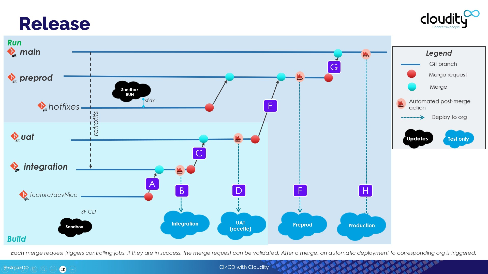

<!-- markdownlint-disable MD013 -->

## Minor and Major branches

Minor branches are individual git branches that do not have a CI/CD associated org

Major branches are git branches that have a CI/CD associated org, and each new commit in a major branch automatically triggers a deployment to the associated org.

{ align=center }

Examples:

- **Minor to major**: When a merge request from `dev_nico` to `ìntegration` **(1)** is validated and merged, a new state (commit) is detected in branch `integration`, so CI server automatically deploys to `associated Salesforce org Integration` **(2)**

- **Major to Major**: When a merge request from `integration` to `uat` **(3)** is validated and merged, a new state (commit) is detected in branch `uat`, so CI server automatically deploys to `associated Salesforce org UAT` **(4)**

- **Major to Major**: When a merge request from `preprod` to `production` **(5)** is validated and mged, a new state (commit) is detected in branch `production`, so CI server automatically deploys to `associated Salesforce org Production` **(6)**

## Merge requests between major branches

- Create a **New Merge request**
  - Set a meaningful title, like **recette to uat** or **uat to production**
  - Make sure that **Delete source after merge** and **Squash commits** are **UNCHECKED**
- Click on **Submit merge request**

- **Controlling jobs** are automatically launched, and should pass as merge requests from minor branches has been in success
  - If jobs fail, it means that you need to perform manual actions in target org, like activating features or manually rename elements if metadatas API Names has been renamed (which is a bad practice but happens)

- Once **all jobs are in success**, **merge the merge request**
  - It will **automatically trigger** the **deployment to the associated Salesforce org**
