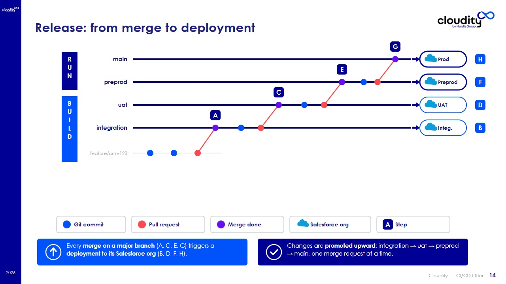
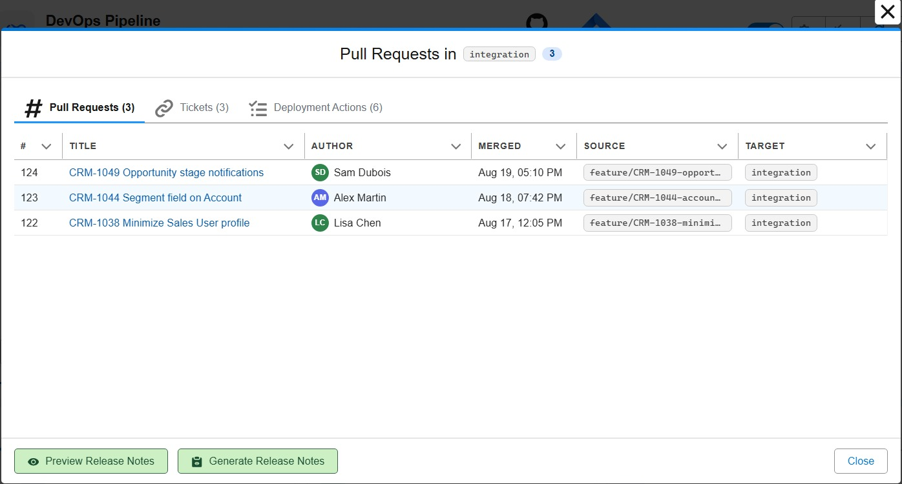

<!-- markdownlint-disable MD013 -->

## Deploy to major orgs

- [Minor and major branches](#minor-and-major-branches)
- [Pull Requests between major branches](#pull-requests-between-major-branches)

___

## Minor and major branches

**Minor branches** are the individual git branches of the User Stories. They do not have an associated CI/CD org.

**Major branches** are the git branches that have an associated CI/CD org: each new commit in a major branch automatically triggers a deployment to that org.

{ align=center }

Examples:

- **Minor to major**: when a Pull Request (Merge Request on GitLab) from `feature/crm-123` to `integration` **(A)** is validated and merged, a new state (commit) is detected in branch `integration`, so the CI server automatically deploys to the `Integration` org **(B)**

- **Major to major**: when a Pull Request from `integration` to `uat` **(C)** is validated and merged, a new state (commit) is detected in branch `uat`, so the CI server automatically deploys to the `UAT` org **(D)**

- **Major to major**: when a Pull Request from `uat` to `preprod` **(E)** is validated and merged, a new state (commit) is detected in branch `preprod`, so the CI server automatically deploys to the `Preprod` org **(F)**

- **Major to major**: when a Pull Request from `preprod` to `main` **(G)** is validated and merged, a new state (commit) is detected in branch `main`, so the CI server automatically deploys to the `Production` org **(H)**

___

## Pull Requests between major branches

A Pull Request between two major branches promotes everything that has been merged into the source branch since its last promotion: all the User Stories, their tickets and their deployment actions.

In the **DevOps Pipeline** panel of the VS Code SFDX Hardis extension, click a major branch to see what it contains: the merged Pull Requests, the related tickets and the deployment actions, with **Preview Release Notes** and **Generate Release Notes** buttons.

- Create a **new Pull Request** from the source major branch to the target major branch
  - Set a meaningful title, like **MAJOR: uat to preprod** or **MAJOR: preprod to production**
  - Make sure that **Delete source branch after merge** and **Squash commits** are **UNCHECKED**
- Submit the Pull Request

- The **control jobs** start automatically. They should pass, as the Pull Requests from the minor branches already passed them
  - If a job fails, you usually need to perform manual actions in the target org, like activating a feature, or renaming elements when metadata API names have been renamed (a bad practice, but it happens)

- Check the [deployment actions](salesforce-ci-cd-work-on-task-deployment-actions.md) carried by the promotion: automated actions run by themselves at deployment time, and the manual steps still to perform are listed as checkboxes in the Pull Request comments

- Once **all jobs succeed**, **merge the Pull Request**
  - The merge **automatically triggers** the **deployment to the associated Salesforce org**

- If your project publishes [Release Notes](hardis/doc/salesforce-ci-cd-release-notes.md), generate them from the major branch window of the DevOps Pipeline

For urgent fixes that cannot wait for the next promotion, see [Hotfixes and retrofit](salesforce-ci-cd-hotfixes.md).
