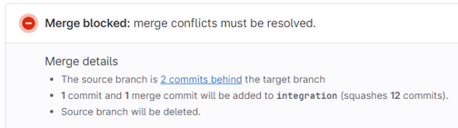
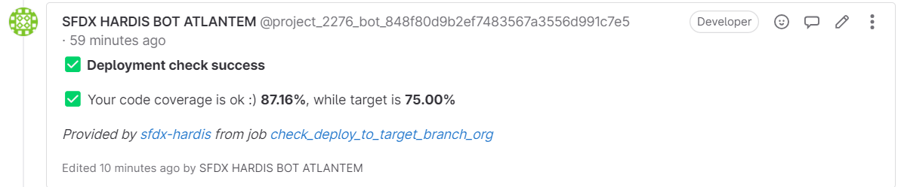
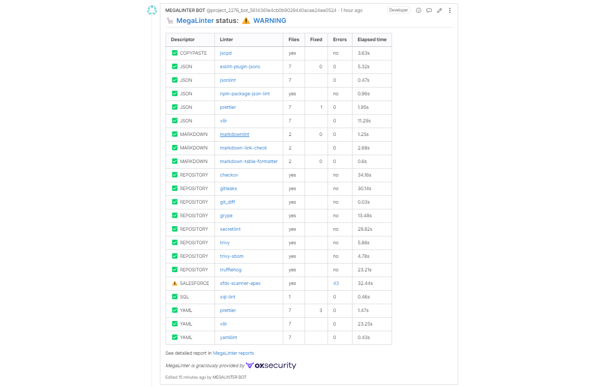

<!-- markdownlint-disable MD013 -->

- [Conflicts detection](#conflicts-detection)
- [Deployment simulation](#deployment-simulation)
- [Quality gate](#quality-gate)

## Conflicts detection

If you are about to overwrite the work of one of your colleagues, a conflicts message will appear.

- **If you are trained with git**, you can [merge conflicts](salesforce-ci-cd-validate-merge-request.md#conflicts) by merging the target branch in your own branch
- Otherwise, call your [release manager](salesforce-ci-cd-release-home.md) !

## Deployment simulation

When you create a Merge Request to a major git branch, for example `integration`, sfdx-hardis will simulate a deployment to the related major Salesforce org, for example **Integration org**.

It will also run **Apex test classes** and **Apex code coverage**.

The result will be displayed in a message on the Merge Request UI

If you see errors, please check [Solve deployment errors documentation](salesforce-ci-cd-solve-deployment-errors.md)

## Quality gate

Any Merge Request will trigger a technical quality gate, that will check for:

- Apex best practices using PMD
- LWC best practices using eslint
- Security issues
- Excessive copy-pastes

The result will be displayed in a message on the Merge Request UI

If you see errors, please check [Solve MegaLinter errors documentation](salesforce-ci-cd-solve-megalinter-errors.md)

