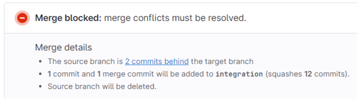
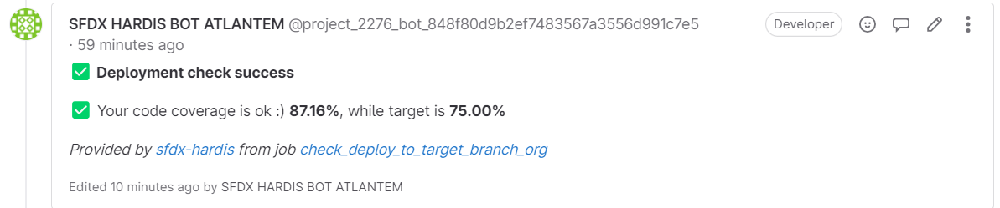
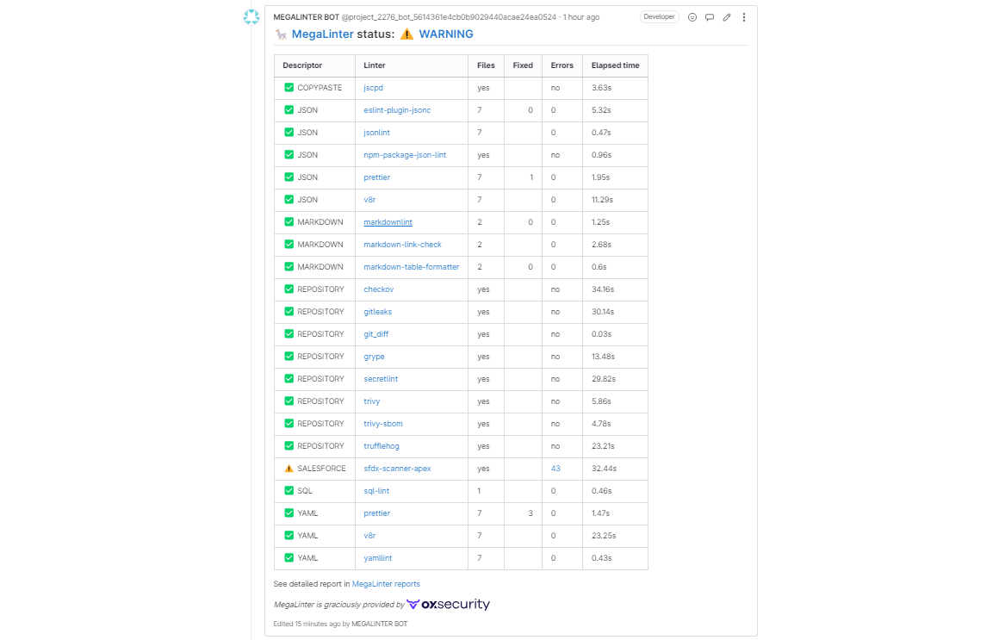

<!-- markdownlint-disable MD013 -->

- [Conflicts detection](#conflicts-detection)
- [Validation comment](#validation-comment)
- [Quality gate](#quality-gate)
- [Deployment comment](#deployment-comment)
- [Deployment Actions comment](#deployment-actions-comment)

## Check the Pull Request results

When you create a Pull Request (Merge Request on GitLab) targeting a major branch, or push a new commit to it, CI jobs start automatically and post their results as comments on the Pull Request. A Pull Request is merged only when these jobs are green, so read them carefully.

### Conflicts detection

If your updates overlap with the work of a colleague already merged in the target branch, the Git platform shows a conflicts message on the Pull Request.

- **If you are trained with git**, you can [solve the conflicts](salesforce-ci-cd-validate-merge-request.md#conflicts) by merging the target branch into your own branch.
- Otherwise, ask your [release manager](salesforce-ci-cd-release-home.md).

### Validation comment

When you create a Pull Request to a major branch, for example `integration`, sfdx-hardis simulates the deployment to the related major org, for example the integration org. Nothing is deployed for real, but Salesforce checks that everything would deploy.

The job also runs the **Apex test classes** and computes the **Apex code coverage**, and adds a **visual diff of the Flows** you updated so reviewers can see what changed without opening Flow Builder.

The result is posted as a comment on the Pull Request.

If you see errors, read [Solve deployment errors](salesforce-ci-cd-solve-deployment-errors.md).

### Quality gate

Every Pull Request also runs a technical quality gate with [MegaLinter](https://megalinter.io/), which checks:

- Apex best practices, using PMD
- Lightning Web Components best practices, using ESLint
- Security issues, like hardcoded tokens
- Excessive copy-pastes

The result is posted as a comment on the Pull Request.

If you see errors, read [Solve MegaLinter errors](salesforce-ci-cd-solve-megalinter-errors.md).

### Deployment comment

Once your release manager merges the Pull Request, the real deployment to the major org runs. Its result is posted as a new comment on the same Pull Request, so you know when your work is live in the org.

If this deployment fails (for example because of a change merged by someone else in the meantime), your release manager handles it and may ask for your help.

### Deployment Actions comment

If your User Story has [deployment actions](salesforce-ci-cd-work-on-task-deployment-actions.md) (data loads, Apex scripts, manual steps...), sfdx-hardis also maintains a **Deployment Actions** comment on the Pull Request. It shows the manual steps still waiting to be done, with a checkbox to tick when you have done them, and the status of every action in every org.
