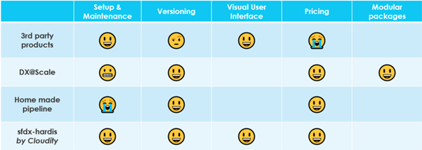

<!-- markdownlint-disable MD013 -->

- [Introduction](#introduction)
- [Use sfdx-hardis CI/CD](#use-sfdx-hardis-cicd)
- [Release Management](#release-management)
- [Setup sfdx-hardis CI/CD](#setup-sfdx-hardis-cicd)

___

## Introduction

There are many ways to do DevOps with Salesforce, each of them have their advantages and inconvenients, like showed in the following comparison table.

{ align=center }

You can setup and use a full CI/CD pipeline for your Salesforce projects using sfdx-hardis.

We provide [Gitlab](https://github.com/hardisgroupcom/sfdx-hardis/blob/main/defaults/ci/.gitlab-ci.yml) & [Azure](https://github.com/hardisgroupcom/sfdx-hardis/blob/main/defaults/ci/azure-pipelines-checks.yml) pipelines, and they can easily be adapted to other platforms like [Github Actions](https://github.com/features/actions), [Jenkins](https://www.jenkins.io/)...

If you speak fluently **git**, **sfdx** & **DevOps**, you can be fully autonomous to setup and use Salesforce CI/CD, otherwise you can contact us at [**Cloudity**](https://cloudity.com/) (or your favorite Salesforce integrator) and we'll be glad to assist you :)

As everything is open-source, there is no license costs !

_Here is an advanced example of a Salesforce CI/CD Pipeline that you can easily define using sfdx-hardis._
_You can define much simpler branch/orgs models, to manage only RUN operations._

{ align=center }

___

## Use sfdx-hardis CI/CD

Please read [User Guide](salesforce-ci-cd-use-home.md) to know how to work on CI/CD projects, as an **Business consultant**, a **Developer** or a **Release Manager**

___

## Release Management

Please read [Release Manager Guide](salesforce-ci-cd-release-home.md) to know how to be a release manager on Salesforce CI/CD project.

___

## Setup sfdx-hardis CI/CD

Please read [Setup Guide](salesforce-ci-cd-setup-home.md) to know how to initialize and maintain a Salesforce CI/CD project.

