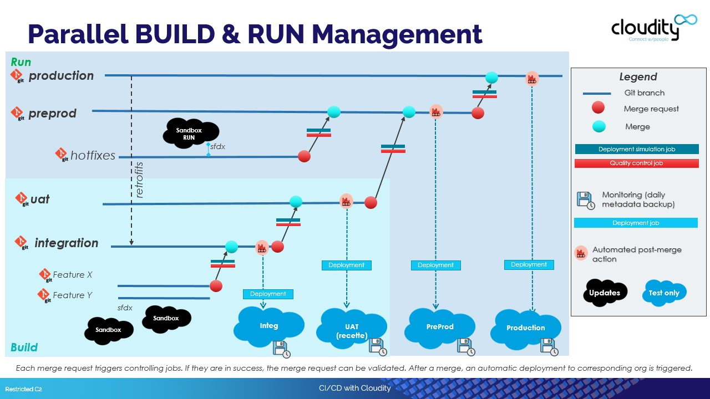

<!-- markdownlint-disable MD013 -->

- [Introduction](#introduction)
- [Setup and maintain sfdx-hardis CI/CD](#setup-and-maintain-sfdx-hardis-cicd)
- [Use sfdx-hardis CI/CD](#use-sfdx-hardis-cicd)

## Introduction

You can setup and use a full CI/CD pipeline for your Salesforce projects using sfdx-hardis.

We provide a [gitlab CI default template](https://github.com/hardisgroupcom/sfdx-hardis/blob/main/defaults/ci/.gitlab-ci.yml), but its can easily be adapted to other platforms like [Github Actions](https://github.com/features/actions), [Azure Pipelines](https://azure.microsoft.com/en-gb/products/devops/pipelines/), [Jenkins](https://www.jenkins.io/)...

If you speak fluently **git**, **sfdx** & **DevOps**, you can be fully autonomous to setup and use Salesforce CI/CD, otherwise you can contact us at [**Cloudity**](https://cloudity.com/) and we'll be glad to assist you :)

_Here is an advanced example of a Salesforce CI/CD Pipeline that you can easily define using sfdx-hardis._
_You can define much simpler branch/orgs models, to manage only RUN operations_

{ align=center }

## Setup and maintain sfdx-hardis CI/CD

Please read [Sfdx-hardis Setup Guide](salesforce-ci-cd-setup-home.md) to know how to initialize and maintain a Salesforce CI/CD project.

## Use sfdx-hardis CI/CD

Please read [Sfdx-hardis User Guide](salesforce-ci-cd-use.md) to know how to work on CI/CD projects, as an **Business consultant**, a **Developer** or a **Release Manager**

