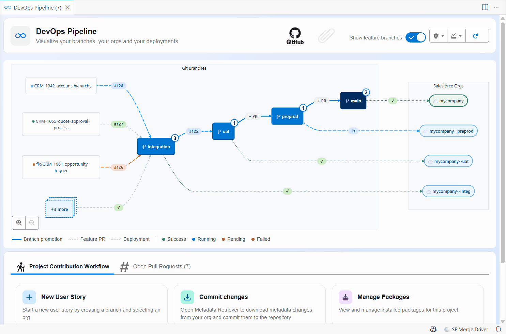
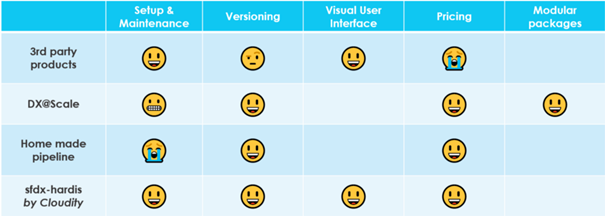
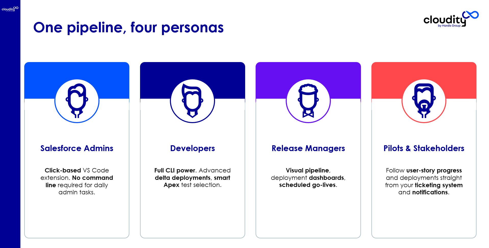
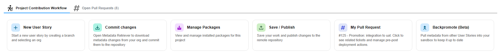
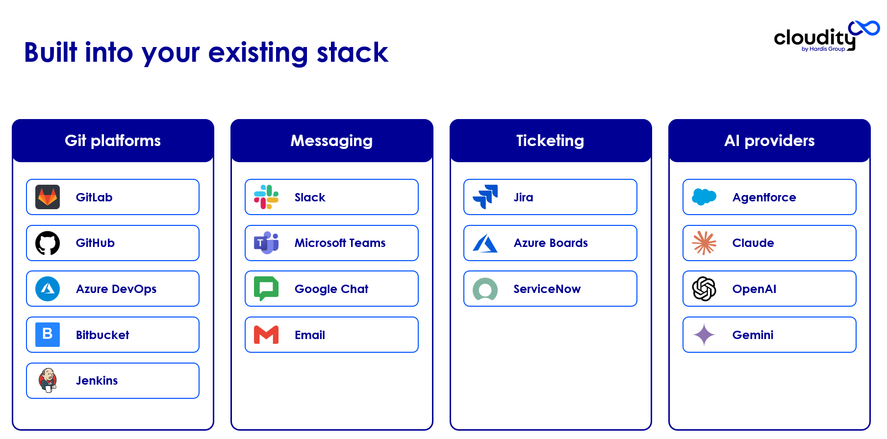
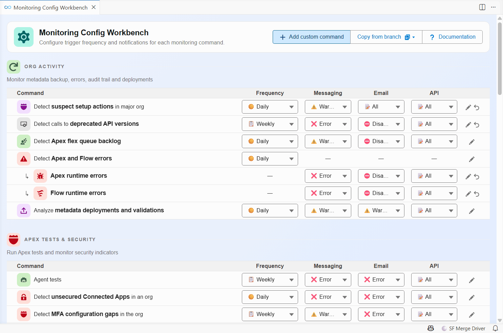
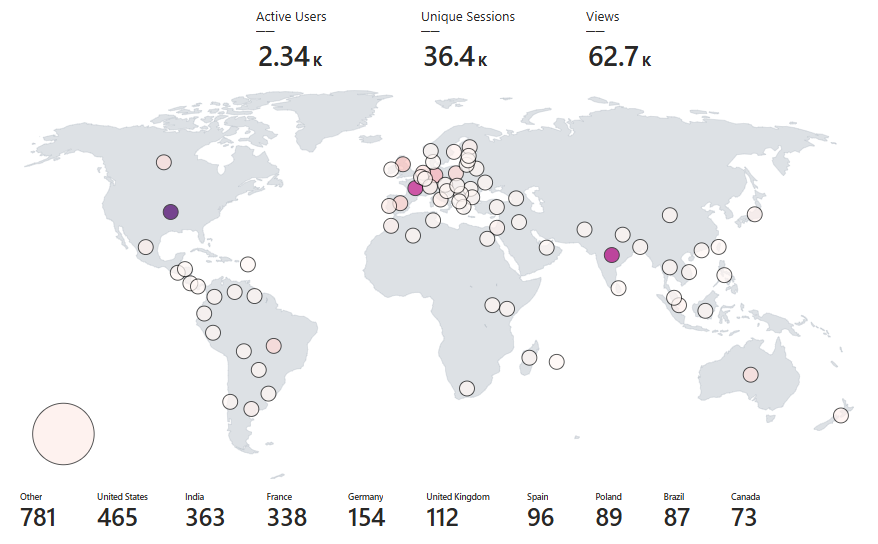
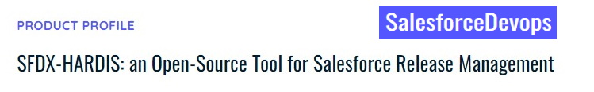
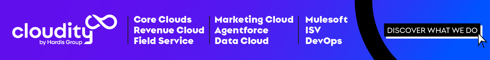

<!-- markdownlint-disable MD013 -->

## Salesforce CI/CD with sfdx-hardis

Run a **production-grade Salesforce CI/CD pipeline** on the Git platform, runners and tools you already use. No vendor lock-in, no extra license, no data leaving your infrastructure.

> Used in production by major companies worldwide. Open-source and free, with optional [Cloudity](https://cloudity.com/) Professional Services for setup, support and release management.

---

## Why sfdx-hardis?

There are many ways to do DevOps with Salesforce. Each has its advantages and limitations.

{ align=center }

- **Admin-friendly**: every persona (admin, developer, release manager, project lead) is autonomous. Admins build Pull Requests with clicks in the VS Code extension, without a command line.
- **Your tools, your infrastructure**: there are no "sfdx-hardis servers". Everything runs in your Git platform, your CI runner and your VS Code. Cloudity has no access to your data.
- **Smart deployments**: delta deployments, overwrite protection, smart Apex test selection and automated source cleaning make deployments faster and safer.
- **Deployment actions**: the steps around a deployment (data loads, Apex scripts, site publishing, scheduled jobs, manual checks) are declared on the Pull Request and run automatically in every org.
- **AI-agent ready**: 130+ commands support an `--agent` flag for non-interactive execution by Claude Code, GitHub Copilot, Codex, Gemini and others.
- **No license fees**: open-source. Many vendors charge 250+ EUR per contributor per month for the same workflow.
- **Monitoring included**: a [daily metadata backup and observability layer](salesforce-monitoring-home.md) runs in a separate monitoring repository, on the same Git platform and CI runner.
- **Documentation included**: generate a [searchable documentation website](salesforce-project-documentation.md) of your whole project (Flows, Objects, Profiles, Apex, Lightning Pages), with AI-written explanations and visual Flow diff history.

---

## Who uses it

| Role                 | How they use sfdx-hardis                                                                                                                                                |
|----------------------|-------------------------------------------------------------------------------------------------------------------------------------------------------------------------|
| **Admins**           | [Build Pull Requests](salesforce-ci-cd-publish-task.md) from the **VS Code extension** with clicks. No command line.                                                    |
| **Developers**       | Same as admins, plus the **Advanced mode** of the UI to see the Salesforce CLI commands that run under the hood.                                                          |
| **Release Managers** | Configure the pipeline with the **Pipeline Settings** panel, track Pull Requests and deployments in the **DevOps Pipeline** view, generate release notes and DORA reports. |
| **Project Managers** | Follow the application lifecycle through the native integrations with **Jira** and **Azure Boards**.                                                                    |

---

## One workflow, from User Story to production

The DevOps Pipeline panel of the VS Code extension guides contributors through the whole cycle. Each card runs a guided command: no Git or Salesforce CLI knowledge required.

1. [**Start a User Story**](salesforce-ci-cd-create-new-task.md): a Git branch is created and a dev sandbox or scratch org is assigned to it.
2. [**Work in your org**](salesforce-ci-cd-work-on-task.md): configure and develop in Salesforce Setup or VS Code, as usual.
3. [**Publish your User Story**](salesforce-ci-cd-publish-task.md): retrieve your changes with the Metadata Retriever, commit the ones you want to publish, then Save / Publish. The manifest is updated, the sources are cleaned, the commit is pushed and the Pull Request is created.
4. [**Check the Pull Request**](salesforce-ci-cd-handle-merge-request-results.md): the CI server simulates the deployment, runs the Apex tests and the quality checks, and posts the results as comments on the Pull Request.
5. [**Review, merge and deploy**](salesforce-ci-cd-release-home.md): once merged, the CI server deploys to the matching org, runs the deployment actions, notifies the team and updates the tickets.

---

## What you get

**Smart deployments**

- [Delta deployments](salesforce-ci-cd-config-delta-deployment.md): deploy only what changed.
- [Overwrite management](salesforce-ci-cd-config-overwrite.md): protect metadata that must never be overwritten by the pipeline.
- [Smart Apex test runs](https://sfdx-hardis.cloudity.com/hardis/project/deploy/smart/#smart-deployments-tests): skip tests that cannot break on sandbox Pull Requests.
- [Automated source cleaning](salesforce-ci-cd-config-cleaning.md): tidy profiles, flow positions and more before each Pull Request.
- [Quick Deploy](salesforce-ci-cd-smart-deployment.md): reuse the validated deployment after the merge instead of deploying twice.

**Deployment actions**

Deploying a User Story is not always just about metadata. With [deployment actions](salesforce-ci-cd-work-on-task-deployment-actions.md), contributors declare on their Pull Request what must happen before or after the deployment: run a command, import data with SFDMU, run an Apex script, publish an Experience Cloud site, schedule an Apex batch, remove items from package.xml, or remind a human to do something in Setup. sfdx-hardis runs them in every org the User Story reaches, once per org, and tracks what has been done in a Pull Request comment.

**Releases and reporting**

- [Release Notes](hardis/doc/salesforce-ci-cd-release-notes.md): generated from the Git history, the tickets, the metadata changes and the deployment actions. Markdown, PDF and XLSX outputs, with an optional AI summary.
- [DORA Metrics](hardis/doc/salesforce-ci-cd-dora-report.md): Deployment Frequency, Lead Time for Changes, Change Failure Rate and MTTR, scored Elite / High / Medium / Low against industry benchmarks.
- [Backpromote (Beta)](hardis/work/backpromote.md): bring the changes merged in a parent branch back into a developer's sandbox, with org conflict detection and diff reports.

**Integrations**

- [Slack, Microsoft Teams and email notifications](salesforce-ci-cd-setup-integrations-home.md) with detailed deployment results.
- [Jira](salesforce-ci-cd-setup-integration-jira.md), [Azure Boards](salesforce-ci-cd-setup-integration-azure-boards.md) or [any other ticketing tool](salesforce-ci-cd-setup-integration-generic-ticketing.md): tickets are linked in Pull Request comments and updated when they reach an org.
- [Deployment Agent](salesforce-deployment-agent-home.md): explains deployment errors with built-in rules and AI (Agentforce, or direct calls to OpenAI, Anthropic or Gemini).

> Read the [Smart Deploy internals](salesforce-ci-cd-smart-deployment.md) page to see how all these pieces fit together in a single deployment.

---

## Plays nicely with your stack

- **Git and CI/CD**: GitHub, GitLab, Bitbucket, Azure DevOps, Gitea, Jenkins
- **Messaging**: Slack, Microsoft Teams, Google Chat, Email
- **Ticketing**: Jira, Azure Boards, or anything else via webhooks
- **AI**: Agentforce, OpenAI, Anthropic, Gemini, Ollama
- **Observability**: Grafana, Vector.dev (DataDog, Splunk...)

Compliance stays in your hands: it depends on the tools you already operate (Git platform, runner, Jira, AI providers, SSO) and on the security policies you apply to them.

---

## AI-agent ready

Every command that asks questions also supports an `--agent` flag that switches to fully non-interactive execution:

- **No tokens wasted on menus**: agents skip the multi-choice prompts.
- **Predictable execution**: required values are passed as CLI flags. The command fails fast with a clear error when something is missing.
- **Safe defaults**: sensible defaults apply when prompts are skipped. Destructive operations still need an explicit flag.

With 130+ commands supporting `--agent`, your coding agent can drive the whole Salesforce DevOps lifecycle: create User Stories, deploy metadata, run diagnostics, purge obsolete data, manage packages.

See [Work with AI coding agents](salesforce-ci-cd-agent-skills.md) for the full picture.

---

## Ready-to-use pipeline templates

The deployment simulation results are posted as comments on every Pull Request.

| Platform       | CI/CD template                                                                                                                                                                                                                                                                                           |
|----------------|----------------------------------------------------------------------------------------------------------------------------------------------------------------------------------------------------------------------------------------------------------------------------------------------------------|
| GitLab         | [GitLab CI configuration](https://github.com/hardisgroupcom/sfdx-hardis/blob/main/defaults/ci/.gitlab-ci.yml)                                                                                                                                                                                            |
| Azure DevOps   | [Azure Pipelines checks](https://github.com/hardisgroupcom/sfdx-hardis/blob/main/defaults/ci/azure-pipelines-checks.yml), [Azure Pipelines deployment](https://github.com/hardisgroupcom/sfdx-hardis/blob/main/defaults/ci/azure-pipelines-deployment.yml)                                               |
| GitHub & Gitea | [GitHub Actions / Gitea workflow checks](https://github.com/hardisgroupcom/sfdx-hardis/blob/main/defaults/ci/.github/workflows/check-deploy.yml), [GitHub Actions / Gitea workflow deployment](https://github.com/hardisgroupcom/sfdx-hardis/blob/main/defaults/ci/.github/workflows/process-deploy.yml) |
| Bitbucket      | [Bitbucket Pipelines](https://github.com/hardisgroupcom/sfdx-hardis/blob/main/defaults/ci/bitbucket-pipelines.yml)                                                                                                                                                                                       |
| Jenkins        | [Jenkinsfile](https://github.com/hardisgroupcom/sfdx-hardis/blob/main/defaults/ci/Jenkinsfile)                                                                                                                                                                                                           |

The pipelines adapt to other platforms like [TeamCity](https://www.jetbrains.com/teamcity/).

_An advanced branch and org model you can build with sfdx-hardis. Simpler RUN-only models also work:_

{ align=center }

For more questions and answers, see this article:

---

## Monitoring on the same Git platform

CI/CD is only half the story. Once your changes reach production, you still need to **know what is happening in your orgs**. sfdx-hardis ships with a [Monitoring layer](salesforce-monitoring-home.md) that lives in its own repository (separate from the CI/CD one), on the same Git platform and CI runner. No extra license, no extra platform.

What you get out of the box:

- **Daily metadata backup** with the exact Git diff between yesterday and today (who changed what, before and after).
- **Suspect setup actions** detected in the Salesforce Audit Trail, so production changes never go unnoticed.
- **Apex tests, code quality (MegaLinter), org limits, deprecated API calls, release updates, unsecured Connected Apps, unused licenses, missing access** and more, all scheduled and reported automatically.
- **Per-channel notifications** routed independently to [Slack and Microsoft Teams](salesforce-ci-cd-setup-integration-slack.md), [email](salesforce-ci-cd-setup-integration-email.md) and [API / Grafana / Prometheus](salesforce-ci-cd-setup-integration-api.md), with a severity threshold per notification type (stream everything to Grafana, keep Slack for warnings and errors).
- **Ready-to-use Grafana dashboards** to follow org health, backups, tests, security and license usage over time.
- **Fully configurable** from the [VS Code SFDX Hardis extension](https://marketplace.visualstudio.com/items?itemName=NicolasVuillamy.vscode-sfdx-hardis) or directly in `.sfdx-hardis.yml` (frequency, thresholds, channels, custom commands).

> Pick CI/CD with sfdx-hardis and you also get a production-grade monitoring stack in the same move. See the [Monitoring documentation](salesforce-monitoring-home.md) for the full picture.

---

## Open-source, no license fees

Everything is **open-source**. There are **no license costs**.

> In comparison, many Salesforce DevOps vendors charge more than 250 EUR per contributor per month.

Run it yourself, or ask [**Cloudity**](https://cloudity.com/) Professional Services for support.

---

## Used in production worldwide

Featured in conferences, blogs and webinars.

_Interview on SalesforceBen with a live demo:_

<iframe width="560" height="315" src="https://www.youtube.com/embed/vtWx_IWoL9k" title="YouTube video player" frameborder="0" allow="accelerometer; autoplay; clipboard-write; encrypted-media; gyroscope; picture-in-picture" allowfullscreen></iframe>

> The Dreamforce presentation, the slides and the article below were recorded before sfdx-hardis got its current **LWC-based UI**. The concepts still apply, but the on-screen experience is now built around Lightning Web Component panels instead of CLI menus.

_Dreamforce presentation:_

<iframe width="560" height="315" src="https://www.youtube.com/embed/o0Mm9F07UFs" title="YouTube video player" frameborder="0" allow="accelerometer; autoplay; clipboard-write; encrypted-media; gyroscope; picture-in-picture" allowfullscreen></iframe>

_Slides from the [Dreamforce '23 session](https://reg.salesforce.com/flow/plus/df23/sessioncatalog/page/catalog/session/1684196389783001OqEl){target=\_blank}:_

<iframe src="https://www.slideshare.net/slideshow/embed_code/key/qroQjoKmRUUjqx?hostedIn=slideshare&page=upload" width="714" height="600" frameborder="0" marginwidth="0" marginheight="0" scrolling="no"></iframe>

_Detailed article on SalesforceDevOps.net:_

{target=\_blank}

---

## Get started

### Set it up yourself

Open-source and free. The [**Setup Guide**](salesforce-ci-cd-setup-home.md) walks you through the initialization of a Salesforce CI/CD project, from the Git repository to the first Pull Request.

### Get help from Cloudity

sfdx-hardis works well on its own. It works even better with the people who built it on your side: a sharper branch model, a cleaner pipeline, edge cases anticipated upfront. [**Cloudity**](https://cloudity.com/), the company behind sfdx-hardis, offers four service tiers to match every team's needs and budget.

---

#### Assisted Setup: for experienced teams

> **Best for:** teams with solid Git and Salesforce CLI skills who want expert guidance without handing over the wheel.

Your team drives the setup. A Cloudity expert rides along: reviewing your branch model, validating your pipeline configuration, unblocking tricky situations, and making sure you follow best practices from the start.

**What's included:**

- Branch and org model review and recommendations
- Guided pipeline configuration (CI checks, deployments, notifications)
- Review of your sfdx-hardis configuration files
- Q&A sessions with a Cloudity expert at key milestones
- Guidance and material to train your team on sfdx-hardis best practices

The most cost-effective way to get professional assurance without a full engagement.

---

#### Full Setup Service: end-to-end, done for you

> **Best for:** teams that want a production-ready CI/CD pipeline without investing internal time in setup and configuration.

Cloudity takes full ownership. You receive a fully configured CI/CD pipeline, proven on many projects and tailored to your org structure, team size and release process. Ready to go live.

**What's included:**

- Analysis of your existing Salesforce org and release process
- Full pipeline setup on your Git platform (GitHub, GitLab, Azure DevOps, Bitbucket, Jenkins...)
- Branch model and deployment strategy definition
- Training sessions for contributors, release managers and project leads
- Change management support to accelerate adoption across your organization
- Handover documentation and knowledge transfer

---

#### Option: Support Subscription, peace of mind over time

> **Best for:** any team that wants guaranteed access to sfdx-hardis expertise after go-live, and wants to stay ahead of Salesforce releases.

A Cloudity expert is available whenever you need them: to answer questions, resolve blockers and review changes. You also directly fund the sustainability of sfdx-hardis as an open-source project.

**What's included:**

- A pool of skilled Cloudity experts, reachable by your team
- Priority response for incidents and deployment issues
- Proactive alerts on Salesforce API changes and sfdx-hardis updates that may affect your pipelines
- Access to new sfdx-hardis features and security patches as they ship
- Direct influence on the sfdx-hardis roadmap through feedback and feature requests

---

#### Option: Release Manager as a Service, your release process covered

> **Best for:** teams without a dedicated release manager, or who need cover during holidays, parental leave or peak release periods.

A Cloudity release manager takes the wheel, permanently or on demand. Your team keeps shipping and your release cadence stays on track.

**What's included:**

- Day-to-day management of Pull Requests, deployments and release branches
- Coordination between development, QA and business teams
- Incident response and rollback management
- Available as a permanent service or as a temporary cover arrangement

---

  
   
  <a href="https://cloudity.com/contact-us/" target="_blank" rel="noopener noreferrer" role="button" aria-label="Cloudity Professional Services"
     style="display:inline-block; padding:0.75rem 1.25rem; background:#0070d2; color:#ffffff; text-decoration:none; border-radius:0.25rem; font-weight:600; margin-top:1rem;">
    Talk to a Cloudity expert
  </a>

---

## Next steps

- [**Contributor Guide**](salesforce-ci-cd-use-home.md): work on a CI/CD project as a business analyst, admin or developer.
- [**Release Manager Guide**](salesforce-ci-cd-release-home.md): review Pull Requests, drive deployments and releases, configure the project.
- [**Setup Guide**](salesforce-ci-cd-setup-home.md): initialize a Salesforce CI/CD project from scratch.
- [**Monitoring**](salesforce-monitoring-home.md): back up and monitor your orgs from a separate repository on the same Git platform.
