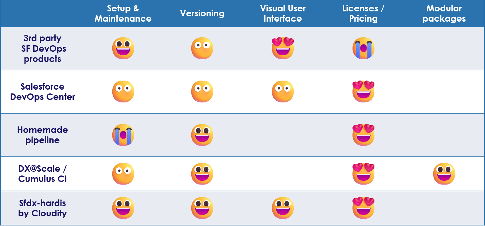
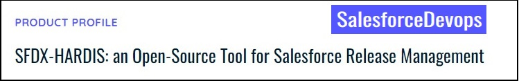

<!-- markdownlint-disable MD013 -->

- [Why choosing sfdx-hardis ?](#why-choosing-sfdx-hardis)
  - [Because it is user friendly](#because-it-is-user-friendly)
  - [Because it is powerful](#because-it-is-powerful)
  - [Because there are no licences costs](#because-there-are-no-licences-costs)
  - [Because it is widely adopted](#because-it-is-widely-adopted)
- [Get started](#get-started)
  - [Setup sfdx-hardis](#setup-sfdx-hardis)
  - [As a Contributor](#as-a-contributor)
  - [As a Release Manager](#as-a-release-manager)

___

## Why choosing sfdx-hardis ?

There are many ways to do DevOps with Salesforce, each of them have their advantages and inconveniences, like showed in the following comparison table.

{ align=center }

### Because it is user friendly

- **Admins** are autonomous to [build their pull requests](https://sfdx-hardis.cloudity.com/salesforce-ci-cd-publish-task/) **with clicks in VsCode Extension, no command lines**
- **Developers** understand what's happening under the hood with SF CLI thanks to the **Advanced mode** of the User Interface
- **Release Managers** can easily configure the CI/CD process using the **Visual DevOps Pipeline Builder**
- **Project Managers** can easily follow the Application Lifecycle Management on the project using sfdx-hardis native integration with Ticketing systems like JIRA and Azure Boards.

### Because it is powerful

More advanced features are making sfdx-hardis a credible alternative to expensive SF DevOps vendor tools:

- [**Delta Deployments**](salesforce-ci-cd-config-delta-deployment.md): Improve performances by deploying only updated metadatas
- [**Overwrite Management**](salesforce-ci-cd-config-overwrite.md): Define which metadatas will never be overwritten if they are already existing in the target org of a deployment
- [**Smart Apex Test Runs**](https://sfdx-hardis.cloudity.com/hardis/project/deploy/smart/#smart-deployments-tests): If your Pull Request to a sandbox can not break Apex Tests, just don't run them to improve performances.
- [**Automated sources cleaning**](salesforce-ci-cd-config-cleaning.md): Clean profiles from attributes existing on permission sets, clean flow positions...
- [**Integration with Messaging platforms**](salesforce-ci-cd-setup-integrations-home.md): Receive detailed deployment notifications on **Slack**, **Microsoft Teams** and Emails
- Integration with **ticketing systems**: [**JIRA**](https://sfdx-hardis.cloudity.com/salesforce-ci-cd-setup-integration-jira/), [**Azure Boards**](https://sfdx-hardis.cloudity.com/salesforce-ci-cd-setup-integration-azure-boards/), or [any other tool](https://sfdx-hardis.cloudity.com/salesforce-ci-cd-setup-integration-generic-ticketing/)
- [**Integration with AI**](salesforce-deployment-assistant-home.md) to easily solve Deployment issues (use Agentforce, or direct calls to OpenAI, Anthropic, Gemini...)

We provide **ready to use CI/CD pipeline workflows** for the following Git platforms, with results of Deployment simulation jobs as comments on Pull Requests:

- [Gitlab](https://github.com/hardisgroupcom/sfdx-hardis/blob/main/defaults/ci/.gitlab-ci.yml)
- [Azure](https://github.com/hardisgroupcom/sfdx-hardis/blob/main/defaults/ci/azure-pipelines-checks.yml)
- [Github & Gitea](https://github.com/hardisgroupcom/sfdx-hardis/blob/main/defaults/ci/.github/workflows/deploy.yml)
- [BitBucket](https://github.com/hardisgroupcom/sfdx-hardis/blob/main/defaults/ci/bitbucket-pipelines.yml)
- [Jenkins](https://github.com/hardisgroupcom/sfdx-hardis/blob/main/defaults/ci/Jenkinsfile)

Pipelines can easily be adapted to other platforms like [TeamCity](https://www.jetbrains.com/teamcity/)

_Here is an advanced example of a Salesforce CI/CD Pipeline that you can easily define using sfdx-hardis._
_You can define much simpler branch/orgs models, to manage only RUN operations._

{ align=center }

### Because there are no licences costs

As everything is **open-source**, there is **no license costs** !

> In comparison, many Salesforce DevOps tools vendors charge more than 250€/user/month per contributor user.

You can handle everything on your own, or ask [**Cloudity**](https://cloudity.com/) Professional Services for support.

### Because it is widely adopted

Sfdx-hardis CI/CD is used in production by major companies all around the world.

It is also demonstrated in many conferences / blogs / webinars.

_See presentation of sfdx-hardis at Dreamforce !_

<iframe width="560" height="315" src="https://www.youtube.com/embed/o0Mm9F07UFs" title="YouTube video player" frameborder="0" allow="accelerometer; autoplay; clipboard-write; encrypted-media; gyroscope; picture-in-picture" allowfullscreen></iframe>

_See Slides of [Dreamforce 23 session](https://reg.salesforce.com/flow/plus/df23/sessioncatalog/page/catalog/session/1684196389783001OqEl){target=_blank}_

<iframe src="https://www.slideshare.net/slideshow/embed_code/key/qroQjoKmRUUjqx?hostedIn=slideshare&page=upload" width="714" height="600" frameborder="0" marginwidth="0" marginheight="0" scrolling="no"></iframe>

_See detailed article on SalesforceDevOps.net_

{target=_blank}

___

## Get started

### Setup sfdx-hardis

If you speak fluently **Git**, **Salesforce CLI** & **DevOps**, you can be fully autonomous to setup and use Salesforce CI/CD.

You can also contact us at [**Cloudity**](https://cloudity.com/) and our Professional Services we'll be glad to assist you with:

- Technical setup and initialization from your existing Salesforce production org sources
- Release Management strategy definition
- Training of your contributors and release managers
- Change management to accelerate adoption of DevOps in your structure

Please read [Setup Guide](salesforce-ci-cd-setup-home.md) to know how to initialize and maintain a Salesforce CI/CD project.

### As a Contributor

Please read [Contributor Guide](salesforce-ci-cd-use-home.md) to know how to work on CI/CD projects, as an **Business analyst**, a **Salesforce Administrator** or a **Salesforce Developer**

### As a Release Manager

Please read [Release Manager Guide](salesforce-ci-cd-release-home.md) to know how to be a release manager on Salesforce CI/CD project.

