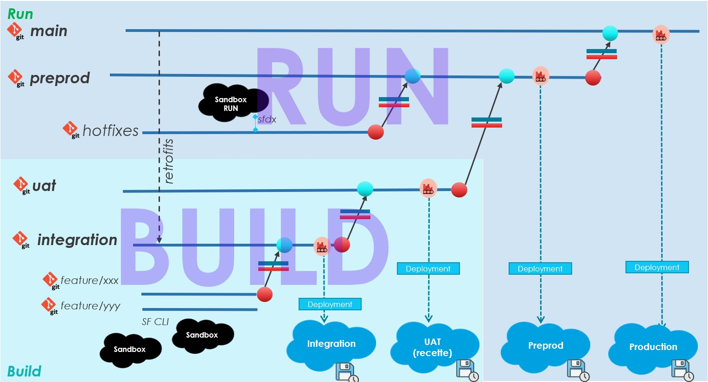

<!-- markdownlint-disable MD013 -->

## BUILD & RUN

Except for projects in maintenance that contain RUN only, a project is separated into 2 sections:

- the RUN stream: Fast cycle, to often deploy minor changes and fixes

- the BUILD stream: Project cycle, to build more advanced features and enhancements, that require User Acceptance Testing

### THE BUILD

This is the layer where you prepare the **next major or minor version**.

Such new features will go through **integration level**, then **uat level** where they will be **qualified and validated by business users**.

When the User Acceptance Test will be validated in **uat org**, then **uat can be merged into preprod**, and just after minimal tests (mostly technical), **preprod will soon be merged into production**.

Is it important that **major features or enhancements are not tested directly at preprod level**, because while the next version is being validated in preprod, it is **not possible for the RUN to deploy anything into production**.

### THE RUN

Daily maintenance of the production Salesforce org must be very reactive, the RUN level will allow you to often **deploy patch versions**.

As we usually can not wait for the next minor or major version to be deployed in production, projects need a way to quickly deploy hot fixes into production. That layer is called the RUN, and is exclusively about **preprod** and **main** branches.

To summarize, you will **publish at RUN level, but also at BUILD level**, so when the BUILD will be merged in the RUN, **there will be no overwrite triggering regressions**.

The **hotfix process** is the following:

_Note: in this example, we merge directly in **preprod**, but in more advanced organizations we can define a branch/org **uat_run** as intermediate layer before merging to preprod_

- IMPLEMENT **HOTFIX** _**(1)**_

  - Create new task with **preprod as target when prompted**, named `my-very-hot-hotfix` for example

  - Work on a dev sandbox that has been cloned from production

- DEPLOYMENT IN **RUN LAYER** _**(2)**_

  - Create Pull Request from `my-very-hot-hotfix` to `preprod` & merge it after controls (do not select “delete after merge” )

  - Create Pull request from `preprod` to `main`

  - Merge `preprod` to `main` after control checks are green.

- RETROFIT IN **BUILD LAYER** _**(3)**_

  - Create a sub-branch to `integration`, named `retrofit-from-run` for example

  - Using Git IDE, manually merge `main` (or `preprod`) branch into `retrofit-from-run`

  - If there are git conflicts, solve them before committing

  - Create Pull Request from `retrofit-from-run` to `integration`

  - Merge the Pull Request into `integration`: your retrofit from the RUN to the BUILD is over :)
    - You might refresh dev sandboxes if your retrofits have lots of impacts