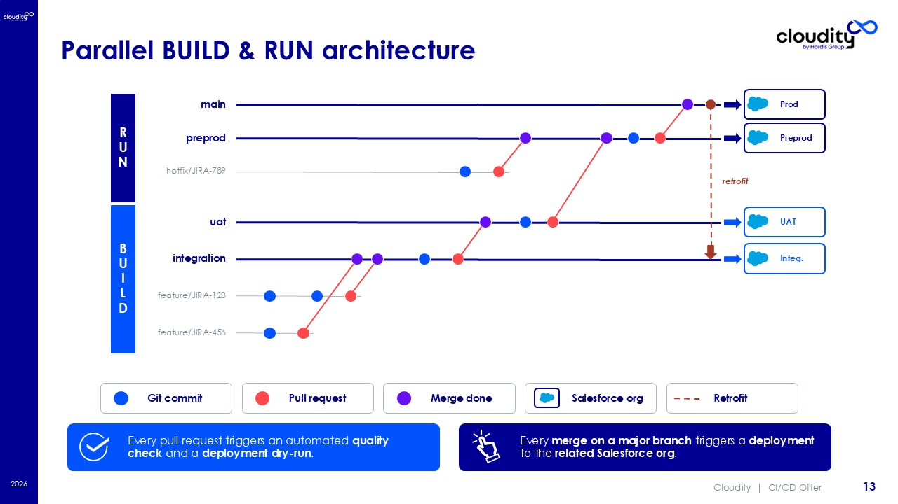
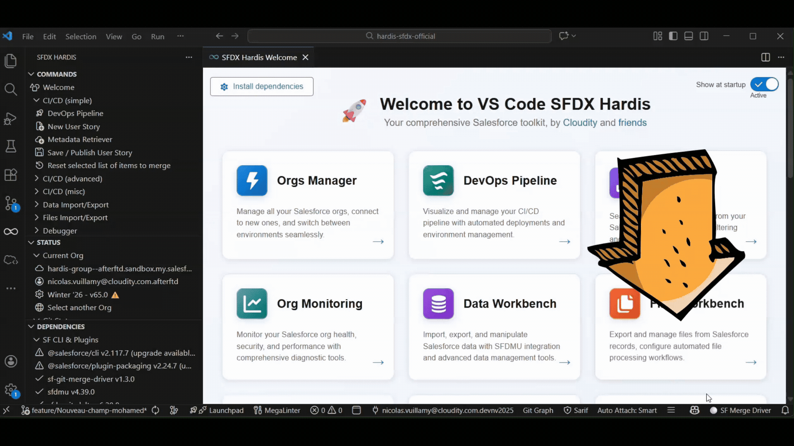

<!-- markdownlint-disable MD013 -->

## Hotfixes and retrofit

- [BUILD and RUN](#build-and-run)
  - [The BUILD](#the-build)
  - [The RUN](#the-run)
- [Hotfix process](#hotfix-process)
  - [1. Implement the hotfix](#1-implement-the-hotfix)
  - [2. Deploy in the RUN stream](#2-deploy-in-the-run-stream)
  - [3. Retrofit in the BUILD stream](#3-retrofit-in-the-build-stream)

___

## BUILD and RUN

Except for projects in maintenance that only have a RUN, a project is split in two streams:

- the **RUN** stream: a fast cycle, to often deploy minor changes and fixes
- the **BUILD** stream: the project cycle, to build larger features and enhancements that require User Acceptance Testing

### The BUILD

This is the stream where you prepare the **next major or minor version**.

New features go through the **integration level**, then the **uat level**, where **business users qualify and validate them**.

Once the User Acceptance Test is validated in the **uat org**, **uat is merged into preprod**. After minimal (mostly technical) tests, **preprod is merged into production**.

Major features or enhancements must **not be tested directly at preprod level**: while the next version is being validated in preprod, the RUN **cannot deploy anything into production**.

### The RUN

The daily maintenance of the production org must be very reactive: the RUN stream lets you often **deploy patch versions**.

As you usually cannot wait for the next minor or major version to reach production, you need a way to quickly deploy hotfixes. That stream is the RUN, and it only involves the **preprod** and **main** branches.

To summarize, you **publish at RUN level, then also at BUILD level** (the retrofit), so that when the BUILD is later merged into the RUN, **no overwrite triggers a regression**.

___

## Hotfix process

The hotfix process has three phases:

1. **Implement the hotfix** on a branch that targets `preprod`
2. **Promote `preprod` to `main`**: the hotfix reaches production
3. **Retrofit `main` (or `preprod`) into `integration`**: the BUILD gets the hotfix too

_Note: in this example, the hotfix is merged directly into **preprod**. More advanced organizations can define a **uat_run** branch and org as an intermediate level before preprod._

### 1. Implement the hotfix

- [Start a new User Story](salesforce-ci-cd-create-new-task.md) and select **preprod as target branch when prompted**. Name it `my-very-hot-hotfix`, for example
- Work on a dev sandbox that has been cloned from production

### 2. Deploy in the RUN stream

- Create a Pull Request (Merge Request on GitLab) from `my-very-hot-hotfix` to `preprod`, and merge it once the control jobs pass (do not select **Delete source branch after merge**)
- Create a Pull Request from `preprod` to `main`
- Merge it once the control jobs are green: the hotfix is deployed in production

### 3. Retrofit in the BUILD stream

Activate the [sf-git-merge-driver](https://github.com/jayree/sf-git-merge-driver) plugin before the retrofit: it automatically solves many XML conflicts.

- Create a sub-branch of `integration` named `retrofit/from-main`, for example. Keep the `retrofit/` prefix: sfdx-hardis recognizes it and carries the [deployment actions](salesforce-ci-cd-work-on-task-deployment-actions.md) of every Pull Request included in the retrofit
- Using your git IDE, merge the `main` (or `preprod`) branch into `retrofit/from-main`
- If there are git conflicts, solve them before committing
- Create a Pull Request from `retrofit/from-main` to `integration`
- Merge the Pull Request into `integration`: the retrofit from the RUN to the BUILD is done
  - If the retrofit has many impacts, consider refreshing the dev sandboxes
