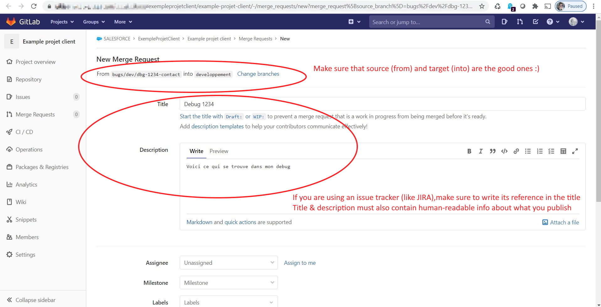
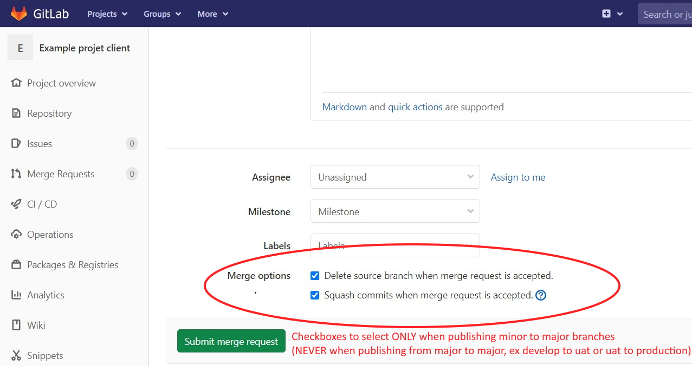

<!-- markdownlint-disable MD013 -->

## Create a Merge Request on GitLab

Once your branch is pushed (see [Publish your User Story](salesforce-ci-cd-publish-task.md)), create a Merge Request (the GitLab name for a Pull Request) to ask for your work to be merged into the target major branch. At the end of the **Save / Publish** command, sfdx-hardis shows a **Create Merge Request** button that opens the right page directly. Otherwise, follow these steps.

1. Open your repository in your web browser (example: `https://gitlab.com/mycompany/dreamhouse-lwc`).

2. Go to the **Merge requests** menu and click **New merge request**. Select the **source branch** (your User Story branch) and the **target branch** (the target major branch, for example `integration`), then click **Compare branches and continue**.

3. Check that the **From** and **into** branches are the right ones. Add a meaningful title and description. If you use a ticketing system like Jira, put the ticket number in the title.

    { align=center }

4. In **Merge options**, check **Delete source branch when merge request is accepted** and **Squash commits when merge request is accepted**. These two options are for User Story branches only: never check them for a Merge Request between two major branches (for example `integration` to `uat`). Then click **Create merge request**.

    { align=center }

### After creation

- The validation jobs start automatically and post their results as comments on the Merge Request. See [Check the Pull Request results](salesforce-ci-cd-handle-merge-request-results.md).
- To add more updates to an open Merge Request, do not create a new one: commit again and run **Save / Publish** again, as described in [Publish your User Story](salesforce-ci-cd-publish-task.md). Every new commit pushed to your branch runs the validation jobs again.
- When the jobs are green, your release manager [reviews and merges the Merge Request](salesforce-ci-cd-validate-merge-request.md). Depending on the organization of the project, you may be responsible for getting the jobs green yourself before asking for the review.
