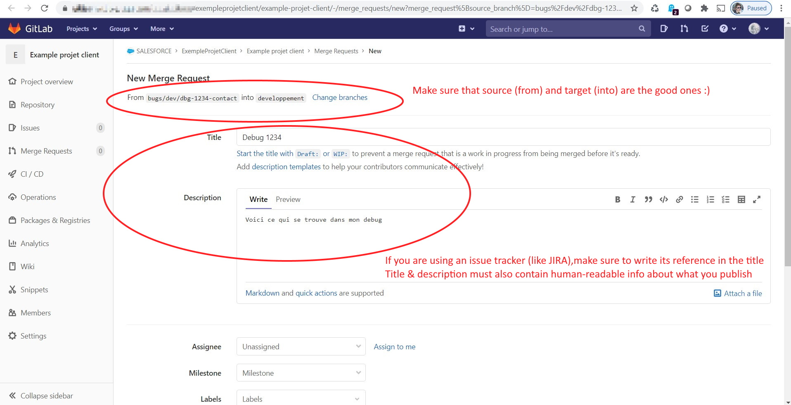
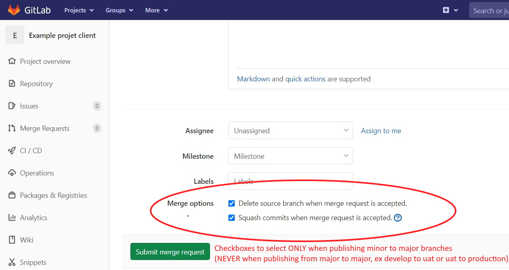

<!-- markdownlint-disable MD013 -->

## Create a merge request using Gitlab

- Go in your online repository in your web browser (example: `https://gitlab.com/trailheadapps/dreamhouse-lwc`)

- Go to menu **Merge Requests**

- Create a **New Merge request**

{ align=center }

{ align=center }

- Click on **Submit merge request**

- Controlling jobs are automatically launched, you can now ask your release manager to [**validate a merge request**](salesforce-ci-cd-validate-merge-request.md)
  - _If you are a developer, (or even a business consultant depending on the project organization), you may have the responsibility to make sure than controlling jobs are valid (**check-deploy job** and **code-quality job** in **success**)_

- If you need to add additional updates to an existing merge requests, you just this to follow again [this guide](salesforce-ci-cd-publish-task.md) from the beginning, except the part "Create a merge request". Any new commit pushed on a branch where there is already a merge request will trigger again the [control jobs](salesforce-ci-cd-validate-merge-request.md#control-jobs).
