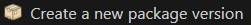
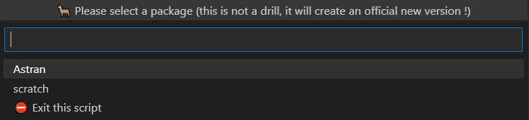
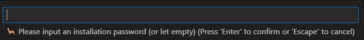

<!-- markdownlint-disable MD013 -->

## Pre-requisites

sfdx-hardis menus allow to create new packages and new package versions, but to do that you need some pre-requisites.

- In order to generate packages, you first need a Dev Hub to link them.

  - Instructions in [Salesforce Documentation](https://developer.salesforce.com/docs/atlas.en-us.sfdx_dev.meta/sfdx_dev/sfdx_dev_dev2gp_before_know_orgs.htm)

- If you need to use a namespace with a package (managed or unmanaged), you also need to link you Dev Hub and a dev org where you will create the namespace.

  - Instructions in [Salesforce Documentation](https://developer.salesforce.com/docs/atlas.en-us.sfdx_dev.meta/sfdx_dev/sfdx_dev_dev2gp_create_namespace.htm)

- Then you need a sfdx-hardis flavored sfdx project, that you can create with `sfdx hardis:project:create`

## New package

Use sfdx-hardis menu **Packaging -> Create a new package** and follow instructions.

___

## New package version

### Git branch

Create a git sub-branch of your packaging branch (for example `pkg/release-v0.1.0`)

___

### Increment package version

Before being able to generate a new package version, you need to increment the package version in `sfdx-project.json`.

```json
{
  "packageDirectories": [
    {
      "path": "package-astran",
      "default": true,
      "package": "Astran",
      "versionName": "ver 0.1",                         # Change version name here to match the incremented package version
      "versionNumber": "0.1.0.NEXT",                    # Increment version here (Respect SEMVER or you will have errors)
      "versionDescription": "Astran for Salesforce"
    },
    {
      "path": "scratch",
      "default": false
    }
  ],
  "name": "astran",
  "namespace": "Astran",
  "sfdcLoginUrl": "https://my-devhub-org.salesforce.com",
  "sourceApiVersion": "57.0"
}
```

___

### Run create package version command

Run sfdx-hardis command **Packaging -> Create new package version**



Select the package you want to create a version, and input an installation if necessary (otherwise let it blank)





After some time, the new package version will be generated, and you will be able to find its ID in your `sfdx-project.json`

```json
{
    ...
      "packageAliases": {
        "Astran": "0Ho7S0123010wZWSAU",
        "Astran@0.1.0-1": "04t7S000000gYxPQAF",
        "Astran@0.1.0-2": "04t7S000000gYm1QAE",
        "Astran@0.1.0-3": "04t7S000000gYp7WAG",
}
```

If you have issues, it might be because you incremented the version as a patch whereas the updates with the previous version require at least a minor version.

For example, `1.1.4.NEXT` can fail, and `1.2.0.NEXT` will pass

___

### Test the beta version

 _(optional but recommended)_

The latest entry is the one you can use to install the beta package version (every created package version is a beta by default)

Example of URL to append at the end of your org domain name: `/packaging/installPackage.apexp?p0=04t7S000000gYp7QAG`

Install the beta package in a dummy sandbox to check that its content is ok for you

___

### Pull request to packaging branch

Once you decide the package is ok for you, make a Pull Request to the `packaging` branch (or `main` branch, depending on your project config)

___

### Promote the beta

Once you merged your PR in packaging branch (after checking the control jobs are green), you can promote the package.

> **WARNING**: Promoting a package is a sensitive operation, because it declares it as production-ready, then you can not remove metadatas from it, and you must respect ascending compatibility to generate new package versions !

To promote a package version, run the following command

`sfdx force:package:version:promote -p PACKAGE_VERSION_ID`

Example: `sfdx force:package:version:promote -p 04t7S000000gYp7QAG`

Note: When later you will **create a new scratch org** in a new development branch, if you have issues, just increment again the `versionNumber` in `sfdx-project.json`

___

### Create version git tag

Once you promoted a package, **create a git tag** with the version id on the commit corresponding to your merged Pull Request

Example: `v1.1.0`

Push the git tag to origin

