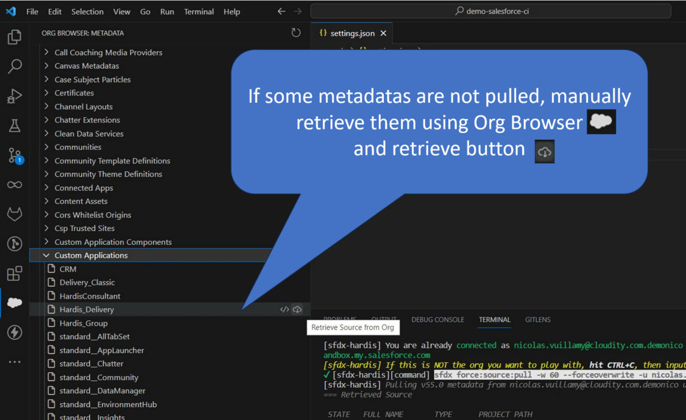
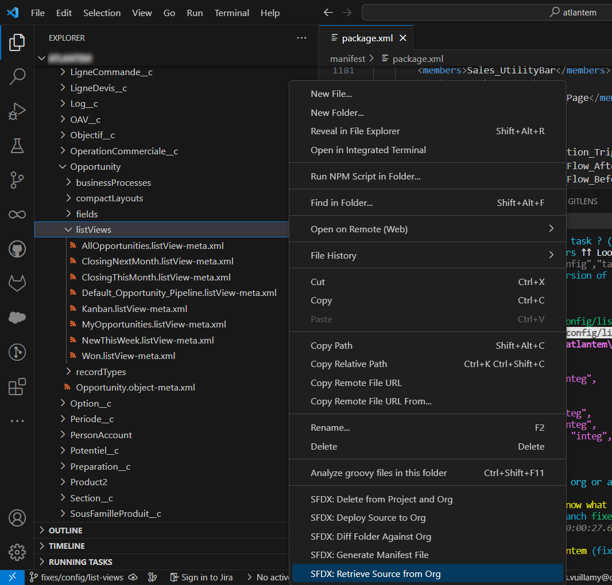
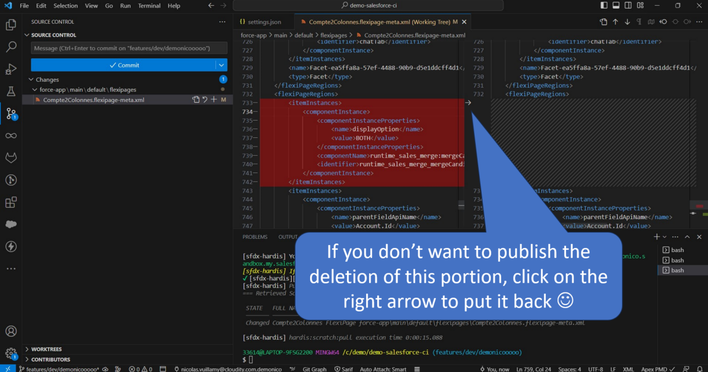
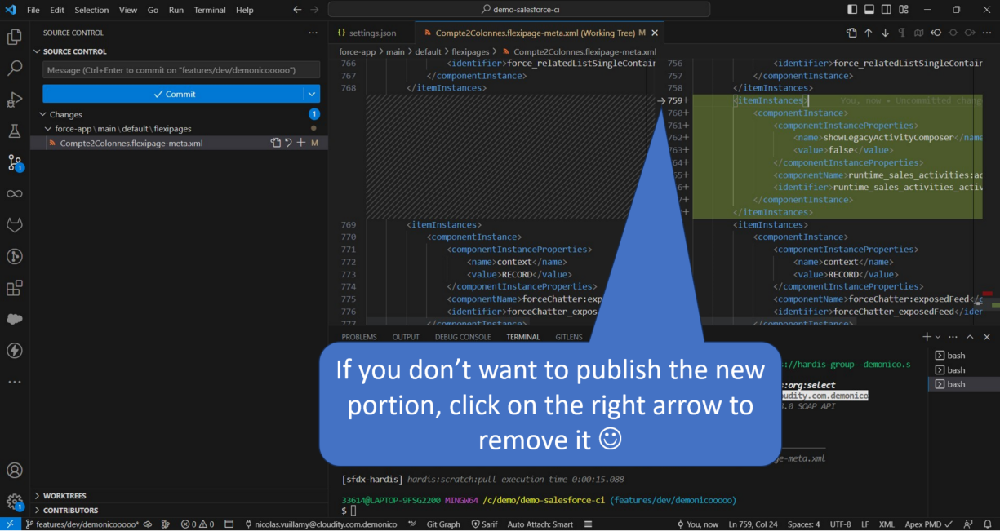
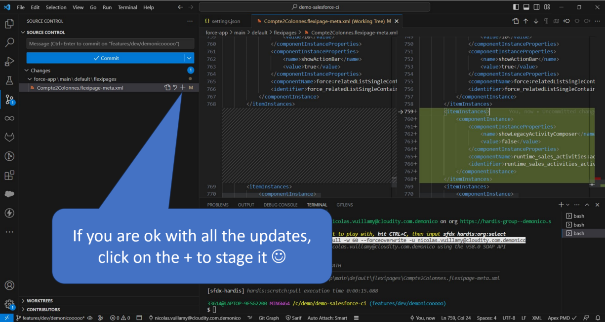

<!-- markdownlint-disable MD013 -->

- [Commit your updates](#commit-your-updates)
  - [Retrieve metadatas](#retrieve-metadatas)
  - [Stage and commit](#stage-and-commit)
- [Prepare merge request](#prepare-merge-request)
- [Create merge request](#create-merge-request)
  - [Using Gitlab](#using-gitlab)
  - [Using Github](#using-github)
  - [Using Azure](#using-azure)
- [Check merge request results](#check-merge-request-results)

___

## Commit your updates

_The following video shows how to perform theses operations_

<iframe width="560" height="315" src="https://www.youtube.com/embed/Ik6whtflmfY" title="YouTube video player" frameborder="0" allow="accelerometer; autoplay; clipboard-write; encrypted-media; gyroscope; picture-in-picture" allowfullscreen></iframe>

### Retrieve metadatas

If you made updates on your org that you have not pulled yet, Use command  to **pull your latest updates in local files**

If you updated config elements that you do not see in your local files, you may discuss with your release manager to [automate force retrieve metadatas](salesforce-ci-cd-retrieve.md)

#### Alternative: Use Org Browser

You can also use Salesforce extension Org Browser to manually browse and retrieve specific metadatas

#### Alternative: Use contextual menu

If Org Browser does not see items that you want to retrieve, like list views, you can right click on any **listViews** folder and use command **SFDX: Retrieve source from org**

#### Alternative: Use menu "Select and retrieve"

If it is not possible to use pull configuration, you may retrieve metadatas using  (but it will retrieve locally many files and it will be harder to select the ones you really need, select carefully the items that you stage and commit)

### Stage and commit

In VsCode Git extension, **stage** and **commit** created, updated and deleted files that you want to publish

- By selecting the metadata files you can **see the differences** with the previous versions, to know if you want to publish or not an updated file

- **Never use Stage all function**

- If you see standard items like standard fields that do not contain customizations, do not commit them

- **Important**: If you think that your sandbox may not be up to date according to elements published by your colleagues, look closely at the diff on those items, and stage only the updates that you want to publish

___

## Prepare merge request

- **Once your commit is completed**, run command  to prepare your merge request.

- As you committed your files like explained in the previous section, select option  when prompted.

- Wait for the script to complete, and select **Push commit to server** when prompted

>  **_Under the hood_**
>
> The script performs the following operations:
>
> - Update `manifest/package.xml` automatically according to the committed updates
> - Clean XML of metadatas according to .sfdx-hardis.yml config property `autoCleanTypes` and `autoRemoveUserPermissions`
> - New git commit with automated updates
> - Git push commit to git server
>
> More details in [hardis:work:save](https://sfdx-hardis.cloudity.com/hardis/work/save/) command documentation

___

## Create merge request

It is now time to create your merge request to technically publish your updates at the upper level !

Depending on the CI platform you use, follow the related guide.

>  If you are **publishing to a RUN branch** (ex: `preprod`), **AND** the **project also has a BUILD branch** (ex: `integration`), you need to **notify the release manager**
> He/she will have to retrofit your updates once published

> If you are working with a ticketing system like JIRA, make sure to add the **full url** of the tickets in the MR/PR description, so it will help for the release management.
> For example, use `https://sfdx-hardis.atlassian.net/browse/CLOUDITY-4` , not `CLOUDITY-4`

### Using Gitlab

See [Create a merge request using Gitlab](salesforce-ci-cd-merge-request-gitlab.md)

### Using Azure

See [Create a merge request using Azure](salesforce-ci-cd-pull-request-azure.md)

### Using GitHub

See [Create a merge request using Github](salesforce-ci-cd-pull-request-github.md)

## Check merge request results

After you create your merge request, [check its control jobs results](salesforce-ci-cd-handle-merge-request-results.md) !