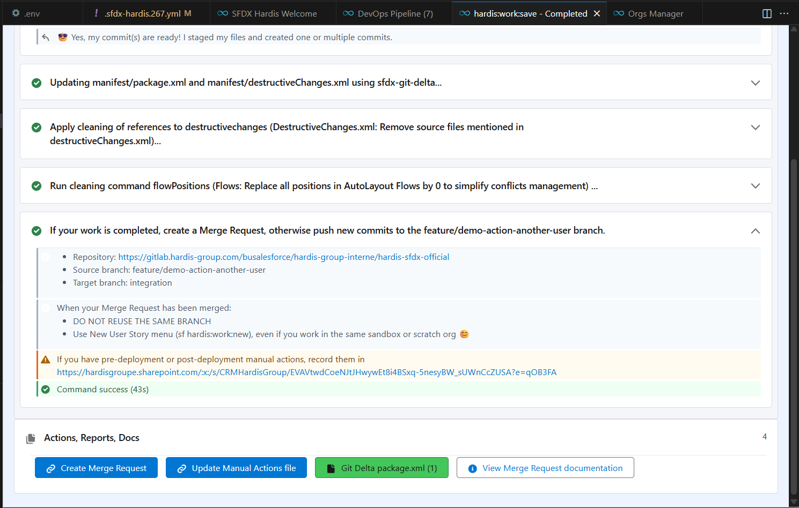

<!-- markdownlint-disable MD013 -->

- [1. Commit your updates](#commit-your-updates)
  - [Retrieve metadata](#retrieve-metadata)
  - [Stage and commit](#stage-and-commit)
- [2. Prepare Merge request](#prepare-merge-request)
- [3. Create merge request](#create-merge-request)
  - [Using Gitlab](#using-gitlab)
  - [Using Github](#using-github)
  - [Using Azure](#using-azure)
- [4. Check merge request results](#check-merge-request-results)

> Note: Merge requests and pull requests are the same concept; different platforms use different names.

___

## Commit your updates

_The following video shows how to perform these operations._

> Note: this video shows an older version of sfdx-hardis and will be updated to reference the new VS Code SFDX-Hardis UI.

<iframe width="560" height="315" src="https://www.youtube.com/embed/Ik6whtflmfY" title="YouTube video player" frameborder="0" allow="accelerometer; autoplay; clipboard-write; encrypted-media; gyroscope; picture-in-picture" allowfullscreen></iframe>

### Retrieve metadata

Use the Sfdx-Hardis Metadata Retriever to identify and retrieve metadata from your org.

- **Recent Changes** shows updates made in the org since its creation or the last source tracking reset.

- **All Metadata** shows all metadata available in your org.

Select the metadata you want to retrieve, then click the "Retrieve Selected" button.

### Stage and commit

In the VS Code Git extension, **stage** and **commit** the created, updated and deleted files that you want to publish.

- By selecting a metadata file, you can **see the differences** with the previous version to decide whether to publish the update. You can partially stage file updates if needed.

- **Never use the Stage All function.**

- If you see standard items (for example, standard fields) that do not contain user customizations, do not commit them.

- **Important**: If you think your sandbox may not be up to date with changes published by your colleagues, inspect the diffs carefully and stage only the updates you want to publish.

___

## Prepare merge request

- **Once your commit is completed**, run the command shown by the  to prepare your merge request.

- After committing your files as described in the previous section, select the **Message: my commit is ready** option when prompted.

- Wait for the script to complete, then select **Push commit to server** when prompted.

If you want to create a Pull Request / Merge Request, click on the related button.

>  **Under the hood**
>
> The script performs the following operations:
>
> - Updates `manifest/package.xml` automatically based on the committed changes.
> - Cleans metadata XML according to `.sfdx-hardis.yml` config properties `autoCleanTypes` and `autoRemoveUserPermissions`.
> - Creates a new Git commit with automated updates.
> - Pushes the commit to the Git server.
>
> More details in the [hardis:work:save](https://sfdx-hardis.cloudity.com/hardis/work/save/) command documentation.

___

## Create merge request

Now create your merge request to publish your updates to the higher-level branch.

If you are working with a ticketing system like JIRA, make sure to add the ticket number(s) or the full ticket URL in the MR/PR title and description to help with release management.

For example, use a PR title like `CLOUDITY-456 Add condition on Account After Update Flow`.

Depending on the CI platform you use, follow the appropriate guide.

### Using Gitlab

See [Create a Merge Request using Gitlab](salesforce-ci-cd-merge-request-gitlab.md)

### Using Azure

See [Create a Pull Request using Azure](salesforce-ci-cd-pull-request-azure.md)

### Using GitHub

See [Create a Pull Request using Github](salesforce-ci-cd-pull-request-github.md)

## Check merge request results

After you create your merge request, check the results of its control jobs: [see how to handle merge request results](salesforce-ci-cd-handle-merge-request-results.md).