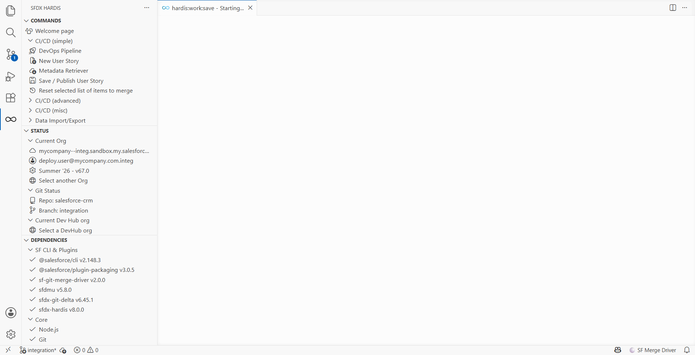
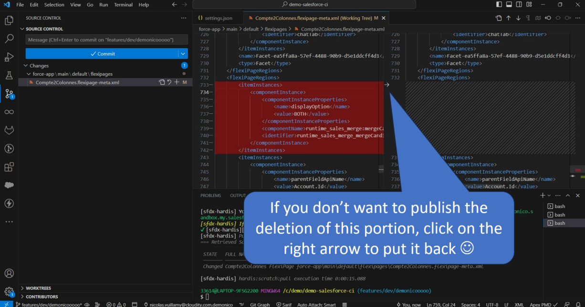
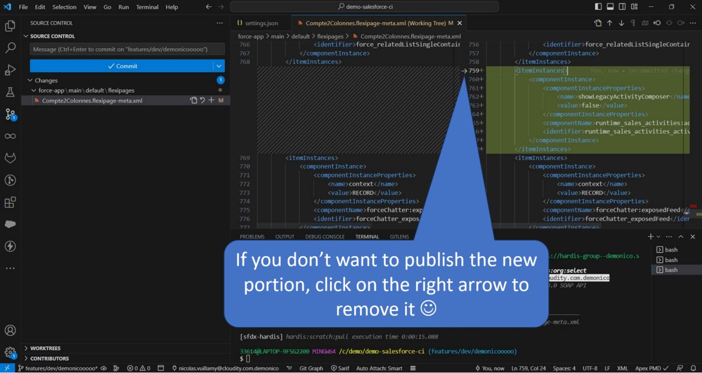
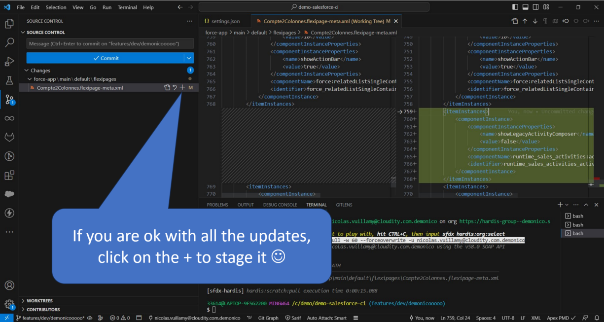
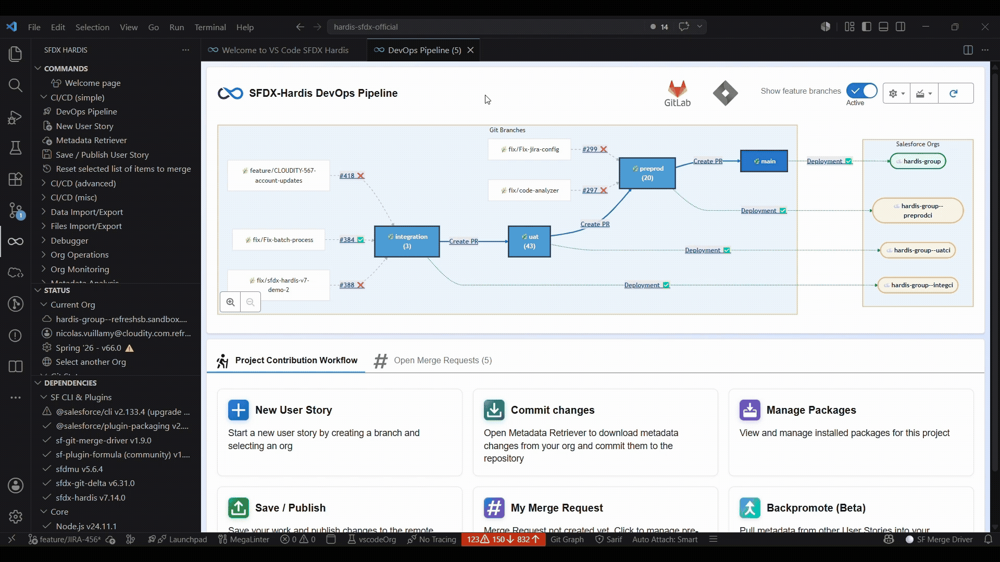

<!-- markdownlint-disable MD013 -->

- [1. Commit your updates](#commit-your-updates)
  - [Retrieve metadata](#retrieve-metadatas)
  - [Stage and commit](#stage-and-commit)
- [2. Prepare the Pull Request](#prepare-merge-request)
- [3. Create the Pull Request](#create-merge-request)
- [4. Check the Pull Request results](#4-check-the-pull-request-results)

> Pull Requests and Merge Requests are the same concept: GitHub, Azure DevOps and Bitbucket say Pull Request, GitLab says Merge Request. This documentation says Pull Request (Merge Request on GitLab).

All the commands of this page are in the **Project Contribution Workflow** row of the **DevOps Pipeline** panel (and of the Welcome page). They also exist in the side bar of the VS Code SFDX Hardis extension.

___

## Publish your User Story

### 1. Commit your updates { #commit-your-updates }

_The following animation shows how to retrieve and commit your updates._

#### Retrieve metadata { #retrieve-metadatas }

Click the **Commit changes** card to open the **Metadata Retriever**. It finds the metadata you updated in your org and downloads it into your local project files.

- The **Recent Changes** tab lists the updates made in the org since its creation or since the last source tracking reset. This is the tab you use most of the time.
- The **All Metadata** tab lists every metadata of your org, for the cases where source tracking missed something.

Select the metadata you want to retrieve, then click **Retrieve Selected**.

#### Stage and commit

In the **Source Control** view of VS Code, **stage** and **commit** the created, updated and deleted files that you want to publish.

- Click a file to **see the differences** with the previous version and decide whether to publish the update. You can stage only part of a file if needed.

- **Never use Stage All Changes.** Always review the files one by one.

- If you see standard items (for example standard fields) that do not contain your customizations, do not commit them.

- **Important**: if your sandbox may not be up to date with the changes published by your colleagues, inspect the diffs carefully and stage only the updates you want to publish. Otherwise you could overwrite their work.

___

### 2. Prepare the Pull Request { #prepare-merge-request }

- **Once your commit is done**, click the **Save / Publish** card (or  in the side bar).

- When asked if you already committed your updates, select **Yes, my commit(s) are ready**.

- Wait for the command to complete, then answer **yes** when asked to push your commits to the git server.

- At the end, the command shows a **Create Pull Request** button (or **Update Pull Request** when a Pull Request is already open for your branch) and an **Update the Deployment Actions of your Pull Request** button. Click the first one to create the Pull Request, and use the second one if your User Story needs [deployment actions](salesforce-ci-cd-work-on-task-deployment-actions.md) (data loads, Apex scripts, manual steps...).

>  **_Under the hood_**
>
> The command run is `sf hardis:work:save`. It performs the following operations:
>
> - Updates `manifest/package.xml` and `manifest/destructiveChanges.xml` based on the committed changes.
> - Cleans the metadata XML according to the `.sfdx-hardis.yml` config properties `autoCleanTypes` and `autoRemoveUserPermissions`.
> - Creates a new git commit with these automated updates.
> - Pushes the commits to the git server.
>
> More details in the [hardis:work:save](https://sfdx-hardis.cloudity.com/hardis/work/save/) command documentation.

___

### 3. Create the Pull Request { #create-merge-request }

Now create the Pull Request (Merge Request on GitLab) to ask for your updates to be merged into the target major branch.

If you work with a ticketing system like Jira, add the ticket number(s) or the full ticket URL in the title and description of the Pull Request. It helps release management, and sfdx-hardis uses it to link the ticket to the deployments.

For example, use a title like `CLOUDITY-456 Add condition on Account After Update Flow`.

Depending on the Git platform of your project, follow the matching guide:

- [On GitHub](salesforce-ci-cd-pull-request-github.md)
- [On GitLab](salesforce-ci-cd-merge-request-gitlab.md)
- [On Azure DevOps](salesforce-ci-cd-pull-request-azure.md)
- [On Bitbucket](salesforce-ci-cd-pull-request-bitbucket.md)

___

### 4. Check the Pull Request results

Once the Pull Request is created, validation jobs run automatically and post their results as comments on the Pull Request. Read [Check the Pull Request results](salesforce-ci-cd-handle-merge-request-results.md) to know what to look at and how to fix errors.
