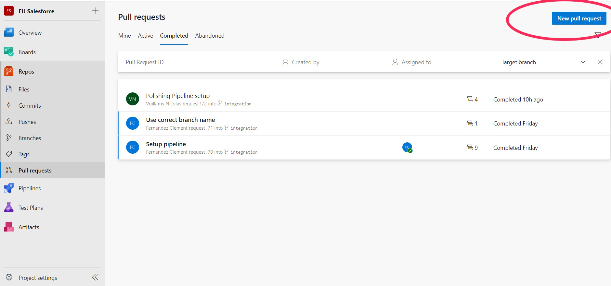
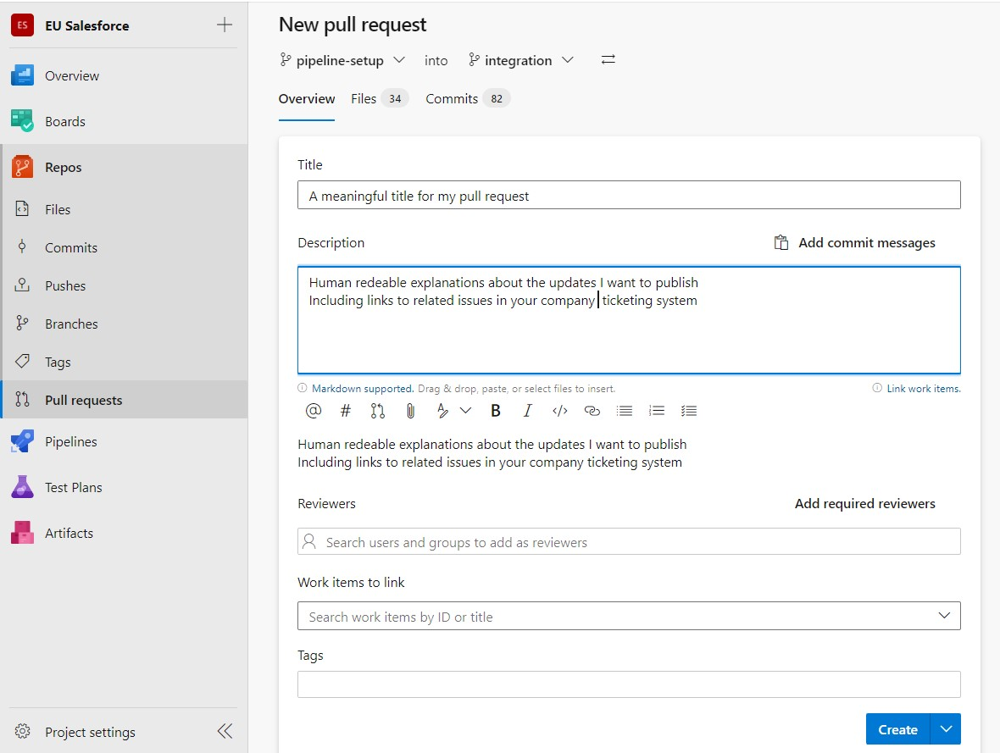

<!-- markdownlint-disable MD013 -->

## Create a Pull Request on Azure DevOps

Once your branch is pushed (see [Publish your User Story](salesforce-ci-cd-publish-task.md)), create a Pull Request to ask for your work to be merged into the target major branch. At the end of the **Save / Publish** command, sfdx-hardis shows a **Create Pull Request** button that opens the right page directly. Otherwise, follow these steps.

1. Open your repository in your web browser (example: `https://dev.azure.com/mycompany/myproject/_git/dreamhouse-lwc`).

2. Go to **Repos > Pull requests** and click **New pull request**.

    { align=center }

3. Select your User Story branch as the source and the target major branch (for example `integration`) as the destination. Add a meaningful title and description. If you use a ticketing system like Jira or Azure Boards, put the ticket number in the title.

    { align=center }

4. Click **Create**.

### After creation

- The validation jobs start automatically and post their results as comments on the Pull Request. See [Check the Pull Request results](salesforce-ci-cd-handle-merge-request-results.md).
- To add more updates to an open Pull Request, do not create a new one: commit again and run **Save / Publish** again, as described in [Publish your User Story](salesforce-ci-cd-publish-task.md). Every new commit pushed to your branch runs the validation jobs again.
- When the jobs are green, your release manager [reviews and merges the Pull Request](salesforce-ci-cd-validate-merge-request.md). Depending on the organization of the project, you may be responsible for getting the jobs green yourself before asking for the review.
