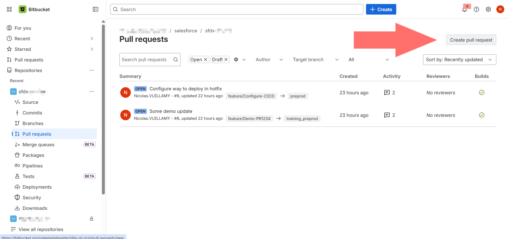
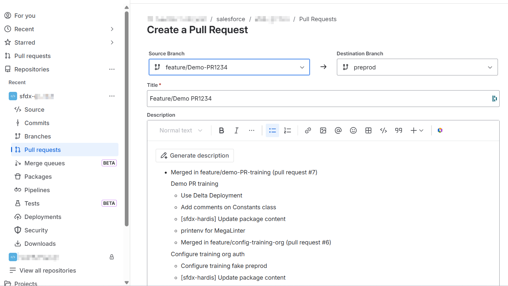

<!-- markdownlint-disable MD013 -->

## Create a Pull Request using Bitbucket

- Go in your online repository in your web browser (example: `https://bitbucket.org/mycompany/dreamhouse-lwc`)

- Click the **Pull requests** icon in the left sidebar to open the pull requests section

{ align=center }

- Click **Create pull request**. The creation form opens on a single page: select the **Source branch** (the branch with your changes) and the **Destination branch** (the target environment). Add a meaningful title and description, then click **Create pull request**

{ align=center }

- Controlling jobs are automatically launched, you can now ask your release manager to [**validate the merge request**](salesforce-ci-cd-validate-merge-request.md)
  - _If you are a developer, (or even a business consultant depending on the project organization), you may have the responsibility to make sure than controlling jobs are valid (**check-deploy job** and **code-quality job** in **success**) and eventually fix the errors (See [Handle merge requests errors](salesforce-ci-cd-handle-merge-request-results.md))_

- If you need to add additional updates to an existing merge requests, you just this to follow again [this guide](salesforce-ci-cd-publish-task.md) from the beginning, except the part "Create a merge request". Any new commit pushed on a branch where there is already a merge request will trigger again the [control jobs](salesforce-ci-cd-validate-merge-request.md#control-jobs).
