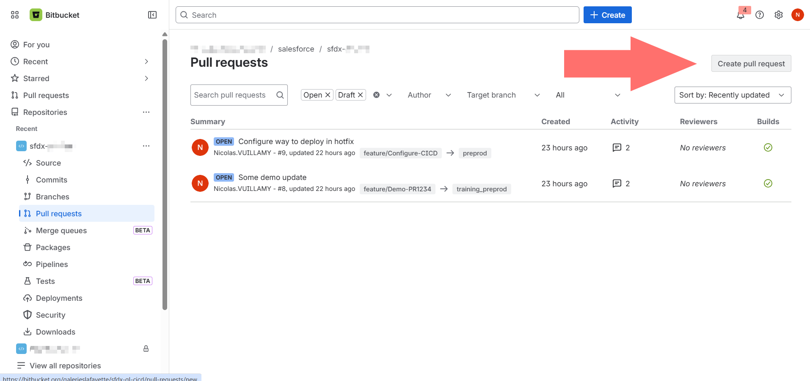
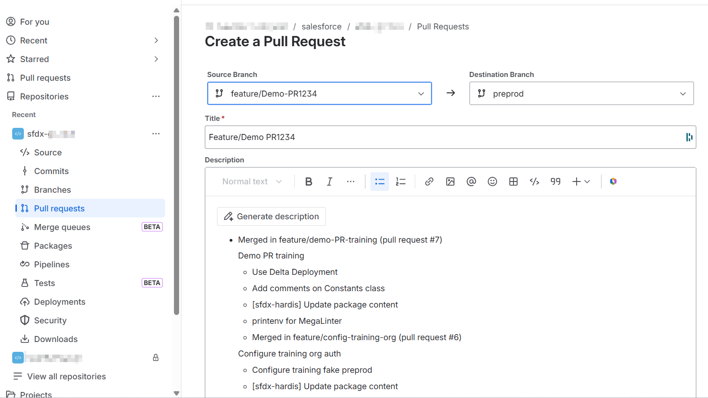

<!-- markdownlint-disable MD013 -->

## Create a Pull Request on Bitbucket

Once your branch is pushed (see [Publish your User Story](salesforce-ci-cd-publish-task.md)), create a Pull Request to ask for your work to be merged into the target major branch. At the end of the **Save / Publish** command, sfdx-hardis shows a **Create Pull Request** button that opens the right page directly. Otherwise, follow these steps.

1. Open your repository in your web browser (example: `https://bitbucket.org/mycompany/dreamhouse-lwc`).

2. Click the **Pull requests** icon in the left sidebar.

    { align=center }

3. Click **Create pull request**. The form opens on a single page: select the **Source branch** (your User Story branch) and the **Destination branch** (the target major branch, for example `integration`).

4. Add a meaningful title and description. If you use a ticketing system like Jira, put the ticket number in the title. Click **Create pull request**.

    { align=center }

### After creation

- The validation jobs start automatically and post their results as comments on the Pull Request. See [Check the Pull Request results](salesforce-ci-cd-handle-merge-request-results.md).
- To add more updates to an open Pull Request, do not create a new one: commit again and run **Save / Publish** again, as described in [Publish your User Story](salesforce-ci-cd-publish-task.md). Every new commit pushed to your branch runs the validation jobs again.
- When the jobs are green, your release manager [reviews and merges the Pull Request](salesforce-ci-cd-validate-merge-request.md). Depending on the organization of the project, you may be responsible for getting the jobs green yourself before asking for the review.
