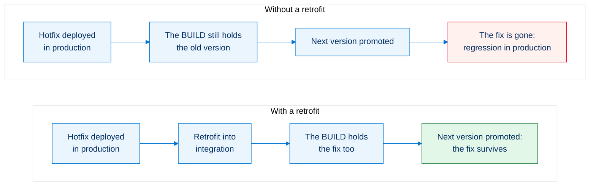
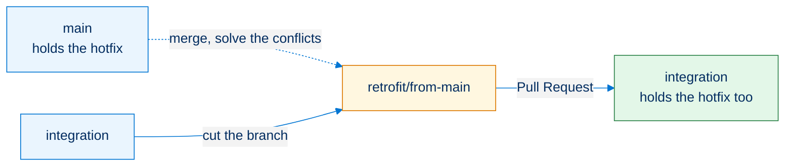

<!-- markdownlint-disable MD013 -->

## Retrofit

A **retrofit** brings back into the BUILD branches what reached production without going through them. Skip it, and the next version quietly undoes the fix.

> **Two things are called retrofit in sfdx-hardis**, and this page covers both:
>
> - **[Retrofit a branch](#retrofit-a-branch-into-the-build)**: `main` (or `preprod`) is merged down into `integration` through a `retrofit/` branch. This is the one that follows a hotfix or a promotion branch.
> - **[Retrofit changes made directly in production](#retrofit-changes-made-directly-in-production)**: somebody edited the production org by hand, and the change has to come back into git.

- [Why it matters](#why-it-matters)
- [When to retrofit](#when-to-retrofit)
- [Retrofit a branch into the BUILD](#retrofit-a-branch-into-the-build)
- [Retrofit changes made directly in production](#retrofit-changes-made-directly-in-production)

___

## Why it matters

The BUILD branches were cut before the fix existed. They still hold the **old version of the same metadata**, and they do not know it is old. When the BUILD is promoted, it deploys what it holds, and the fix disappears from production.



To summarize, you **publish at RUN level, then also at BUILD level** (the retrofit), so that when the BUILD is later merged into the RUN, **no overwrite triggers a regression**.

___

## When to retrofit

Every time something reached production without going through the BUILD branches.

| What happened                                                                                         | What to retrofit                         | When                                                                              |
|-------------------------------------------------------------------------------------------------------|------------------------------------------|-----------------------------------------------------------------------------------|
| A [hotfix](salesforce-ci-cd-hotfixes.md) was merged into `main`                                       | `main` (or `preprod`) into `integration` | Right after the hotfix is in production                                           |
| A [promotion branch (experimental)](salesforce-ci-cd-promotion-branches.md) was merged into `preprod` | `preprod` into `integration`             | Right after the promotion is merged                                               |
| Somebody changed the production org **by hand**                                                       | The org itself, back into git            | As soon as you notice, see [below](#retrofit-changes-made-directly-in-production) |

Do it **right away** in every case. A retrofit left for later is a conflict that grows: the BUILD branches keep moving on top of metadata that is already out of date in production.

___

## Retrofit a branch into the BUILD

### 1. Activate the merge driver

Activate the [sf-git-merge-driver](https://github.com/scolladon/sf-git-merge-driver) plugin before the retrofit: it automatically solves many XML conflicts, which is most of what a retrofit produces.


### 2. Merge production down into a retrofit branch



- Create a sub-branch of `integration` named `retrofit/from-main`, for example. Keep the `retrofit/` prefix: sfdx-hardis recognizes it and carries the [deployment actions](salesforce-ci-cd-work-on-task-deployment-actions.md) of every Pull Request included in the retrofit
- Using your git IDE, merge the `main` (or `preprod`) branch into `retrofit/from-main`
- If there are git conflicts, solve them before committing

### 3. Merge the retrofit into the BUILD

- Create a Pull Request from `retrofit/from-main` to `integration`
- Merge the Pull Request into `integration`: the retrofit from the RUN to the BUILD is done
  - If the retrofit has many impacts, consider refreshing the dev sandboxes

<details markdown="1">
<summary>How it works behind the hood</summary>

The `retrofit/` prefix is what makes the difference. A merge from a feature branch only processes the actions of the Pull Request that has just been merged, but a merge from a `retrofit/*` branch is treated like a merge between two major branches: its scope is **every Pull Request merged since the previous merge**.

That is what lets a hotfix keep its [deployment actions](salesforce-ci-cd-work-on-task-deployment-actions.md) on the way down. A Pull Request merged into an upstream branch joins the batch as soon as its commits arrive in the window, so a hotfix merged into `main` is collected when the retrofit brings it into `integration`, and its actions run there too. `runOnlyOnceByOrg` keeps an action that already ran in that org from running twice.

In the DevOps Pipeline, a `retrofit/` Pull Request is listed as work of its own: it carries its own change, unlike a merge between two major branches, which only moves other Pull Requests.

</details>

___

## Retrofit changes made directly in production

Somebody changed the production org through Setup instead of the pipeline. The change is live, it is in no branch, and the next deployment will overwrite it.

`sf hardis:org:retrieve:sources:retrofit` retrieves what the production org holds and the sources do not, commits it and opens a Pull Request against the retrofit target branch, so the change re-enters the pipeline instead of being lost.

It is usually scheduled as a CI job rather than run by hand, so the drift is caught on its own.

<details markdown="1">
<summary>How it works behind the hood</summary>

Run from a branch connected to the org, [`sf hardis:org:retrieve:sources:retrofit`](hardis/org/retrieve/sources/retrofit.md) retrieves the changes that are not in the branch sources, commits them and creates a merge request against the default branch. When a merge request already exists, it adds a commit to it instead of opening another one.

Configuration lives in `.sfdx-hardis.yml`:

```yaml
productionBranch: main
retrofitBranch: preprod
retrofitIgnoredFiles:
  - force-app/main/default/applications/MyApp.app-meta.xml
```

- `productionBranch`: the branch matching the production org.
- `retrofitBranch`: the target branch of the merge request.
- `retrofitIgnoredFiles`: files to leave alone even when production changed them.

Which metadata types are retrieved is read, in order of priority, from the `CI_SOURCES_TO_RETROFIT` environment variable, the `sourcesToRetrofit` property of `.sfdx-hardis.yml`, or a default list covering the types people most often edit by hand (CustomField, CustomLabel, CustomMetadata, CustomObject, FlexiPage, Layout, EmailTemplate, GlobalValueSet...). The command page lists the full default.

</details>

___

## See also

- [Hotfixes](salesforce-ci-cd-hotfixes.md): ship an urgent fix to production through the RUN stream.
- [Promotion branches (experimental)](salesforce-ci-cd-promotion-branches.md): ship the approved stories of `uat` without waiting for the rest.
- [Deployment actions](salesforce-ci-cd-work-on-task-deployment-actions.md): what runs around a deployment, and the scope each kind of merge gets.
