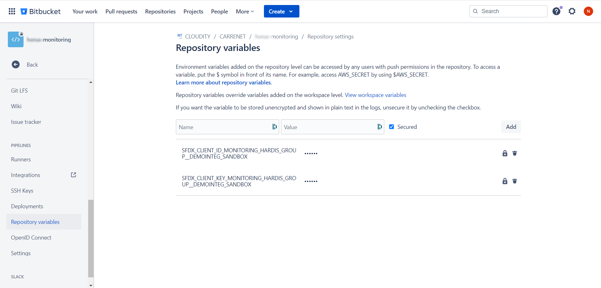

<!-- markdownlint-disable MD013 -->

## Define sfdx-hardis environment variables

- Go to **Project -> Repository Settings > Repository Variables** _(you must have Bitbucket authorizations to access this menu)_

More info: [BitBucket documentation](https://support.atlassian.com/bitbucket-cloud/docs/variables-and-secrets/#Secured-variables){target=blank}