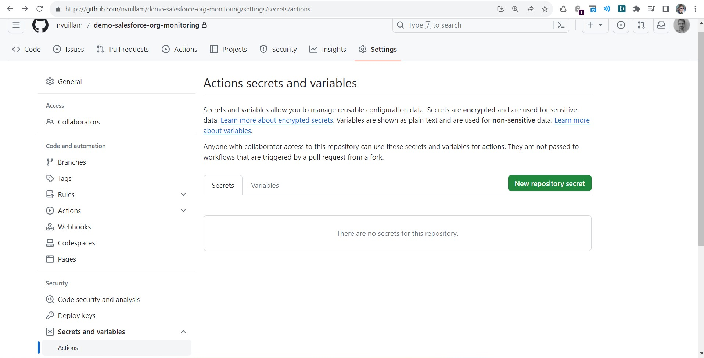

<!-- markdownlint-disable MD013 -->

## Define sfdx-hardis environment variables

- Go to **Repository -> Settings > Secret and variables -> Actions** _(you must have Github authorizations to access this menu)_

- Create the new secret with the following info:
  - name: **YOUR_VARIABLE_NAME**
  - value: `Your variable value`

More info: [GitHub documentation](https://docs.github.com/en/actions/security-guides/encrypted-secrets#creating-encrypted-secrets-for-a-repository){target=blank}