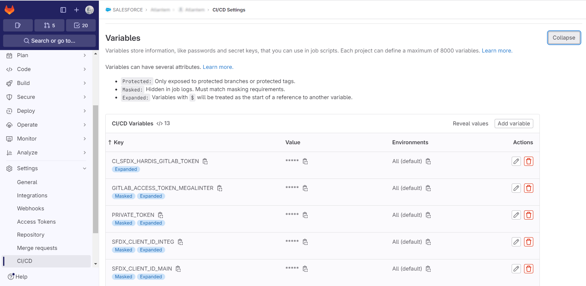
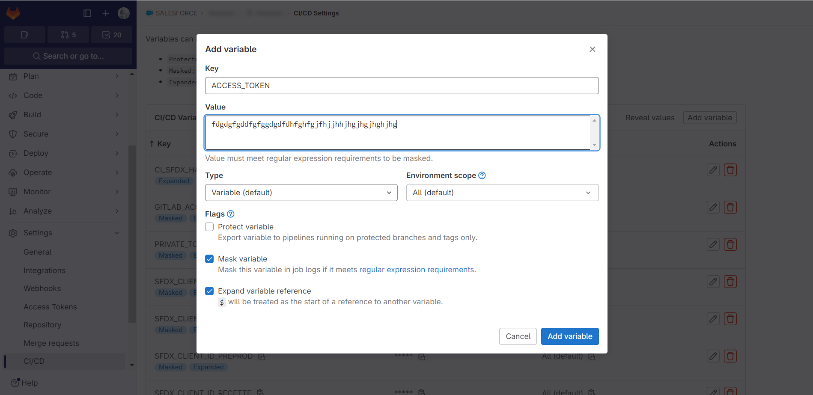

<!-- markdownlint-disable MD013 -->

## Define sfdx-hardis environment variables

- Go to **Project -> Settings > CI/CD -> Variables** _(you must have Gitlab authorizations to access this menu)_

- Create the variable with the following info:
  - name: **YOUR_VARIABLE_NAME**
  - value: `Your variable value`
  - Select **Mask variable** if the value is secured, like credentials or tokens
  - Unselect **Protected variable**

More info: [Gitlab documentation](https://docs.gitlab.com/ee/ci/variables/#for-a-project){target=blank}