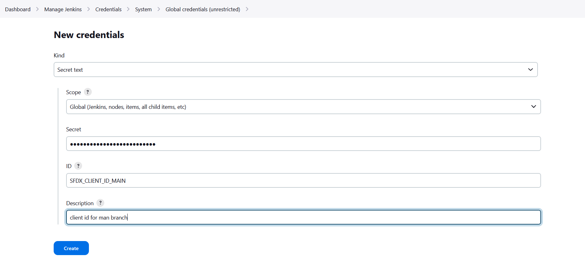

<!-- markdownlint-disable MD013 -->

## Define sfdx-hardis environment variables

- Go to **Dashboard -> Manage Jenkins**
- Under Security tab click on **Credentials -> global credentials**
- Click on **Add credential** , then choose **Secret text**
- Input variable name and value
- Don't forget to click on **create** !



More info: [Jenkins documentation](https://www.jenkins.io/doc/book/using/using-credentials/){target=blank}

## Reference variables in your Jenkinsfile

When you defined your secret variables in Jenkins, you need to reference them in your pipeline YAML files using the syntax `VARIABLE_NAME: credentials('VARIABLE_NAME')`, so their values are correctly passed to the pipeline.

Example:

```groovy
    environment {
        SFDX_CLIENT_ID_MY_ORG = credentials('SFDX_CLIENT_ID_MY_ORG') //Example
        SFDX_CLIENT_KEY_MY_ORG = credentials('SFDX_CLIENT_KEY_MY_ORG') //Example
    }
```

Impacted files if present in your repo:

- `Jenkinsfile`

