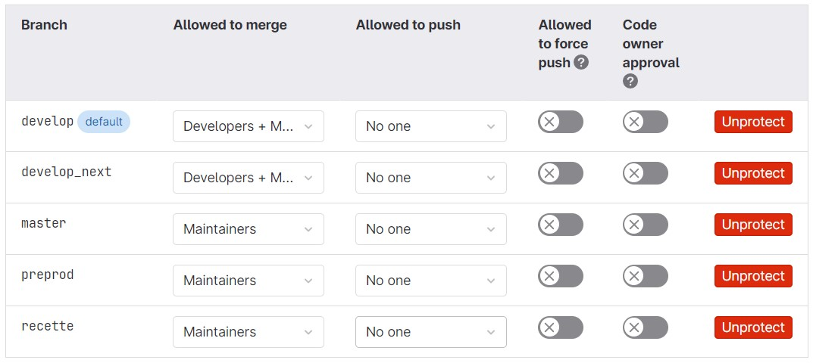
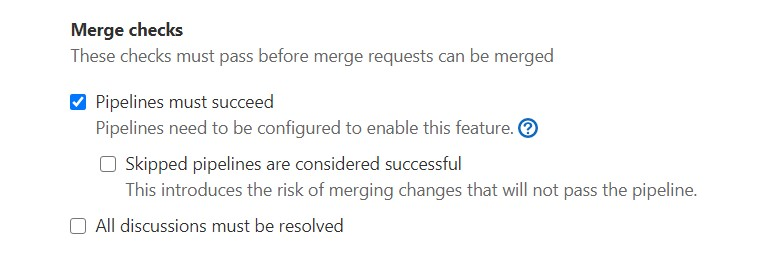

<!-- markdownlint-disable MD013 -->

- [Create git repository](#create-git-repository)
- [Create major branches](#create-major-branches)
  - [Small project](#small-project)
  - [Medium project](#medium-project)
  - [Complex project](#complex-project)
- [Protect major branches](#protect-major-branches)
- [Define merge rules](#define-merge-rules)

## Create git repository

Your git repository will be used to store and manage the versioning of your Salesforce DX sources

- Create a new repository, for example _myclient-sfdx_
  - Select `Initialize repository with a README`

## Create major branches

In `Repository -> Branches`, create the branch tree according to the complexity of your project

Below are examples of branches tree that you can define.

### Small project

- **main** (will be related to Production org)
  - **preprod** (will be related to PreProd org)

### Medium project

- **main** (will be related to Production org)
  - **preprod** (will be related to PreProd org)
    - **integration** (will be related to Integration org)

### Complex project

- **main** (will be related to Production org)
  - **preprod** (will be related to PreProd org)
    - **uat** (will be related to UAT org)
      - **integration** (will be related to Integration org)

Example of branching strategy

{ align=center }

## Protect major branches

To avoid messes, protected branches must be updated only using [Merge Requests](https://docs.gitlab.com/ee/user/project/merge_requests/)

- Go to menu `Settings -> Repository`
- Define your developments target branch (usually _integration_) as **Default Branch**
- Protect all branches that will have a corresponding Salesforce org (main, preprod, uat, integration...)

Recommended practice is to set **Maintainer** in **Allowed to merge** to all protected branches, except **integration**

Example

## Define merge rules

Let's make sure that merge request jobs will be valid before being merged ! (can be deactivated later but at your own risk)

- Go in menu `Settings -> General` , then in section `Merge requests` (expand)
- Leave all default values, except checkbox **Pipelines must succeed** that must be checked

