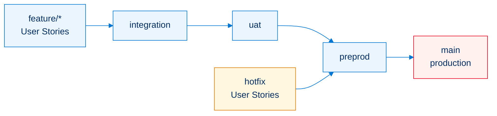
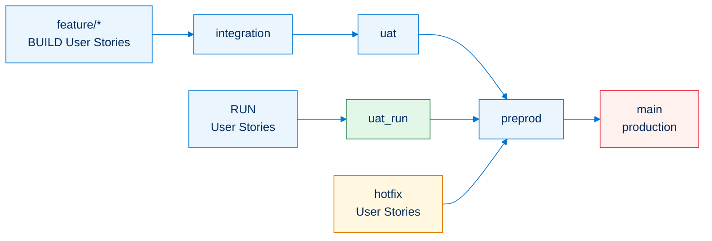

<!-- markdownlint-disable MD013 -->

## Create the Git repository

- [Create the repository](#create-the-repository)
- [Create the major branches](#create-the-major-branches)
  - [How deep is your BUILD chain?](#how-deep-is-your-build-chain)
  - [Pattern A: BUILD and hotfixes](#pattern-a-build-and-hotfixes)
  - [Pattern B: BUILD, RUN and hotfixes](#pattern-b-build-run-and-hotfixes)
- [Protect the major branches](#protect-the-major-branches)
- [Define the merge rules](#define-the-merge-rules)

### Create the repository

Your git repository stores and versions your Salesforce DX sources.

- Create a new repository on your Git platform (GitHub, GitLab, Azure DevOps or Bitbucket), for example _myclient-sfdx_
  - Select `Initialize repository with a README`

### Create the major branches

In the branches section of your Git platform (for example `Repository -> Branches` on GitLab), create the branch tree that matches the complexity of your project.

Two decisions shape the tree: **how many levels your BUILD chain needs**, and **whether urgent work gets a stream of its own**.

#### How deep is your BUILD chain?

Each level is a branch and the Salesforce org it deploys to. Start with what you can staff, you can always add a level later.

| Project | Branch tree |
|---------|-------------|
| Small | **main** (Production) > **preprod** (PreProd) |
| Medium | **main** (Production) > **preprod** (PreProd) > **integration** (Integration) |
| Complex | **main** (Production) > **preprod** (PreProd) > **uat** (UAT) > **integration** (Integration) |

The rest of this documentation uses the complex tree, `integration` > `uat` > `preprod` > `main`, because it names every level. Drop the ones you do not have.

#### Pattern A: BUILD and hotfixes

The usual setup. User Stories climb the BUILD chain, and an urgent fix that cannot wait merges **straight into `preprod`** from its own branch, then goes to production with the next `preprod` > `main` merge.

```mermaid
%%{init: {"theme": "base", "themeVariables": {"primaryColor": "#eaf5fe", "primaryTextColor": "#032d60", "primaryBorderColor": "#0176d3", "lineColor": "#0176d3", "secondaryColor": "#f3f3f3", "tertiaryColor": "#ffffff", "fontFamily": "Salesforce Sans, Arial, sans-serif"}}}%%
flowchart LR
    FEAT["feature/*<br/>User Stories"] --> INTEG["integration"]
    INTEG --> UAT["uat"]
    UAT --> PREPROD["preprod"]
    HOTFIX["hotfix<br/>User Stories"] --> PREPROD
    PREPROD --> MAIN["main<br/>production"]
    style HOTFIX fill:#fff7e0,stroke:#dd7a01
    style MAIN fill:#fef1ee,stroke:#ea001e
```

See [Hotfixes](salesforce-ci-cd-hotfixes.md) for the process, and [Retrofit](salesforce-ci-cd-retrofit.md) for the step that brings the fix back down into the BUILD branches.

The same model, seen as a git history with its orgs:

{ align=center }

#### Pattern B: BUILD, RUN and hotfixes

When the maintenance work is steady enough to need its own validation org, add a **`uat_run`** branch below `preprod`, parallel to the BUILD chain:

- **RUN User Stories** (small changes and fixes that are not urgent) merge into **`uat_run`**, get validated in its org, and reach `preprod` with the next promotion;
- **hotfix User Stories** still merge **directly into `preprod`**, because they cannot wait for anything.

```mermaid
%%{init: {"theme": "base", "themeVariables": {"primaryColor": "#eaf5fe", "primaryTextColor": "#032d60", "primaryBorderColor": "#0176d3", "lineColor": "#0176d3", "secondaryColor": "#f3f3f3", "tertiaryColor": "#ffffff", "fontFamily": "Salesforce Sans, Arial, sans-serif"}}}%%
flowchart LR
    FEAT["feature/*<br/>BUILD User Stories"] --> INTEG["integration"]
    INTEG --> UAT["uat"]
    UAT --> PREPROD["preprod"]
    RUN_STORIES["RUN<br/>User Stories"] --> UATRUN["uat_run"]
    UATRUN --> PREPROD
    HOTFIX["hotfix<br/>User Stories"] --> PREPROD
    PREPROD --> MAIN["main<br/>production"]
    style RUN_STORIES fill:#eaf5fe,stroke:#0176d3
    style UATRUN fill:#e3f7e8,stroke:#2e844a
    style HOTFIX fill:#fff7e0,stroke:#dd7a01
    style MAIN fill:#fef1ee,stroke:#ea001e
```

sfdx-hardis recognizes `uat_run` (and `uatrun`) as a RUN branch, and labels it as such in the DevOps Pipeline. Create its Salesforce org like any other major org, and add it to `availableTargetBranches` so developers can pick it when they start a User Story.

### Protect the major branches

Protected branches can only be updated through Pull Requests (Merge Requests on GitLab). This avoids accidental pushes to a branch that deploys to an org.

In your Git platform settings (for example `Settings -> Repository` on GitLab):

- Define your development target branch (usually _integration_) as the **default branch**
- Protect all branches that have a corresponding Salesforce org (main, preprod, uat, integration...)

The recommended practice is to allow only release managers (role **Maintainer** on GitLab) to merge into the protected branches, except **integration**.

Example on GitLab:

### Define the merge rules

Make sure that the control jobs of a Pull Request must pass before it can be merged. You can deactivate this rule later, at your own risk.

On GitLab:

- Go to `Settings -> General`, then expand the `Merge requests` section
- Leave all default values, except the checkbox **Pipelines must succeed**, which must be checked

On other platforms, use the equivalent setting: required status checks in the branch protection rules (GitHub), build validation in the branch policies (Azure DevOps), or merge checks (Bitbucket).

You can now go to step [2. Prepare the Salesforce orgs](salesforce-ci-cd-setup-activate-org.md).
