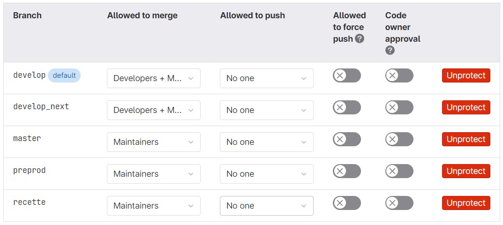
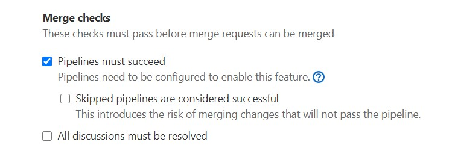

<!-- markdownlint-disable MD013 -->

## Create the Git repository

- [Create the repository](#create-the-repository)
- [Create the major branches](#create-the-major-branches)
  - [Small project](#small-project)
  - [Medium project](#medium-project)
  - [Complex project](#complex-project)
- [Protect the major branches](#protect-the-major-branches)
- [Define the merge rules](#define-the-merge-rules)

### Create the repository

Your git repository stores and versions your Salesforce DX sources.

- Create a new repository on your Git platform (GitHub, GitLab, Azure DevOps or Bitbucket), for example _myclient-sfdx_
  - Select `Initialize repository with a README`

### Create the major branches

In the branches section of your Git platform (for example `Repository -> Branches` on GitLab), create the branch tree that matches the complexity of your project.

Below are examples of branch trees that you can define.

#### Small project

- **main** (related to the Production org)
  - **preprod** (related to the PreProd org)

#### Medium project

- **main** (related to the Production org)
  - **preprod** (related to the PreProd org)
    - **integration** (related to the Integration org)

#### Complex project

- **main** (related to the Production org)
  - **preprod** (related to the PreProd org)
    - **uat** (related to the UAT org)
      - **integration** (related to the Integration org)

Example of branching strategy:

{ align=center }

### Protect the major branches

Protected branches can only be updated through Pull Requests (Merge Requests on GitLab). This avoids accidental pushes to a branch that deploys to an org.

In your Git platform settings (for example `Settings -> Repository` on GitLab):

- Define your development target branch (usually _integration_) as the **default branch**
- Protect all branches that have a corresponding Salesforce org (main, preprod, uat, integration...)

The recommended practice is to allow only release managers (role **Maintainer** on GitLab) to merge into the protected branches, except **integration**.

Example on GitLab:

### Define the merge rules

Make sure that the control jobs of a Pull Request must pass before it can be merged. You can deactivate this rule later, at your own risk.

On GitLab:

- Go to `Settings -> General`, then expand the `Merge requests` section
- Leave all default values, except the checkbox **Pipelines must succeed**, which must be checked

On other platforms, use the equivalent setting: required status checks in the branch protection rules (GitHub), build validation in the branch policies (Azure DevOps), or merge checks (Bitbucket).

You can now go to step [2. Prepare the Salesforce orgs](salesforce-ci-cd-setup-activate-org.md).
