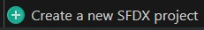

<!-- markdownlint-disable MD013 -->

- Clone locally the [repository that you created in previous step](salesforce-ci-cd-setup-git.md) (or reuse an existing sfdx project repo)

- Create a new git branch named **cicd** under your lower major branch (usually **integration**)

- Run command **Configuration ->**  (`sf hardis:project:create`) and select options to create a new sfdx-hardis project.

- Open file **manifest/package.xml** and replace the content by the following code

```yaml
<?xml version="1.0" encoding="UTF-8" standalone="yes"?>
<Package xmlns="http://soap.sforce.com/2006/04/metadata">
    <version>59.0</version> <!-- use current latest Salesforce api version -->
</Package>
```

- IF you are using Gitlab CI and sandboxes only (not scratch orgs), open **gitlab-ci-config.yml** at the root of the repository, and set variable **USE_SCRATCH_ORGS** to `"false"`

- Depending your git provider, keep the related workflow files and delete the others
  - Gitlab
    - `gitlab-ci.yml`
    - `gitlab-ci-config.yml`
  - Azure
    - `azure-pipelines-checks.yml`
    - `azure-pipelines-deployment.yml`
  - GitHub:
    - Folder `.github/workflows`
  - Bitbucket
    - `bitbucket-pipelines.yml`

> Some workflow files contain additional configuration instructions, please read the comments at the beginning of the files !

You can now go to step [Setup CI Authentication](salesforce-ci-cd-setup-auth.md)

