<!-- markdownlint-disable MD013 -->

## API Integration

You can send notifications to an external API endpoints, for example to [build Grafana dashboards](#grafana-setup)

- Deployment from a major branch to a major Salesforce org (ex: integration git branch to Integration Org)
- Salesforce [Org Monitoring](salesforce-monitoring-home.md)
  - Latest updates
  - Failing apex tests
  - Monitoring checks notifications

## Logs Configuration

Define the following CI/CD variables:

- **NOTIF_API_URL** : API endpoint
- **NOTIF_API_BASIC_AUTH_USERNAME** : Basic auth username _(if using Basic Auth)_
- **NOTIF_API_BASIC_AUTH_PASSWORD** : Basic auth password/token _(if using Basic Auth)_
- **NOTIF_API_BEARER_TOKEN** : Bearer token _(if using bearer auth)_

Examples of configuration:

```sh
NOTIF_API_URL=https://logs-prod-012.grafana.net/loki/api/v1/push
NOTIF_API_BASIC_AUTH_USERNAME=3435645645
NOTIF_API_BASIC_AUTH_PASSWORD=GHTRGDHDHdhghg23345DFG^sfg!ss
```

```sh
NOTIF_API_URL=https://my.custom.endpoint.net
NOTIF_API_BEARER_TOKEN=DDHGHfgfgjfhQESRDTHFKGKHFswgFHDHGDH
```

Example of logs sent to Loki:

```json
{
  "streams": [
    {
      "stream": {
        "source": "sfdx-hardis",
        "type": "LINT_ACCESS",
        "orgIdentifier": "hardis-group",
        "gitIdentifier": "monitoring-hardis-org/monitoring_hardis_group",
        "severity": "warning"
      },
      "values": [
        [
          "1715530820301000000",
          "{\"metric\":3,\"_dateTime\":\"2024-05-12T16:20:20.301Z\",\"_severityIcon\":\"⚠️\",\"_title\":\"⚠️ 3 custom elements have no access defined in any Profile or Permission set in monitoringhardisgroup\",\"_logBodyText\":\"⚠️ 3 custom elements have no access defined in any Profile or Permission set in monitoringhardisgroup\\n\\nfield\\n\\n• Activity.DBActivityType__c\\n\\n• Activity.IdExterneCARRENET__c\\n\\n• Activity.Typederendezvous_c\\n\\nLinks:\\n\\n  View Job: https://gitlab.onpremise.com/busalesforce/hardis-group-interne/monitoring-hardis-org/-/jobs/12345\\n\\nPowered by sfdx-hardis: https://sfdx-hardis.cloudity.com\",\"_logElements\":[{\"type\":\"field\",\"element\":\"Activity.DB_Activity_Type__c\",\"severity\":\"warning\",\"severityIcon\":\"⚠️\"},{\"type\":\"field\",\"element\":\"Activity.IdExterneCARRENET__c\",\"severity\":\"warning\",\"severityIcon\":\"⚠️\"},{\"type\":\"field\",\"element\":\"Activity.Type_de_rendez_vous__c\",\"severity\":\"warning\",\"severityIcon\":\"⚠️\"}],\"_metrics\":{\"ElementsWithNoProfileOrPermissionSetAccess\":3},\"_metricsKeys\":[\"ElementsWithNoProfileOrPermissionSetAccess\"],\"_jobUrl\":\"https://gitlab.onpremise.com/busalesforce/hardis-group-interne/monitoring-hardis-org/-/jobs/399629\"}"
        ]
      ]
    }
  ]
}
```

## Metrics Configuration

Additionally, you can send metrics in Prometheus format to a secondary API endpoint.

The configuration is the same than for logs, but with different variable names.

- **NOTIF_API_METRICS_URL**
- **NOTIF_API_METRICS_BASIC_AUTH_USERNAME**
- **NOTIF_API_METRICS_BASIC_AUTH_PASSWORD**
- **NOTIF_API_METRICS_BEARER_TOKEN**

Example of configuration:

```sh
NOTIF_API_METRICS_URL=https://influx-prod-72-prod-eu-west-2.grafana.net/api/v1/push/influx/write
NOTIF_API_METRICS_BASIC_AUTH_USERNAME=345673
NOTIF_API_METRICS_BASIC_AUTH_PASSWORD=GHTRGDHDHdhghg23345DFG^sfg!ss
```

Example of metrics sent to Prometheus

```text
ApexTestsFailingClasses,source=sfdx-hardis,type=APEX_TESTS,orgIdentifier=hardis-group,gitIdentifier=monitoring-hardis-org/monitoring_hardis_group metric=0.00
ApexTestsCodeCoverage,source=sfdx-hardis,type=APEX_TESTS,orgIdentifier=hardis-group,gitIdentifier=monitoring-hardis-org/monitoring_hardis_group metric=90.00
```

## Troubleshooting

If you want to see the content of the API notifications in execution logs, you can define `NOTIF_API_DEBUG=true`

## Grafana Setup

If you don't have a Grafana server, you can use Grafana Cloud Free Tier (14 days of logs & metrics retention + 3 users, no credit card required, free forever)

### Create Grafana Account

Create a Grafana Cloud Free account at [this url](https://grafana.com/auth/sign-up/create-user?pg=hp&plcmt=cloud-promo&cta=create-free-account){target=blank}

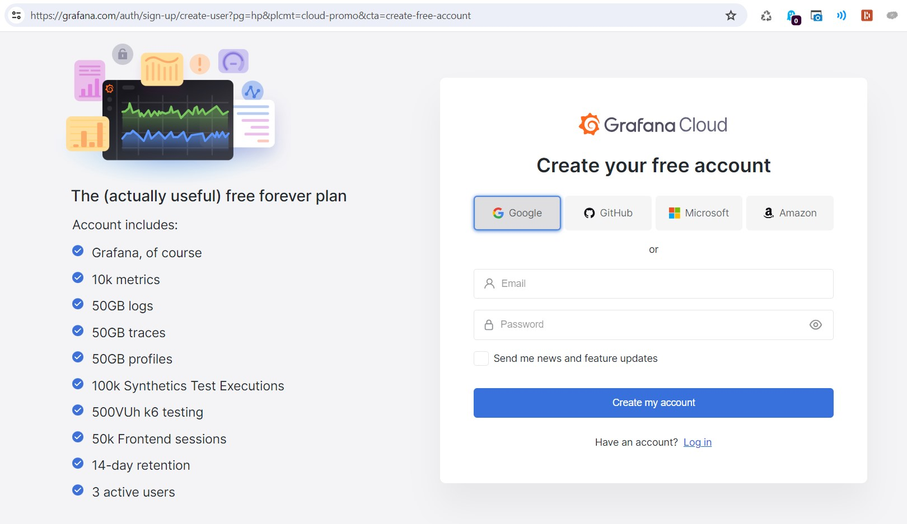

___

Input a Grafana Cloud org name (sfdxhardis in the example)

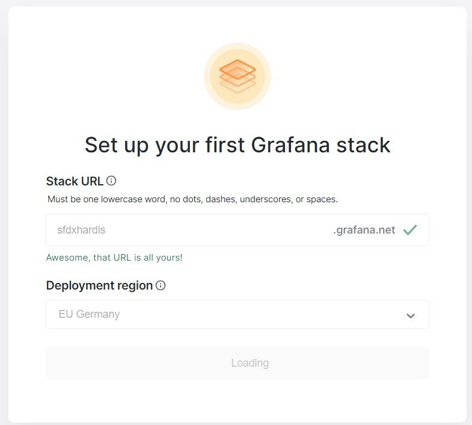

___

Next screen, you can skip setup

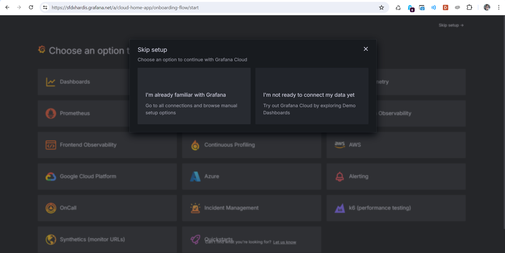

### Gather URLs & auth info

Create a notepad when you copy paste the following text

```sh
NOTIF_API_URL=
NOTIF_API_BASIC_AUTH_USERNAME=
NOTIF_API_BASIC_AUTH_PASSWORD=
NOTIF_API_METRICS_URL=
NOTIF_API_METRICS_BASIC_AUTH_USERNAME=
NOTIF_API_METRICS_BASIC_AUTH_PASSWORD=
```

### Get Loki configuration

Go to **Connections** -> **Data Sources** and click on **grafanacloud-YOURORGNAME-logs (Loki)**

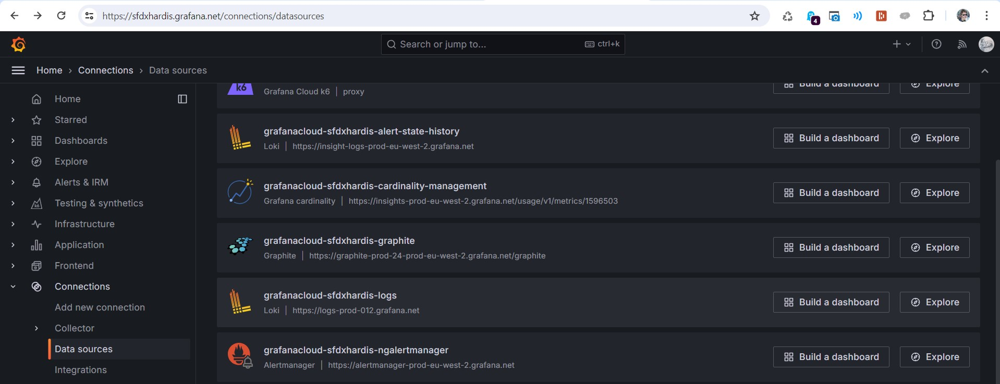

___

Build Logs push url

- Copy value of Connection URL (something like `https://logs-prod-012.grafana.net/`)
- Add `/loki/api/v1/push` at the end
- Copy value to variables `NOTIF_API_URL`

Example: `NOTIF_API_URL=https://logs-prod-012.grafana.net/loki/api/v1/push`

Copy value of Authentication -> User and paste it with variable `NOTIF_API_BASIC_AUTH_USERNAME`

Example: `NOTIF_API_BASIC_AUTH_USERNAME=898189`

Leave NOTIF_API_BASIC_AUTH_PASSWORD empty for now, you can't get it here

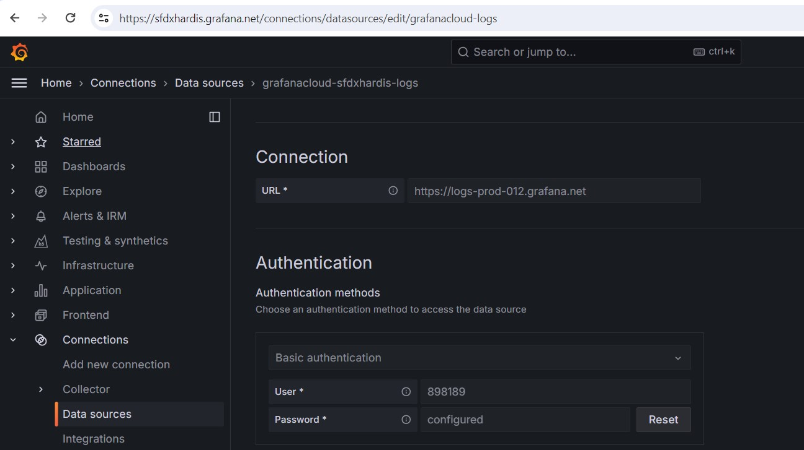

_See [Grafana documentation](https://grafana.com/blog/2024/03/21/how-to-use-http-apis-to-send-metrics-and-logs-to-grafana-cloud/#sending-logs-using-the-http-api) for more info_

### Get Prometheus configuration

Go to **Connections** -> **Data Sources** and click on **grafanacloud-YOURORGNAME-prom (Prometheus)**

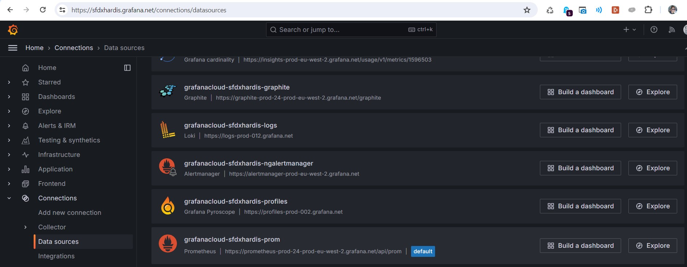

___

Build Metrics push url

- Copy value of Connection URL (something like `https://prometheus-prod-24-prod-eu-west-2.grafana.net/api/prom`)
- Replace `prometheus` by `influx`
- Replace `api/prom` by `api/v1/push/influx/write`
- Then copy value to variables `NOTIF_API_METRICS_URL`

Example: `NOTIF_API_METRICS_URL=https://influx-prod-24-prod-eu-west-2.grafana.net/api/v1/push/influx/write`

Copy value of Authentication -> User and paste it with variable `NOTIF_API_METRICS_BASIC_AUTH_USERNAME`

Example: `NOTIF_API_METRICS_BASIC_AUTH_USERNAME=1596503`

Leave `NOTIF_API_METRICS_BASIC_AUTH_PASSWORD` empty for now, you can't get it here

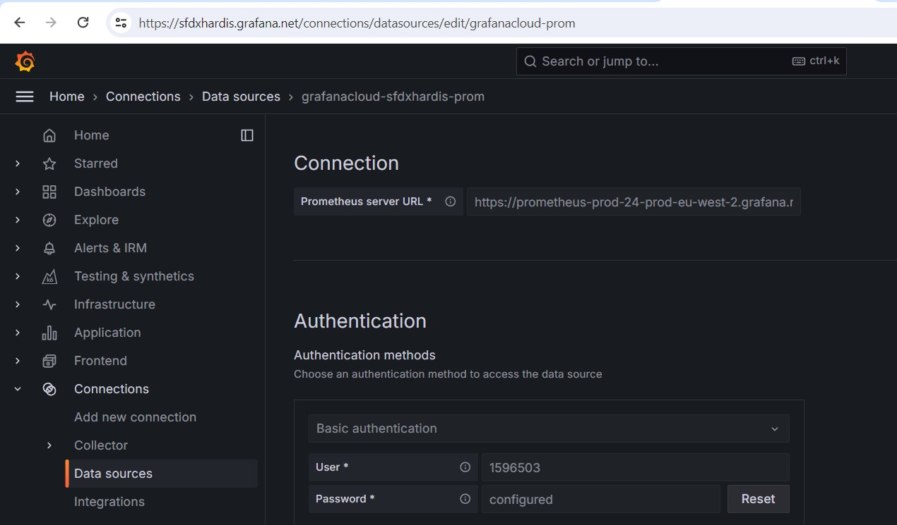

_See [Grafana documentation](https://grafana.com/blog/2024/03/21/how-to-use-http-apis-to-send-metrics-and-logs-to-grafana-cloud/#sending-metrics-using-the-http-api) for more info_

### Create Service Account

Go to **Administration** -> **Users and Access** -> **Cloud Access Policies**, then click on **Create Access Policy**

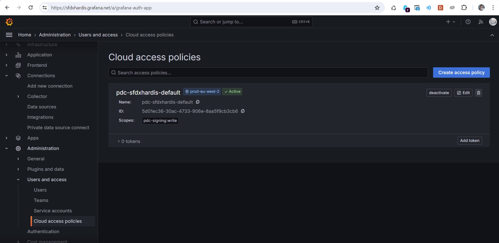

___

Create the access policy

- Define sfdxhardis as name and display name
- Select **write** for items **metrics, logs, traces, profiles, alerts** (only metrics and logs are used today, but who knows hat new features we'll release in the future !)
- Click on **Create**

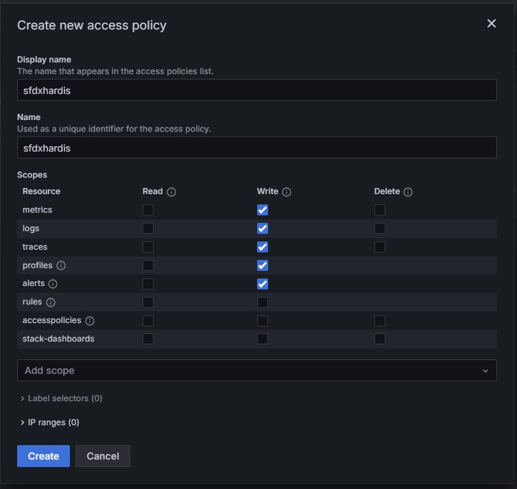

___

On the new Access Policy `sfdxhardis`, click on **Add Token** at the bottom right

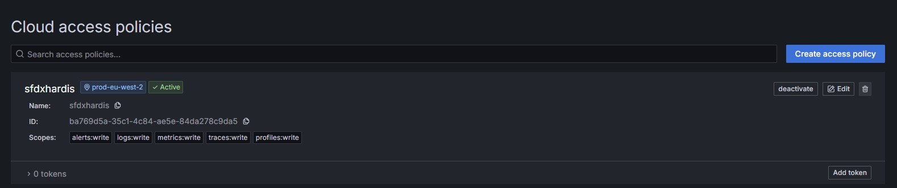

___

Name it sfdxhardis-token, let `No expiration` then click **Create**

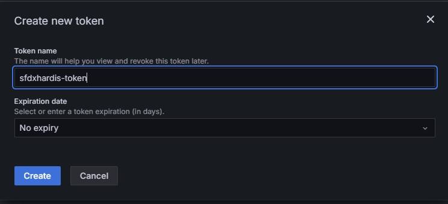

___

On the next screen, click on **Copy to clipboard** then paste in your notepad in front of variables **NOTIF_API_BASIC_AUTH_PASSWORD** and **NOTIF_API_METRICS_BASIC_AUTH_PASSWORD**

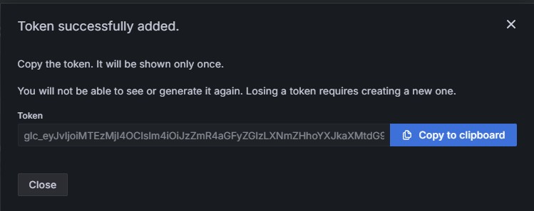

Example:

```
NOTIF_API_BASIC_AUTH_PASSWORD=glc_eyJvIjoiMTEzMjI4OCIsIm4iOiJzZmR4aGFyZGlzLXNmZHhoYXJkaXMtdG9rZW4iLCJrIjoiN0x6MzNXS0hKR1J5ODNsMVE5NU1IM041IiwibSI6eyJyXN0LTIifX0=
NOTIF_API_METRICS_BASIC_AUTH_PASSWORD=glc_eyJvIjoiMTEzMjI4OCIsIm4iOiJzZmR4aGFyZGlzLXNmZHhoYXJkaXMtdG9rZW4iLCJrIjoiN0x6MzNXS0hKR1J5ODNsMVE5NU1IM041IiwibSI6eyJyXN0LTIifX0=
```

### Configure CI variables on repository

Now configure the 6 variables on the monitoring repository. (Ignore other paragraphs, except those who explain how to modify the pipeline YML to access protected variables)

- [GitHub](https://sfdx-hardis.cloudity.com/salesforce-monitoring-config-github/#define-sfdx-hardis-environment-variables)
- [Gitlab](https://sfdx-hardis.cloudity.com/salesforce-monitoring-config-gitlab/#define-sfdx-hardis-environment-variables)
- [Azure](https://sfdx-hardis.cloudity.com/salesforce-monitoring-config-azure/#configure-cicd-variables)
- [BitBucket](https://sfdx-hardis.cloudity.com/salesforce-monitoring-config-bitbucket/#define-sfdx-hardis-environment-variables)

Now you can force a run of your monitoring job (just add a dumb commit on a monitoring_xxxx branch to trigger it)

Optionally , you can look in the logs, you should see \[ApiProvider\] and \[ApiMetricProvider\] items.

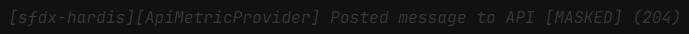

### Download sfdx-hardis dashboards

Download all sfdx-hardis Dashboard JSON files from [this sfdx-hardis repo folder](https://github.com/hardisgroupcom/sfdx-hardis/tree/main/docs/grafana/dashboards)

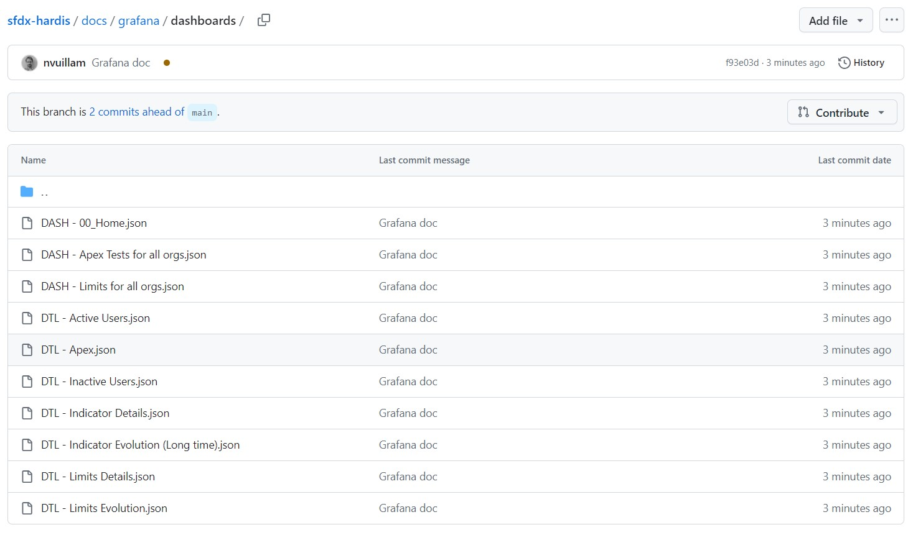

### Create Dashboard folder

Go in menu **Dashboards** then click on **New** then **New folder**

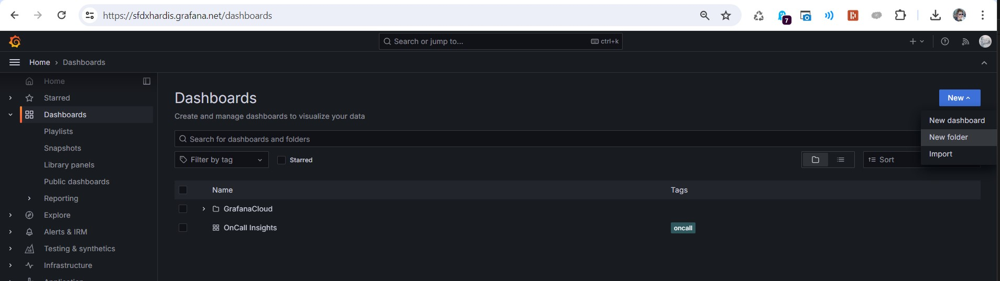

___

Create folder `Sfdx-hardis Dashboards`

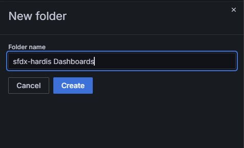

### Import default sfdx-hardis Grafana Dashboards

For each downloaded Dashboard JSON file, process the following actions.

Click **New** then **Import**

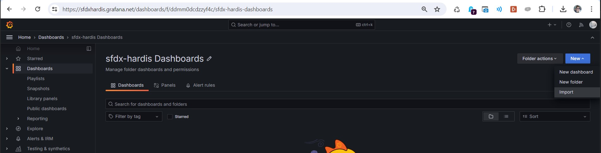

___

Click on **Upload Dashboard JSON File** and select one of the Dashboards JSON files you downloaded on your computer.

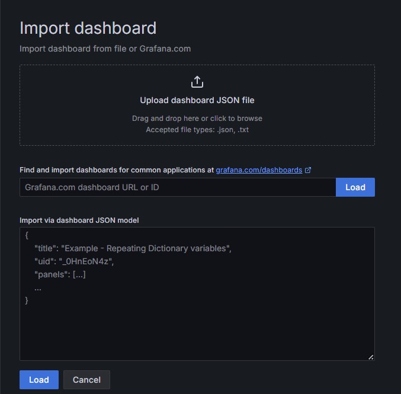

___

- Let Name, Folder and UID default values
- Select your Loki or Prometheus source. They can be:
  - **grafanacloud-YOURORGNAME-logs (Loki)**
  - **grafanacloud-YOURORGNAME-prom (Prometheus)**

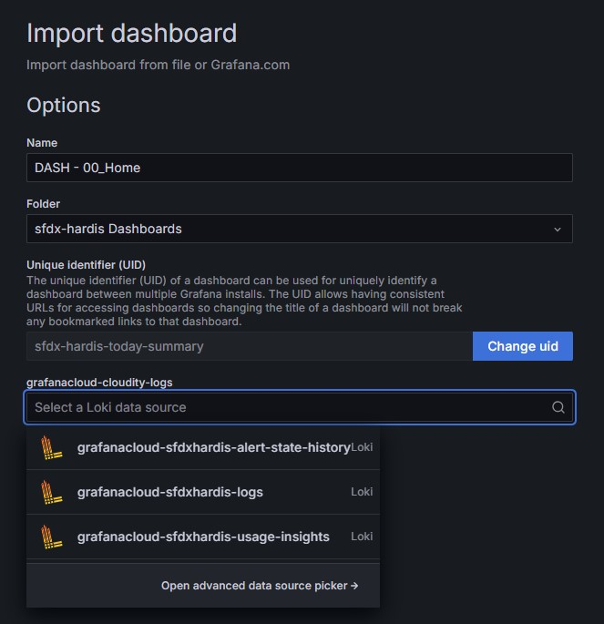

___

Click **Import**

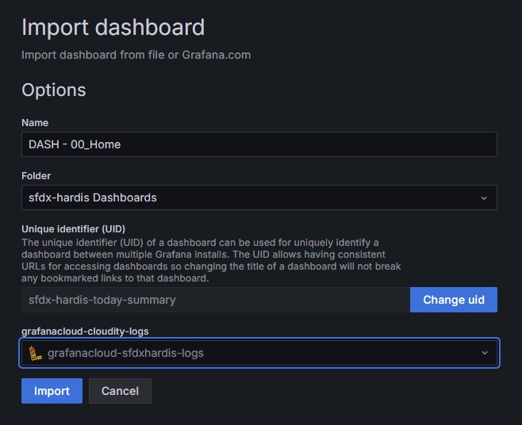

__

Repeat the operation for all Dashboard JSON files, and you're all set !

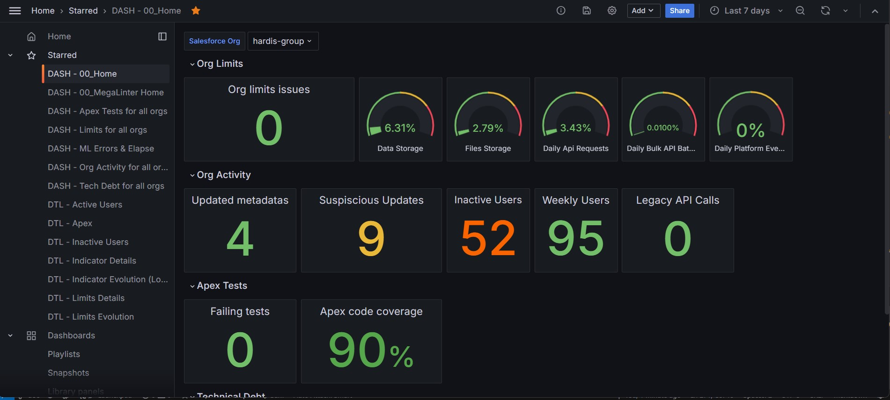


