<!-- markdownlint-disable MD013 -->

## API Integration

You can send notifications to an external API endpoint, for example to [build Grafana dashboards](#grafana-setup):

- Deployment from a major branch to a major Salesforce org (e.g. integration git branch to Integration org)
- Salesforce [Org Monitoring](salesforce-monitoring-home.md)
  - Latest updates
  - Failing Apex tests
  - Monitoring checks notifications

## Logs Configuration

Define the following CI/CD variables:

- **NOTIF_API_URL**: API endpoint
- **NOTIF_API_BASIC_AUTH_USERNAME**: Basic auth username _(if using Basic Auth)_
- **NOTIF_API_BASIC_AUTH_PASSWORD**: Basic auth password/token _(if using Basic Auth)_
- **NOTIF_API_BEARER_TOKEN**: Bearer token _(if using bearer auth)_

Examples of configuration:

```sh
NOTIF_API_URL=https://logs-prod-012.grafana.net/loki/api/v1/push
NOTIF_API_BASIC_AUTH_USERNAME=3435645645
NOTIF_API_BASIC_AUTH_PASSWORD=GHTRGDHDHdhghg23345DFG^sfg!ss
```

```sh
NOTIF_API_URL=https://my.custom.endpoint.net
NOTIF_API_BEARER_TOKEN=DDHGHfgfgjfhQESRDTHFKGKHFswgFHDHGDH
```

Example of logs sent to Loki:

```json
{
  "streams": [
    {
      "stream": {
        "source": "sfdx-hardis",
        "type": "LINT_ACCESS",
        "orgIdentifier": "hardis-group",
        "gitIdentifier": "monitoring-hardis-org/monitoring_hardis_group",
        "severity": "warning"
      },
      "values": [
        [
          "1715530820301000000",
          "{\"metric\":3,\"_dateTime\":\"2024-05-12T16:20:20.301Z\",\"_severityIcon\":\"⚠️\",\"_title\":\"⚠️ 3 custom elements have no access defined in any Profile or Permission set in monitoringhardisgroup\",\"_logBodyText\":\"⚠️ 3 custom elements have no access defined in any Profile or Permission set in monitoringhardisgroup\\n\\nfield\\n\\n• Activity.DBActivityType__c\\n\\n• Activity.IdExterneCARRENET__c\\n\\n• Activity.Typederendezvous_c\\n\\nLinks:\\n\\n  View Job: https://gitlab.onpremise.com/busalesforce/hardis-group-interne/monitoring-hardis-org/-/jobs/12345\\n\\nPowered by sfdx-hardis: https://sfdx-hardis.cloudity.com\",\"_logElements\":[{\"type\":\"field\",\"element\":\"Activity.DB_Activity_Type__c\",\"severity\":\"warning\",\"severityIcon\":\"⚠️\"},{\"type\":\"field\",\"element\":\"Activity.IdExterneCARRENET__c\",\"severity\":\"warning\",\"severityIcon\":\"⚠️\"},{\"type\":\"field\",\"element\":\"Activity.Type_de_rendez_vous__c\",\"severity\":\"warning\",\"severityIcon\":\"⚠️\"}],\"_metrics\":{\"ElementsWithNoProfileOrPermissionSetAccess\":3},\"_metricsKeys\":[\"ElementsWithNoProfileOrPermissionSetAccess\"],\"_jobUrl\":\"https://gitlab.onpremise.com/busalesforce/hardis-group-interne/monitoring-hardis-org/-/jobs/399629\"}"
        ]
      ]
    }
  ]
}
```

## Metrics Configuration

You can also send metrics in Prometheus format to a secondary API endpoint.

The configuration is the same as for logs, but with different variable names.

- **NOTIF_API_METRICS_URL**
- **NOTIF_API_METRICS_BASIC_AUTH_USERNAME**
- **NOTIF_API_METRICS_BASIC_AUTH_PASSWORD**
- **NOTIF_API_METRICS_BEARER_TOKEN**

Example of configuration:

```sh
NOTIF_API_METRICS_URL=https://influx-prod-72-prod-eu-west-2.grafana.net/api/v1/push/influx/write
NOTIF_API_METRICS_BASIC_AUTH_USERNAME=345673
NOTIF_API_METRICS_BASIC_AUTH_PASSWORD=GHTRGDHDHdhghg23345DFG^sfg!ss
```

Example of metrics sent to Prometheus:

```text
ApexTestsFailingClasses,source=sfdx-hardis,type=APEX_TESTS,orgIdentifier=hardis-group,gitIdentifier=monitoring-hardis-org/monitoring_hardis_group metric=0.00
ApexTestsCodeCoverage,source=sfdx-hardis,type=APEX_TESTS,orgIdentifier=hardis-group,gitIdentifier=monitoring-hardis-org/monitoring_hardis_group metric=90.00
```

## Per notification type severity threshold

The API channel (Grafana Loki / Prometheus / custom endpoint) is configurable per notification type, exactly like `messaging` and `email`. By default it forwards everything (so Grafana dashboards stay complete), but you can raise the threshold or mute a notification type entirely from `.sfdx-hardis.yml`:

```yaml
monitoringCommands:
  - key: AUDIT_TRAIL
    notifications:
      api: log             # everything reaches Grafana (default)
  - key: METADATA_STATUS
    notifications:
      api: warning         # only warning / error / critical reach Grafana
  - key: ORG_LIMITS
    notifications:
      api: off             # disable API/Grafana for this type
```

See [Monitoring configuration](salesforce-monitoring-config-home.md#fine-grained-routing-per-notification-type) for the full per-channel routing model.

## Skip Configuration

> The API channel is always sent by default when `NOTIF_API_URL` is configured, regardless of the per-channel severity threshold. To filter what reaches the API per notification type, use either the env vars below, or set `api: off` (or any other threshold) in the per-entry `notifications` block of `monitoringCommands` (see [Monitoring configuration](salesforce-monitoring-config-home.md#fine-grained-routing-per-notification-type)).

You can skip sending logs or metrics to the API based on notification type by defining the following CI/CD variables:

- **NOTIF_API_SKIP_LOGS**: Comma-separated list of notification types to skip for logs, or `all` to skip all logs
- **NOTIF_API_SKIP_METRICS**: Comma-separated list of notification types to skip for metrics, or `all` to skip all metrics

Examples of configuration:

```sh
NOTIF_API_SKIP_LOGS=all
```

```sh
NOTIF_API_SKIP_METRICS=APEX_TESTS,DEPLOYMENT
```

## Data anonymization

When running in CI (which is the case for scheduled monitoring jobs), sfdx-hardis anonymizes personal data before it leaves the machine. This covers:

- Generated report files (CSV and XLSX), which become CI artifacts and email attachments
- API channel payloads (log elements, notification title and body text, extra data fields)
- Email, Slack, Microsoft Teams and Google Chat notification texts
- The monitoring notification files used by the AI executive summary and the PPTX report (they follow the API channel level)
- Tables printed in CI console logs

### Levels

Two anonymization levels are available:

- **standard** (default in CI): masks end-user identity. `Username`, `Email`, `FirstName`, `LastName` and user display names become `user_<hash>`, Salesforce user record Ids (`005...` values, `USER_ID`, `AssigneeId`) become `id_<hash>`, client IPs and their resolved hostnames become `ip_<hash>`. Technical actor fields stay readable: `CreatedBy`, `LastModifiedBy` and `DelegateUser` in audit trail entries, `DeployedBy` in deployment history, `TriggeredBy` in security key unlink reports. They identify administrators performing setup actions, which is exactly what an audit trail is for.
- **strict**: standard, plus the technical actor fields above.

What is NOT anonymized at any level: Salesforce record Ids other than user Ids (deployment Ids, org Ids, permission set Ids...), profile and license names, dates (`LastLoginDate` is needed for inactive-user reports and is not a personal identifier), and metric values.

Key points:

- Pseudonyms are stable per org (same value always gets the same hash), so distinct-user counts and per-user drill-downs keep working in dashboards, and a pseudonym in a Grafana panel matches the same pseudonym in the XLSX report of the same run. They are salted per org, so the same user is not linkable across orgs.
- Local runs (outside CI) are not anonymized by default, so locally generated report files stay directly analyzable.
- Report files are anonymized at generation time: the file on disk is the anonymized artifact, and email attachments are these same files.

### Configuration

Override the default behavior with the env var **SFDX_HARDIS_ANONYMIZE**:

```sh
SFDX_HARDIS_ANONYMIZE=off       # send and write raw values even in CI
SFDX_HARDIS_ANONYMIZE=standard  # anonymize end-user identity, even in local runs
SFDX_HARDIS_ANONYMIZE=strict    # also anonymize technical actor fields
```

Or with the `anonymization` property in `config/.sfdx-hardis.yml`:

```yaml
anonymization:
  level: standard # off | standard | strict
  channels: # optional: a channel can be stricter than the global level, never weaker
    email: strict
    messaging: strict
    api: strict
    files: strict
```

Per-channel levels can only raise the global level: report files are anonymized once at the source, so a channel cannot receive rawer data than the global level allows. Note that email attachments are the generated report files, so they follow the `files` level, not the `email` one.

The former **NOTIF_API_ANONYMIZE** env var is deprecated but still honored (`true` maps to `standard`, `false` to `off`).

Note: anonymization only applies to new entries. Entries sent before enabling it keep their original values until your log retention expires (you can use the Loki delete API to purge them earlier).

## Troubleshooting

If you want to see the content of the API notifications in the execution logs, define `NOTIF_API_DEBUG=true`.

## Grafana Setup

If you don't have a Grafana server, you can use the Grafana Cloud Free Tier (14 days of logs and metrics retention, 3 users, no credit card required, free forever).

If you do have a Grafana server and want to use a log aggregation tool like Vector to ingest logs, see [Salesforce Monitoring Setup with Vector/Datadog and PushGateways](salesforce-monitoring-config-vector.md).

### Create Grafana Account

Create a Grafana Cloud Free account at [this url](https://grafana.com/auth/sign-up/create-user?pg=hp&plcmt=cloud-promo&cta=create-free-account){target=blank}

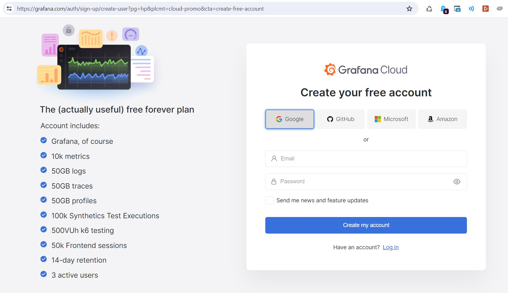

___

Enter a Grafana Cloud org name (sfdxhardis in the example)

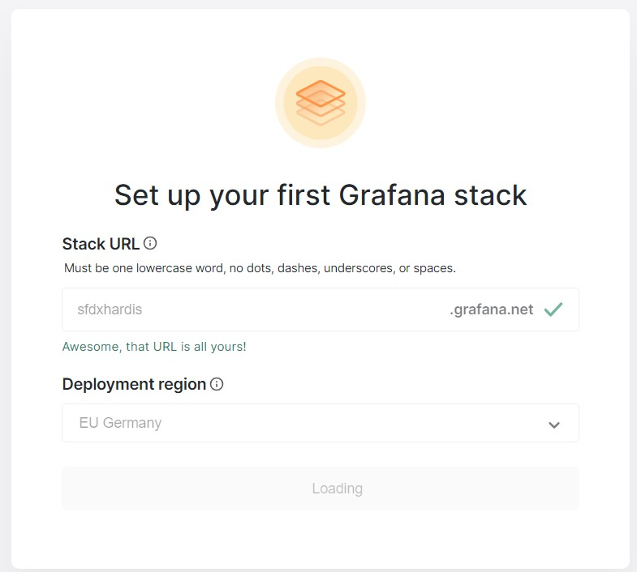

___

On the next screen, you can skip the setup

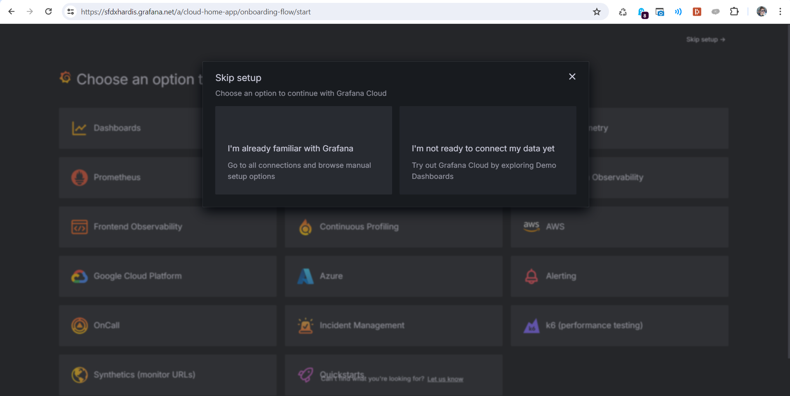

### Gather URLs & auth info

Open a notepad and copy-paste the following text into it:

```sh
NOTIF_API_URL=
NOTIF_API_BASIC_AUTH_USERNAME=
NOTIF_API_BASIC_AUTH_PASSWORD=
NOTIF_API_METRICS_URL=
NOTIF_API_METRICS_BASIC_AUTH_USERNAME=
NOTIF_API_METRICS_BASIC_AUTH_PASSWORD=
```

### Get Loki configuration

Go to **Connections** -> **Data Sources** and click on **grafanacloud-YOURORGNAME-logs (Loki)**

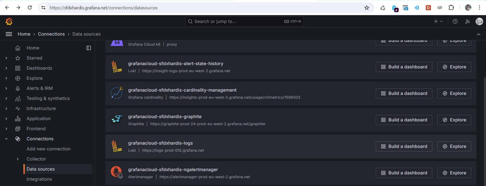

___

Build the logs push URL:

- Copy the value of Connection URL (something like `https://logs-prod-012.grafana.net/`)
- Add `/loki/api/v1/push` at the end
- Copy the value to the variable `NOTIF_API_URL`

Example: `NOTIF_API_URL=https://logs-prod-012.grafana.net/loki/api/v1/push`

Copy the value of Authentication -> User and paste it as the value of the variable `NOTIF_API_BASIC_AUTH_USERNAME`

Example: `NOTIF_API_BASIC_AUTH_USERNAME=898189`

Leave `NOTIF_API_BASIC_AUTH_PASSWORD` empty for now, you cannot get it here.

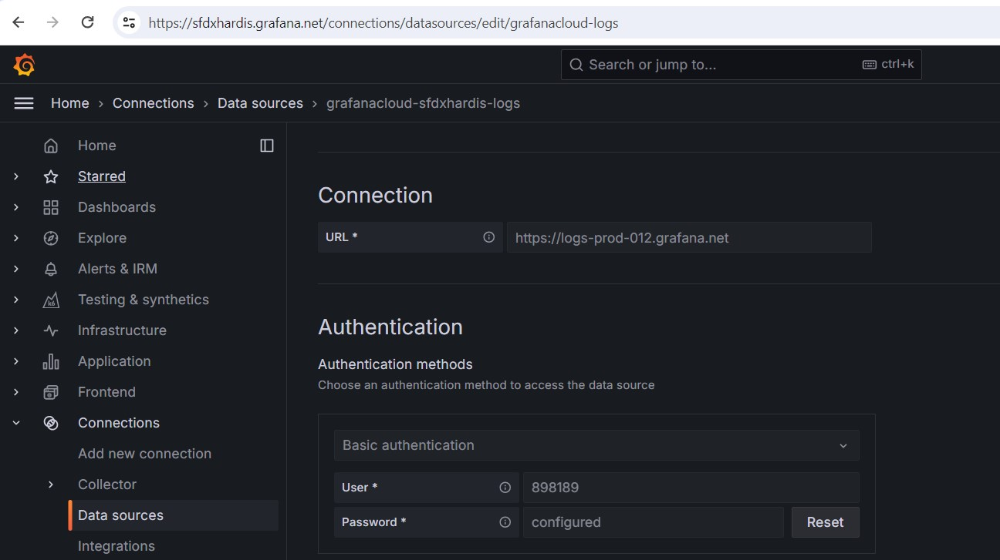

_See [Grafana documentation](https://grafana.com/blog/2024/03/21/how-to-use-http-apis-to-send-metrics-and-logs-to-grafana-cloud/#sending-logs-using-the-http-api) for more info_

### Get Prometheus configuration

Go to **Connections** -> **Data Sources** and click on **grafanacloud-YOURORGNAME-prom (Prometheus)**

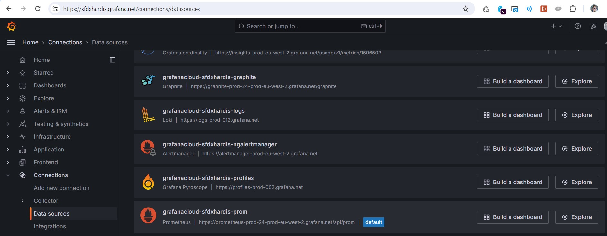

___

Build the metrics push URL:

- Copy the value of Connection URL (something like `https://prometheus-prod-24-prod-eu-west-2.grafana.net/api/prom`)
- Replace `prometheus` by `influx`
- Replace `api/prom` by `api/v1/push/influx/write`
- Then copy the value to the variable `NOTIF_API_METRICS_URL`

Example: `NOTIF_API_METRICS_URL=https://influx-prod-24-prod-eu-west-2.grafana.net/api/v1/push/influx/write`

Copy the value of Authentication -> User and paste it as the value of the variable `NOTIF_API_METRICS_BASIC_AUTH_USERNAME`

Example: `NOTIF_API_METRICS_BASIC_AUTH_USERNAME=1596503`

Leave `NOTIF_API_METRICS_BASIC_AUTH_PASSWORD` empty for now, you cannot get it here.

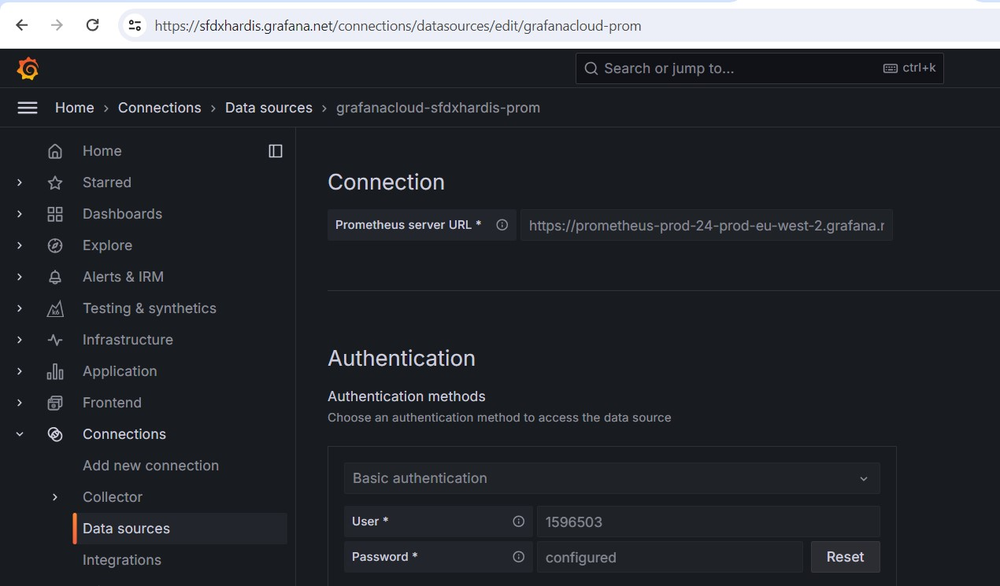

_See [Grafana documentation](https://grafana.com/blog/2024/03/21/how-to-use-http-apis-to-send-metrics-and-logs-to-grafana-cloud/#sending-metrics-using-the-http-api) for more info_

### Create Service Account

Go to **Administration** -> **Users and Access** -> **Cloud Access Policies**, then click on **Create Access Policy**

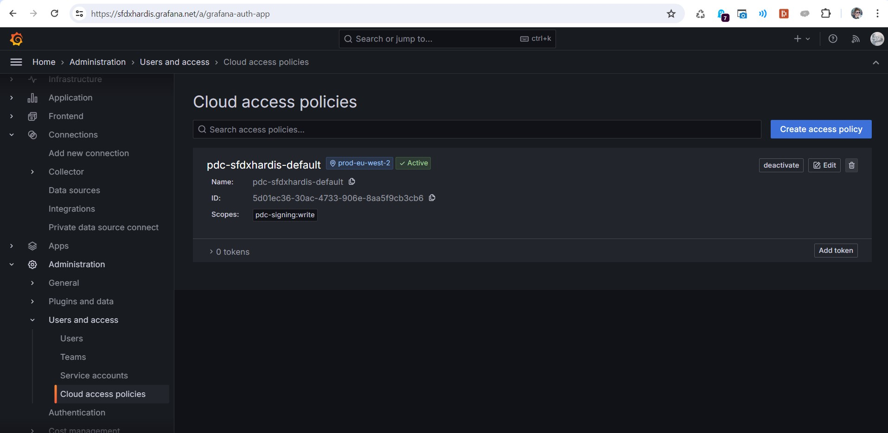

___

Create the access policy:

- Define sfdxhardis as name and display name
- Select **write** for items **metrics, logs, traces, profiles, alerts** (only metrics and logs are used today, but future features may use the others)
- Click on **Create**

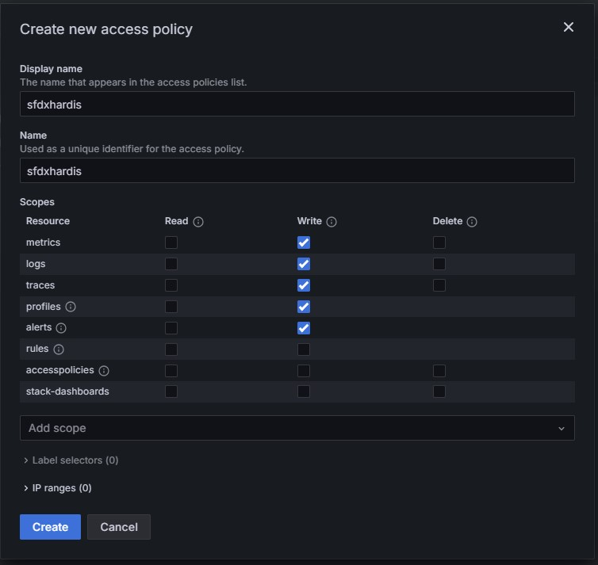

___

On the new Access Policy `sfdxhardis`, click on **Add Token** at the bottom right

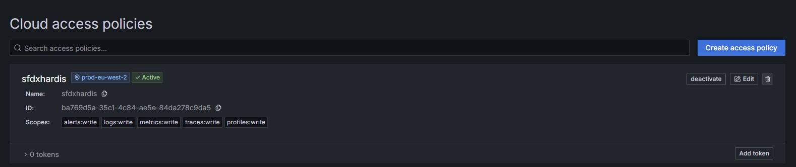

___

Name it sfdxhardis-token, keep `No expiration`, then click **Create**

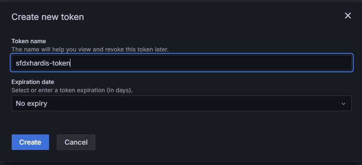

___

On the next screen, click on **Copy to clipboard**, then paste the token in your notepad as the value of the variables **NOTIF_API_BASIC_AUTH_PASSWORD** and **NOTIF_API_METRICS_BASIC_AUTH_PASSWORD**

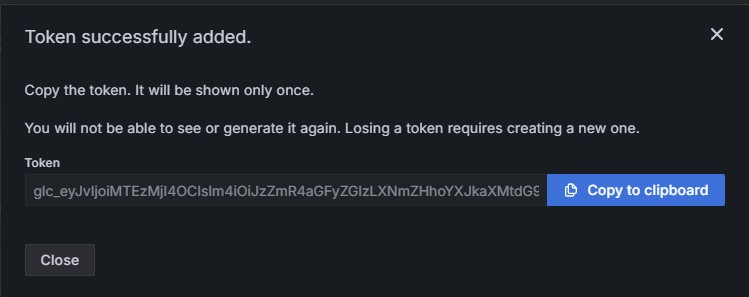

Example:

```
NOTIF_API_BASIC_AUTH_PASSWORD=glc_eyJvIjoiMTEzMjI4OCIsIm4iOiJzZmR4aGFyZGlzLXNmZHhoYXJkaXMtdG9rZW4iLCJrIjoiN0x6MzNXS0hKR1J5ODNsMVE5NU1IM041IiwibSI6eyJyXN0LTIifX0=
NOTIF_API_METRICS_BASIC_AUTH_PASSWORD=glc_eyJvIjoiMTEzMjI4OCIsIm4iOiJzZmR4aGFyZGlzLXNmZHhoYXJkaXMtdG9rZW4iLCJrIjoiN0x6MzNXS0hKR1J5ODNsMVE5NU1IM041IiwibSI6eyJyXN0LTIifX0=
```

### Configure CI variables on repository

Now configure the six variables on the monitoring repository (ignore the other paragraphs, except those explaining how to modify the pipeline YAML to access protected variables).

- [GitHub](https://sfdx-hardis.cloudity.com/salesforce-monitoring-config-github/#define-sfdx-hardis-environment-variables)
- [GitLab](https://sfdx-hardis.cloudity.com/salesforce-monitoring-config-gitlab/#define-sfdx-hardis-environment-variables)
- [Azure](https://sfdx-hardis.cloudity.com/salesforce-monitoring-config-azure/#configure-cicd-variables)
- [Bitbucket](https://sfdx-hardis.cloudity.com/salesforce-monitoring-config-bitbucket/#define-sfdx-hardis-environment-variables)

Now you can force a run of your monitoring job (just push a dummy commit on a monitoring_xxxx branch to trigger it).

Optionally, look in the logs: you should see \[ApiProvider\] and \[ApiMetricProvider\] items.

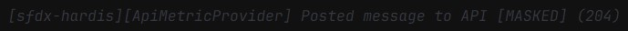

### Import sfdx-hardis dashboards

Your Grafana now receives sfdx-hardis logs and metrics. Import the dashboards:

- **[Org Monitoring by sfdx-hardis (Dashboards v2)](salesforce-monitoring-grafana-v2.md)**: the current set, with fleet overview, trends and averages, limit forecasts, org health score, drill-down navigation, and a ready-to-enable alert pack
- [Legacy Grafana Dashboards (v1)](salesforce-monitoring-grafana-v1-legacy.md): frozen, kept for existing installations


