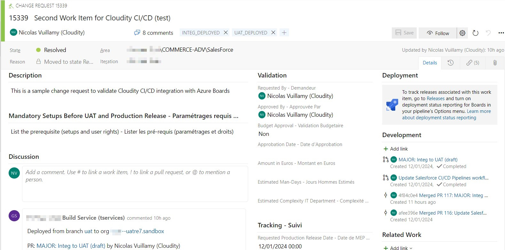

<!-- markdownlint-disable MD013 -->

- [Jira integration](#jira-integration)
  - [For git providers](#for-git-providers)
  - [For notifications providers](#for-notifications-providers)
  - [Update JIRA issues](#update-jira-issues)
- [Authentication](#authentication)
  - [Jira Cloud](#jira-cloud)
  - [Jira On-Premise](#jira-on-premise)
- [Gitlab configuration](#gitlab-configuration)
- [Technical notes](#technical-notes)

## Azure Boards integration

If you use Azure Work Items on your project, sfdx-hardis can use it to enrich its integrations

Sfdx-hardis will automatically analyze commits and PR/MR descriptions to collect Work Items references !

Make sure to link your Work Items to your Pull Requests before submitting them !

### Update Work Items

Add **comments** and **tags** on JIRA tickets when they are deployed in a major org

## Technical notes

This integration use the following variables, that must be available from the pipelines:

- SYSTEM_COLLECTIONURI
- SYSTEM_ACCESSTOKEN
- SYSTEM_TEAMPROJECT
- BUILD_REPOSITORY_ID
